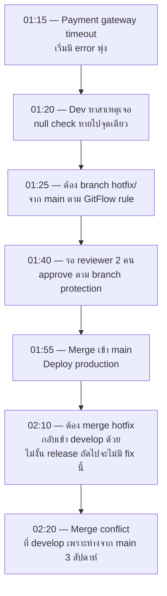

ทีมอีคอมเมิร์ซใช้ GitFlow (จากหัวข้อ GitFlow) มาสองปี ทำงานได้ดีตอน release เดือนละครั้ง — แต่คืนวันศุกร์หนึ่ง payment gateway ล่มกลางดึกช่วง flash sale ทีม on-call ต้อง hotfix ด่วน และตรงนี้เองที่จุดอ่อนของ GitFlow ในสถานการณ์เร่งด่วนก็โผล่ขึ้นมาทันที

## Timeline คืนนั้น

<mark class="hl-warning">ปัญหาไม่ได้อยู่ที่ตัว fix เอง (แก้ได้ใน 5 บรรทัด) แต่อยู่ที่**กระบวนการของ GitFlow เอง**ที่ออกแบบมาสำหรับ release แบบมีจังหวะ ไม่ใช่ incident แบบเร่งด่วน — ต้อง merge เข้า `main` แล้วยังต้อง merge กลับเข้า `develop` อีกรอบ (ไม่งั้น release ถัดไปจะ "ลืม" fix นี้ไปเพราะ develop ไม่มี commit นี้) และการ merge กลับนี้เจอ conflict เพราะ `develop` กับ `main` ห่างกันไปแล้ว 3 สัปดาห์ ตามที่เรียนในหัวข้อ GitFlow ว่ายิ่ง branch อายุยืนเท่าไหร่ merge ยิ่งเจ็บปวดเท่านั้น</mark>

## สิ่งที่ทีมทบทวนหลังเหตุการณ์

<mark class="hl-insight">Postmortem ไม่ได้สรุปว่า "GitFlow แย่" เพราะ GitFlow เหมาะกับบริบทที่ต้อง maintain หลาย version พร้อมกันจริงๆ (จากหัวข้อ GitFlow) แต่ทีมนี้ deploy แค่ version เดียว ไม่เคยต้อง maintain version เก่าคู่ขนาน — ตรงกับสัญญาณที่เรียนในหัวข้อ Choosing Branching Strategy ว่าควรใช้ Trunk-Based Development หรือ GitHub Flow แทน เพราะ deploy บ่อย ไม่มี parallel release ให้ต้อง sync กัน</mark>

## หลัง Migrate มา Trunk-Based Development

<mark class="hl-insight">ครั้งถัดไปที่เกิด incident แบบนี้ — fix ตรงเข้า `main` ทันที ไม่มี `develop` ให้ merge กลับ ไม่มี branch อายุยืนให้ conflict เพราะทุกคน merge เข้า trunk บ่อยๆ อยู่แล้ว เวลาที่เคยเสียไปกับขั้นตอน "merge กลับ develop" หายไปทั้งหมด เหลือแค่ fix → review → merge → deploy เส้นทางเดียว</mark>

## แต่ก็ไม่ใช่ว่าไม่มีต้นทุน

<mark class="hl-warning">Trunk-Based Development ต้องการวินัยที่สูงกว่า — ทุก merge เข้า trunk ต้อง deploy ได้ทันที (ไม่มี develop เป็นกันชนให้ code ที่ยังไม่เสร็จซ่อนอยู่) ทีมต้องพึ่ง feature flags หนักขึ้นสำหรับงานที่ทำไม่เสร็จในวันเดียว และ CI ต้องเร็วและน่าเชื่อถือพอที่จะให้ merge เข้า trunk บ่อยๆ ได้อย่างปลอดภัย ถ้า CI สุ่มพังทีมจะไม่กล้า merge บ่อย และเสียประโยชน์ของ Trunk-Based ไปเลย</mark>

> คำถามสัมภาษณ์: "ทีมใช้ GitFlow อยู่แล้วเจอปัญหา hotfix ช้าเพราะต้อง merge กลับ develop ทุกครั้ง ควรแก้ยังไง" — คำตอบที่ดีคือให้ถามก่อนว่าทีมนี้จำเป็นต้อง maintain หลาย version คู่ขนานจริงไหม ถ้าไม่จำเป็น (deploy version เดียวตลอด) ควรพิจารณาย้ายไป Trunk-Based Development หรือ GitHub Flow ที่ไม่มี develop branch ให้ sync กลับ ลดขั้นตอนที่ไม่จำเป็นออกไป แต่ถ้าทีมจำเป็นต้อง maintain หลาย version จริง (เช่น software ที่ลูกค้าติดตั้งเองหลาย version) ปัญหานี้เป็นต้นทุนที่หลีกเลี่ยงไม่ได้ของ GitFlow ต้องแก้ด้วยการลด merge lag ระหว่าง main กับ develop ให้สั้นลงแทน ไม่ใช่เปลี่ยน strategy ทั้งหมด
