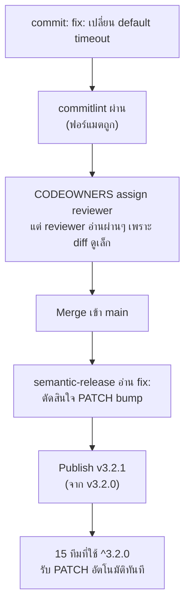

ทีม platform maintain internal library `@acme/http-client` ที่ทีมอื่นในบริษัท 15 ทีมใช้ผ่าน semver range แบบ `^` (จากหัวข้อ Semantic Versioning) — เช้าวันจันทร์หนึ่ง หลัง `semantic-release` publish version ใหม่อัตโนมัติ มี 6 ทีมรายงาน production error พร้อมกันภายในชั่วโมงเดียว

## จุดเริ่มต้นของปัญหา — Commit เดียวที่ผิดฟอร์แมต

```
fix: เปลี่ยน default timeout จาก 30s เป็น 5s
```

<mark class="hl-warning">Commit นี้ตั้งใจแก้บั๊กเรื่อง timeout นานเกินไป แต่**เปลี่ยน default behavior** ซึ่งตามกฎ Semantic Versioning ที่เรียนไปแล้วถือเป็น breaking change ต้องเป็น `fix!:` หรือมี `BREAKING CHANGE:` footer ไม่ใช่ `fix:` ธรรมดา — เพราะ consumer ที่พึ่ง default 30s เดิมอยู่ (เช่น service ที่เรียก API ช้าโดยธรรมชาติ) จะเริ่ม timeout เร็วเกินไปทันทีที่อัปเกรด แต่ `commitlint` ตามที่เรียนในหัวข้อ Commit Convention at Scale เช็กได้แค่**รูปแบบ** ว่ามี prefix ถูกไหม เช็ก**เนื้อหา**ว่า commit นี้ควรเป็น breaking change หรือไม่ไม่ได้เลย</mark>

## ทำไม Automation ถึงปล่อยผ่านได้ทั้งที่มี Process ครบ



<mark class="hl-insight">นี่คือจุดที่เชื่อมทุกอย่างที่เรียนมาในโมดูลนี้เข้าด้วยกัน — CODEOWNERS (จากหัวข้อ CODEOWNERS) ทำให้มี reviewer ที่ถูกต้องมารีวิวจริง แต่ CODEOWNERS แก้ปัญหา "ใครควรรีวิว" ไม่ใช่ "รีวิวละเอียดพอไหม" reviewer เห็น diff เล็ก (เปลี่ยนตัวเลขค่าเดียว) เลยไม่ได้คิดต่อว่ากระทบ consumer ยังไง — semantic-release ทำงานตามที่ออกแบบไว้เป๊ะ (จากหัวข้อ Changelog and Release Automation) คือเชื่อ commit message 100% โดยไม่มีทางรู้ว่าคนเขียนใส่ prefixผิดประเภท ระบบทั้งสายทำงานถูกต้องตามกฎของตัวเอง แต่ผลลัพธ์กลับผิด เพราะจุดอ่อนอยู่ที่ input (commit message) ไม่ใช่ตัว pipeline</mark>

## Post-Incident — แก้ที่ไหนถึงจะตรงจุด

| ทางแก้ที่เสนอ | แก้ตรงจุดไหม |
|---|---|
| ไล่ตักเตือน dev คนที่เขียน commit ผิด | ❌ แก้ที่คน ไม่ยั่งยืน จะเกิดซ้ำกับคนอื่น |
| เพิ่ม PR template เตือนให้เช็ก breaking change | ⚠️ ช่วยได้บ้างแต่ยังพึ่งคนอ่านอยู่ดี |
| เพิ่ม checklist ใน CODEOWNERS review guideline เฉพาะ library ที่มีคนใช้เยอะ ให้ reviewer เช็ก "เปลี่ยน default behavior ไหม" ทุกครั้ง | ✅ ผูกกับจุดที่ระบบพึ่งพามนุษย์อยู่แล้ว (code review) แทนที่จะเพิ่มเครื่องมือใหม่ |
| Pin เวอร์ชัน exact ในทุก consumer แทน `^` | ⚠️ แก้ symptom ที่ consumer แต่เสียประโยชน์ของ semver อัตโนมัติไปทั้งหมด |

<mark class="hl-insight">ทีมเลือกทางที่สาม — เพิ่ม review guideline เฉพาะสำหรับ library ที่มี consumer เยอะ (ระบุใน CODEOWNERS ว่า path นี้ต้องมี reviewer อาวุโสอย่างน้อย 1 คนเช็กเรื่อง breaking change โดยเฉพาะ) เพราะจุดอ่อนที่แท้จริงคือ**automation ไว้ใจ input จากคนโดยไม่มีการเช็กซ้ำเชิงความหมาย** และเชิงความหมายเป็นสิ่งที่เครื่องมือเช็กอัตโนมัติไม่ได้ ต้องพึ่งกระบวนการที่มนุษย์ทำอยู่แล้ว (review) ให้ทำหน้าที่นี้แทน ไม่ใช่เพิ่มเครื่องมือใหม่ที่ก็จะมีจุดบอดของตัวเองอีก</mark>

## ภาพรวมทั้ง Track — ทำไมทุกหัวข้อต้องทำงานร่วมกัน

<mark class="hl-warning">เหตุการณ์นี้พิสูจน์ว่าไม่มีหัวข้อไหนในโมดูลนี้ "พอเพียงในตัวเอง" — Monorepo vs Polyrepo ตัดสินใจถูกโครงสร้าง repo, Branching Strategy ตัดสินใจถูกจังหวะ release, Code Review & Merge Strategy ให้มี CODEOWNERS assign คนถูก, Versioning & Release Management ให้ automation คำนวณ version ถูกสูตร, และ Git Workflow at Scale ให้ enforcement มีจริง — แต่ถ้าจุดใดจุดหนึ่งพึ่งพา "ความเข้าใจเชิงความหมาย" ของคนที่ไม่มีระบบใดเช็กซ้ำได้ ทั้งสายก็ยังพังได้อยู่ดี ระบบที่แข็งแรงจริงต้องมีทั้ง process ที่ถูกต้องและวัฒนธรรมการรีวิวที่ตั้งคำถามกับ diff เล็กๆ เสมอ ไม่ใช่พึ่ง tooling อย่างเดียว</mark>

> คำถามสัมภาษณ์: "semantic-release ทำงานถูกต้องตามที่ออกแบบไว้ทุกจุด แต่ก็ยังทำให้เกิด production incident ได้ แสดงว่าระบบ automation นี้มีข้อบกพร่องยังไง" — คำตอบที่ดีคือชี้ว่าปัญหาไม่ได้อยู่ที่ automation พัง แต่อยู่ที่ automation**เชื่อ input จากคนโดยไม่มีการเช็กเชิงความหมาย** — commitlint เช็กแค่รูปแบบ, semantic-release เชื่อ prefix ที่เขียนมา 100% ไม่มีจุดไหนในสายที่เช็กว่า "การเปลี่ยนนี้ควรเป็น breaking change จริงไหม" เพราะนั่นต้องใช้ความเข้าใจบริบทที่เครื่องมือทำไม่ได้ ทางแก้ที่ถูกต้องคือเสริมจุดที่มนุษย์ทำหน้าที่นี้อยู่แล้ว (code review) ให้ตั้งคำถามนี้ชัดเจนขึ้น ไม่ใช่พยายามให้ automation ฉลาดขึ้นจนตัดสินใจเชิงความหมายแทนคนได้
