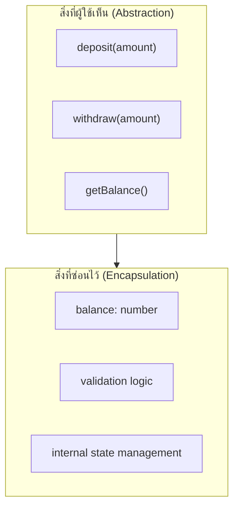

ลองนึกภาพแผงหน้าปัดรถยนต์ — คนขับกดคันเร่งแล้วรถวิ่งเร็วขึ้น โดยไม่ต้องรู้เลยว่าข้างในมีการฉีดน้ำมัน จุดระเบิด หมุนเพลาข้อเหวี่ยงกี่รอบ นี่คือหัวใจของ OOD สองคำที่มักถูกใช้ปนกันแต่ความหมายต่างกันชัดเจน: **encapsulation** คือการซ่อนกลไกภายในเครื่องยนต์ไว้ ส่วน **abstraction** คือการออกแบบแผงหน้าปัดให้เหลือแค่สิ่งที่คนขับต้องรู้จริงๆ

## Encapsulation — ห่อหุ้มข้อมูลกับพฤติกรรมไว้ด้วยกัน

```typescript
class BankAccount {
  private balance: number = 0

  deposit(amount: number): void {
    if (amount <= 0) throw new Error('จำนวนเงินต้องมากกว่า 0')
    this.balance += amount
  }

  withdraw(amount: number): void {
    if (amount > this.balance) throw new Error('ยอดเงินไม่พอ')
    this.balance -= amount
  }

  getBalance(): number {
    return this.balance
  }
}
```

<mark class="hl-term">**Encapsulation**</mark> คือการรวมข้อมูล (`balance`) กับพฤติกรรมที่แก้ไขข้อมูลนั้น (`deposit`, `withdraw`) ไว้ในที่เดียวกัน แล้ว**จำกัดการเข้าถึงข้อมูลโดยตรงจากภายนอก** — โค้ดข้างนอกแก้ `balance` ตรงๆ ไม่ได้เลย ต้องผ่าน `deposit`/`withdraw` เท่านั้น ซึ่งเป็นจุดเดียวที่บังคับกฎ (validation) ได้ ถ้าไม่มี encapsulation ใครก็เขียน `account.balance = -999999` ได้ตรงๆ โดยไม่มีอะไรตรวจสอบเลย

## Abstraction — เหลือแค่สิ่งที่จำเป็นต้องรู้



<mark class="hl-term">**Abstraction**</mark> คือการตัดสินใจว่า**อะไรคือสิ่งจำเป็นที่ผู้ใช้ class ต้องรู้** แล้วเปิดเผยแค่นั้น (`deposit`, `withdraw`, `getBalance`) ส่วนรายละเอียดการ validate หรือเก็บ state ไว้ยังไงไม่ใช่เรื่องที่ผู้ใช้ต้องสนใจ — ต่างจาก encapsulation ที่เป็น**กลไก**ในการซ่อน abstraction คือ**การตัดสินใจเชิงออกแบบ**ว่าจะซ่อนอะไร เปิดอะไร

<mark class="hl-insight">ความสัมพันธ์ของสองคำนี้คือ encapsulation เป็นเครื่องมือที่ทำให้ abstraction เป็นจริงได้ — จะออกแบบ abstraction ที่ดีแค่ไหนก็ไร้ประโยชน์ ถ้าไม่มี encapsulation มาบังคับว่าโค้ดภายนอกต้องผ่าน interface ที่ออกแบบไว้เท่านั้น encapsulation คือ "กำแพง" ส่วน abstraction คือ "แบบแปลนว่าประตูควรอยู่ตรงไหน"</mark>

## Getter/Setter ทุก Field คือ Encapsulation ปลอม

```typescript
// ดูเหมือนมี encapsulation แต่จริงๆ ไม่มีเลย
class BankAccount {
  private balance: number = 0
  getBalance(): number { return this.balance }
  setBalance(value: number): void { this.balance = value }  // ← ไม่มี validation อะไรเลย
}
```

<mark class="hl-warning">การใส่ `private` แล้วสร้าง getter/setter ให้ทุก field โดยไม่มี validation หรือ logic อะไรเพิ่ม คือ**encapsulation แบบผิวเผิน** — โค้ดภายนอกยังคง set ค่าอะไรก็ได้ผ่าน `setBalance(-999999)` เหมือนเดิม แค่เปลี่ยนจาก `account.balance = x` เป็น `account.setBalance(x)` เท่านั้น ไม่ได้ป้องกันอะไรเลย encapsulation ที่มีความหมายจริงต้องมี**กฎทางธุรกิจ**อยู่ในจุดที่ข้อมูลถูกแก้ไข ไม่ใช่แค่เปลี่ยนรูปแบบการเข้าถึง</mark>

## ตารางเปรียบเทียบ

| แง่มุม | Encapsulation | Abstraction |
|---|---|---|
| โฟกัส | **ซ่อน**การ implement | **เลือก**ว่าจะเปิดเผยอะไร |
| กลไกที่ใช้ | access modifier (`private`, `public`) | interface, abstract class, การออกแบบ API |
| คำถามที่ตอบ | "ใครเข้าถึงข้อมูลนี้ได้บ้าง" | "ผู้ใช้ class นี้จำเป็นต้องรู้อะไรบ้าง" |
| ตัวอย่างที่ผิดพลาด | field เป็น `public` ทั้งหมด | expose method ภายในที่ผู้ใช้ไม่ควรเรียกตรงๆ |

> คำถามสัมภาษณ์: "class หนึ่งมี field เป็น private ทั้งหมด แต่มี getter/setter ให้ทุก field แบบตรงไปตรงมา ถือว่ามี encapsulation ที่ดีไหม" — คำตอบที่ดีคือชี้ว่าไม่ใช่ encapsulation ที่มีความหมาย เพราะ getter/setter ที่ไม่มี validation หรือ logic ใดๆ เท่ากับเปิดให้โค้ดภายนอกเข้าถึงและแก้ไข state ได้อย่างอิสระเหมือน field เป็น public อยู่ดี เพียงแค่เปลี่ยนรูปแบบการเรียก encapsulation ที่ดีต้องมีกฎทางธุรกิจ (validation, invariant) อยู่ที่จุดที่ข้อมูลถูกแก้ไข ไม่ใช่แค่ห่อด้วย method เฉยๆ
