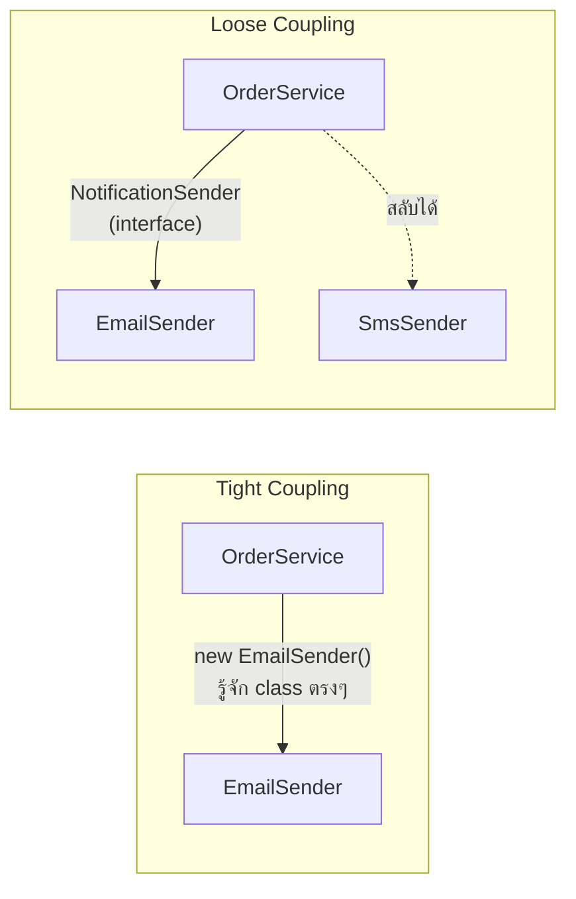

ลองนึกภาพตัวต่อ LEGO เทียบกับชิ้นส่วนที่ติดกาวติดกันแน่น — LEGO แยกชิ้นแล้วประกอบใหม่ได้เสมอ แต่ชิ้นที่ติดกาวไว้ พอจะถอดชิ้นเดียวออก ทั้งก้อนพังไปด้วย **coupling** กับ **cohesion** คือสองมิติที่กำหนดว่าโค้ดของเราเป็น LEGO หรือเป็นก้อนกาวติดแน่น

## Coupling — โมดูลหนึ่งพึ่งพาอีกโมดูลมากแค่ไหน



<mark class="hl-term">**Coupling**</mark> วัดว่าโมดูลหนึ่งรู้รายละเอียดของอีกโมดูลมากแค่ไหน — **tight coupling** คือ `OrderService` สร้าง `new EmailSender()` ตรงๆ ข้างใน ผูกติดกับ class นั้นแบบแยกไม่ออก ถ้าจะเปลี่ยนไปส่ง SMS แทน ต้องแก้โค้ดใน `OrderService` เอง ส่วน**loose coupling**คือ `OrderService` รู้จักแค่ interface `NotificationSender` ไม่สนว่าเบื้องหลังเป็น email หรือ SMS สลับ implementation ได้โดยไม่ต้องแก้ `OrderService` เลย

## Cohesion — สิ่งที่อยู่ในโมดูลเดียวกันเกี่ยวข้องกันแค่ไหน

```typescript
// Low cohesion — ทำหลายเรื่องที่ไม่เกี่ยวกันในคลาสเดียว
class UserManager {
  createUser() { /* ... */ }
  sendWelcomeEmail() { /* ... */ }
  generateInvoicePdf() { /* ... */ }
  calculateShippingCost() { /* ... */ }
}
```

<mark class="hl-term">**Cohesion**</mark> วัดว่า method และข้อมูลภายใน module เดียวกัน**เกี่ยวข้องกันแค่ไหน** — `UserManager` ข้างบนมี**cohesion ต่ำ** เพราะ `generateInvoicePdf` กับ `calculateShippingCost` ไม่เกี่ยวอะไรกับการจัดการ user เลย แค่ถูกยัดไว้ในคลาสเดียวเพราะสะดวก **cohesion สูง**คือทุก method ในคลาสทำงานร่วมกันเพื่อเป้าหมายเดียว เช่น `BankAccount` จากหัวข้อ Encapsulation ที่ทุก method วนเวียนอยู่กับการจัดการยอดเงินเท่านั้น

## ทำไมสองแกนนี้ต้องมองคู่กันเสมอ

<mark class="hl-insight">เป้าหมายของการออกแบบที่ดีคือ **low coupling + high cohesion** พร้อมกัน — ถ้ามีแค่ high cohesion แต่ coupling สูง (แต่ละโมดูล cohesive ในตัวเองแต่ผูกกันแน่นกับโมดูลอื่น) การแก้ module เดียวก็ยังกระทบทั้งระบบอยู่ดี ถ้ามีแค่ low coupling แต่ cohesion ต่ำ (แต่ละโมดูลแยกกันอิสระแต่ข้างในทำหลายเรื่องไม่เกี่ยวกัน) โค้ดจะหาไม่เจอว่า logic ที่ต้องการอยู่ตรงไหนเพราะกระจัดกระจายปนกันในคลาสที่ไม่ควรอยู่ด้วยกัน ต้องได้ทั้งคู่พร้อมกันถึงจะได้ระบบที่แก้ไขง่ายจริง</mark>

## อาการที่บอกว่ามีปัญหา Coupling/Cohesion

| อาการ | สาเหตุ |
|---|---|
| **Shotgun Surgery** — แก้ feature เดียวต้องไล่แก้หลายไฟล์ | Coupling สูงเกินไป logic ที่เกี่ยวข้องกระจายอยู่หลายที่ที่ผูกกันแน่น |
| **God Class** — คลาสเดียวทำทุกอย่าง หลายพันบรรทัด | Cohesion ต่ำ รวมความรับผิดชอบที่ไม่เกี่ยวกันไว้ที่เดียว |
| **Fragile System** — แก้จุดเล็กแล้วพังจุดอื่นที่ไม่คาดคิด | Coupling สูง โมดูลที่ไม่ควรรู้จักกันกลับผูกติดกันอยู่ |

<mark class="hl-warning">**Shotgun Surgery** เป็นสัญญาณเตือนที่ชัดที่สุดว่า coupling สูงเกินไป — ถ้าการเพิ่ม field ใหม่ในฟอร์มเดียวทำให้ต้องแก้ทั้ง validation logic, database schema, API response, และ UI component ที่กระจายอยู่คนละที่โดยไม่มีจุดรวมศูนย์ นั่นคือสัญญาณว่าโมดูลเหล่านี้ผูกติดกันแน่นเกินไปโดยไม่จำเป็น ทั้งที่ควรแยกความรับผิดชอบให้ชัดเจนกว่านี้</mark>

> คำถามสัมภาษณ์: "ทีมพบว่าทุกครั้งที่แก้ business logic เล็กน้อย ต้องไล่แก้ไฟล์เกือบ 10 ไฟล์ที่กระจายอยู่ทั่ว codebase ปัญหานี้เรียกว่าอะไร แก้ยังไง" — คำตอบที่ดีคือระบุว่านี่คืออาการ Shotgun Surgery ที่เกิดจาก coupling สูงเกินไป โมดูลที่ควรเป็นอิสระต่อกันกลับผูกติดกันแน่น ทางแก้คือ refactor ให้ business logic ที่เกี่ยวข้องกันรวมอยู่ในจุดเดียว (เพิ่ม cohesion) และให้โมดูลอื่นเรียกผ่าน interface ที่ชัดเจนแทนที่จะรู้รายละเอียดภายในของกันและกัน (ลด coupling) ซึ่งเป็นแนวคิดที่ SOLID Principles ในหัวข้อถัดไปจะให้หลักการที่เป็นรูปธรรมมากขึ้นในการทำสิ่งนี้
