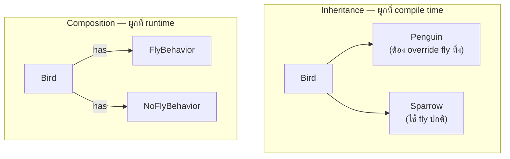

Inheritance คือเครื่องมือแรกที่คนเรียน OOP ทุกคนหลงรัก — พิมพ์ `extends` ครั้งเดียวได้ method ของ parent มาฟรีทั้งหมด แต่ปัญหาคือ inheritance สร้าง**ความผูกพันที่แน่นที่สุด**เท่าที่ OOD มีให้ ยิ่งใช้เยอะ ยิ่งเสี่ยงเจอปัญหาที่แก้ยากภายหลัง

## Is-A vs Has-A

```typescript
// Inheritance — "is-a" relationship
class Bird {
  fly(): void { console.log('บินได้') }
}
class Penguin extends Bird {}  // ← Penguin เป็น Bird แต่บินไม่ได้!

// Composition — "has-a" relationship
class FlyBehavior {
  fly(): void { console.log('บินได้') }
}
class Bird {
  constructor(private flyBehavior: FlyBehavior) {}
  performFly(): void { this.flyBehavior.fly() }
}
```

<mark class="hl-warning">`Penguin extends Bird` ดูสมเหตุสมผลตอนแรก (เพนกวินก็เป็นนกจริง) แต่พอ `Bird` มี method `fly()` ปัญหาก็โผล่ทันที — เพนกวินบินไม่ได้ แต่ต้อง inherit `fly()` มาด้วย ต้อง override ให้ throw error หรือทำอะไรแปลกๆ นี่คือสัญญาณของ**Fragile Base Class Problem**: การเปลี่ยนแปลงใน parent class (`Bird`) ส่งผลกระทบต่อ subclass ทุกตัวที่ inherit มา แม้บาง subclass จะไม่ต้องการพฤติกรรมนั้นเลยก็ตาม</mark>

## ทำไม Composition แก้ปัญหานี้ได้



<mark class="hl-insight">Composition ให้ `Bird` **มี** พฤติกรรมการบินแทนที่จะ **เป็น** สิ่งที่ต้องบิน — `Penguin` composed ด้วย `NoFlyBehavior` แทน `FlyBehavior` โดยไม่ต้อง override อะไรทิ้งเลย และที่สำคัญกว่านั้น พฤติกรรมสลับได้ที่ runtime (เปลี่ยน `flyBehavior` ตอนไหนก็ได้) ต่างจาก inheritance ที่ความสัมพันธ์ตายตัวตั้งแต่ compile time — นี่คือรากฐานของ Strategy Pattern ที่จะเรียนละเอียดในโมดูล Behavioral Design Patterns ถัดไป</mark>

## เมื่อไหร่ที่ Inheritance ยังสมเหตุสมผล

<mark class="hl-insight">"Favor composition over inheritance" ไม่ได้แปลว่าห้ามใช้ inheritance เด็ดขาด — inheritance เหมาะกับกรณีที่ความสัมพันธ์ is-a เป็นจริง**เสมอ**ไม่มีข้อยกเว้น และ subclass ทุกตัวใช้พฤติกรรมของ parent ได้ครบทุกอย่างจริงๆ โดยไม่ต้อง override ทิ้งหรือ throw error เช่น `Circle extends Shape` ที่ `Shape` มีแค่ `getArea()` เป็น abstract method ให้ subclass implement เอง ไม่มีพฤติกรรม concrete ที่ subclass บางตัวใช้ไม่ได้เลย</mark>

## สัญญาณเตือนว่าใช้ Inheritance ผิดที่

| สัญญาณ | ความหมาย |
|---|---|
| Subclass ต้อง override method แล้ว throw `NotImplementedError` | is-a ไม่จริง ควรใช้ composition แทน |
| Deep inheritance hierarchy (มากกว่า 2-3 ชั้น) | เปลี่ยนแปลงจุดใดจุดหนึ่งกระทบทุกชั้นล่าง ยากต่อการเข้าใจ |
| ต้องการเปลี่ยนพฤติกรรมที่ runtime | Inheritance ผูกที่ compile time เปลี่ยนไม่ได้ ต้องใช้ composition |
| Subclass ใช้แค่บาง method ของ parent | สัญญาณว่า parent class ทำหลายหน้าที่เกินไป (cohesion ต่ำ) |

> คำถามสัมภาษณ์: "ทำไมหลักการ 'favor composition over inheritance' ถึงเป็นที่ยอมรับกว้างขวางใน OOD ทั้งที่ inheritance เป็น feature หลักของภาษา OOP" — คำตอบที่ดีคือชี้ว่า inheritance สร้างความผูกพันที่แน่นที่สุดในบรรดาความสัมพันธ์ทั้งหมด (ผูกที่ compile time, กระทบทุก subclass เมื่อ parent เปลี่ยน) ซึ่งขัดกับเป้าหมาย low coupling ที่เรียนไปในหัวข้อ Coupling & Cohesion — composition ให้ความยืดหยุ่นมากกว่าเพราะพฤติกรรมเป็นแค่ object ที่ inject เข้ามา สลับได้ที่ runtime โดยไม่กระทบโครงสร้าง class อื่น หลักการนี้ไม่ได้บอกให้เลิกใช้ inheritance แต่ให้ใช้เฉพาะตอนที่ is-a relationship เป็นจริงแน่นอนไม่มีข้อยกเว้นเท่านั้น
