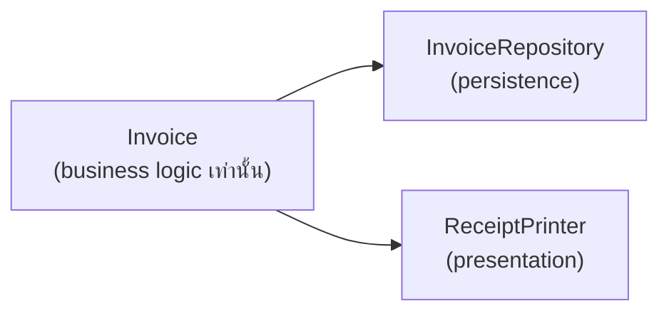

มีดพกสวิสทำได้สิบอย่างในตัวเดียว — เปิดขวด ตัดกระดาษ ไขน็อต แต่พอใบมีดหักไปอันเดียว บางทีต้องทิ้งทั้งด้าม เทียบกับกล่องเครื่องมือที่แยกเป็นชิ้นๆ เสียอันไหนเปลี่ยนอันนั้นได้เลย **SRP** กับ **OCP** คือสองหลักการแรกใน SOLID ที่ตอบคำถามเดียวกัน: **จะออกแบบยังไงให้การเปลี่ยนแปลงไม่ลามไปทั่วระบบ**

## SRP — Class ควรมีเหตุผลให้เปลี่ยนแค่เหตุผลเดียว

```typescript
// ละเมิด SRP — ทำหลายหน้าที่ที่เปลี่ยนด้วยเหตุผลต่างกัน
class Invoice {
  calculateTotal(): number { /* business logic */ }
  saveToDatabase(): void { /* persistence logic */ }
  printReceipt(): void { /* presentation logic */ }
}
```

<mark class="hl-term">**Single Responsibility Principle (SRP)**</mark> บอกว่า class ควรมี "เหตุผลให้เปลี่ยนแปลง" แค่เหตุผลเดียว — `Invoice` ข้างบนมีสามเหตุผลที่ต้องแก้: ทีม finance เปลี่ยนสูตรคำนวณภาษี, ทีม infra เปลี่ยน database, หรือทีม design เปลี่ยนรูปแบบใบเสร็จ ทั้งสามเหตุผลไม่เกี่ยวกันเลย แต่ผูกอยู่ใน class เดียว แก้เรื่องหนึ่งเสี่ยงกระทบอีกเรื่องโดยไม่ตั้งใจ

<mark class="hl-insight">คำว่า "เหตุผลเดียว" ไม่ได้แปลว่า "method เดียว" — เป็นเรื่องของ**actor หรือ stakeholder**ที่เป็นเจ้าของ logic นั้น ถ้าสอง method เปลี่ยนพร้อมกันเสมอเพราะ stakeholder เดียวกันสั่ง (เช่น `calculateSubtotal()` กับ `calculateTax()` ที่ทีม finance เป็นเจ้าของทั้งคู่) มันคือความรับผิดชอบเดียวกัน อยู่ class เดียวกันได้ — SRP คือการเชื่อมกับหัวข้อ Coupling & Cohesion ที่เรียนไปแล้ว: high cohesion หมายถึงสิ่งที่เปลี่ยนด้วยเหตุผลเดียวกันควรอยู่ด้วยกัน</mark>

## แยกความรับผิดชอบตาม SRP



## OCP — เปิดให้ขยาย ปิดไม่ให้แก้ของเดิม

```typescript
// ละเมิด OCP — เพิ่ม payment method ใหม่ต้องแก้ if-else เดิม
function processPayment(type: string, amount: number) {
  if (type === 'credit_card') { /* ... */ }
  else if (type === 'paypal') { /* ... */ }
  // เพิ่ม 'crypto' ต้องมาแก้ function นี้ เสี่ยงพัง logic เดิม
}

// ตาม OCP — เพิ่ม payment method ใหม่โดยไม่แตะโค้ดเดิม
interface PaymentMethod {
  process(amount: number): void
}
class CreditCardPayment implements PaymentMethod { process(amount: number) { /* ... */ } }
class CryptoPayment implements PaymentMethod { process(amount: number) { /* ... */ } }  // ← เพิ่มใหม่ ไม่แตะของเดิมเลย
```

<mark class="hl-term">**Open/Closed Principle (OCP)**</mark> บอกว่า module ควร**เปิดสำหรับการขยาย แต่ปิดสำหรับการแก้ไข** — เพิ่มพฤติกรรมใหม่ได้โดยไม่ต้องแก้โค้ดที่ทดสอบและใช้งานอยู่แล้ว การเขียน `if-else` ไล่ตาม type ทุกครั้งที่มี case ใหม่คือการละเมิด OCP ตรงๆ เพราะทุกครั้งที่เพิ่ม case ต้องกลับไปแก้ function เดิมที่ระบบอื่นพึ่งพาอยู่ เสี่ยงทำ regression กับ case ที่เคยทำงานถูกต้องอยู่แล้ว

<mark class="hl-warning">OCP ไม่ได้แปลว่าเขียนโค้ดครั้งแรกให้ "เผื่อขยาย" ทุกจุดตั้งแต่ต้น — การสร้าง interface และ abstraction ล่วงหน้าสำหรับ requirement ที่ยังไม่เกิดขึ้นจริงคือ over-engineering ไม่ใช่ OCP ที่ดี OCP ควรถูกนำมาใช้**ตอนที่เห็นสัญญาณว่าจุดนี้มีแนวโน้มขยายจริง** (เช่นเจอ if-else ที่โตขึ้นทุก sprint) ไม่ใช่คาดเดาล่วงหน้าทุกจุดในระบบ</mark>

## ตารางสรุป

| หลักการ | คำถามที่ตอบ | สัญญาณว่าละเมิด |
|---|---|---|
| **SRP** | Class นี้ควรมีเหตุผลให้เปลี่ยนกี่เหตุผล | Method ในคลาสเดียวกันเปลี่ยนด้วยเหตุผลที่ไม่เกี่ยวกันเลย |
| **OCP** | เพิ่มพฤติกรรมใหม่ต้องแก้โค้ดเดิมไหม | เจอ `if-else`/`switch` ที่ยาวขึ้นทุกครั้งที่มี requirement ใหม่ |

> คำถามสัมภาษณ์: "โค้ดที่เขียนตาม OCP เป๊ะๆ ตั้งแต่วันแรกของโปรเจกต์ เป็นแนวทางที่ดีเสมอไปไหม" — คำตอบที่ดีคือไม่ใช่เสมอไป OCP มีต้นทุน (ต้องสร้าง abstraction, interface เพิ่ม) ถ้าเผื่อขยายไว้ล่วงหน้าสำหรับ requirement ที่ไม่เคยเกิดขึ้นจริงคือ over-engineering ที่เพิ่มความซับซ้อนโดยไม่จำเป็น แนวทางที่ดีกว่าคือเขียนโค้ดตรงไปตรงมาก่อน แล้ว refactor ให้เป็นไปตาม OCP เมื่อเริ่มเห็นสัญญาณจริงว่าจุดนั้นมีแนวโน้มต้องขยายบ่อยๆ (เช่น YAGNI ที่ชั่งน้ำหนักกับ OCP)
