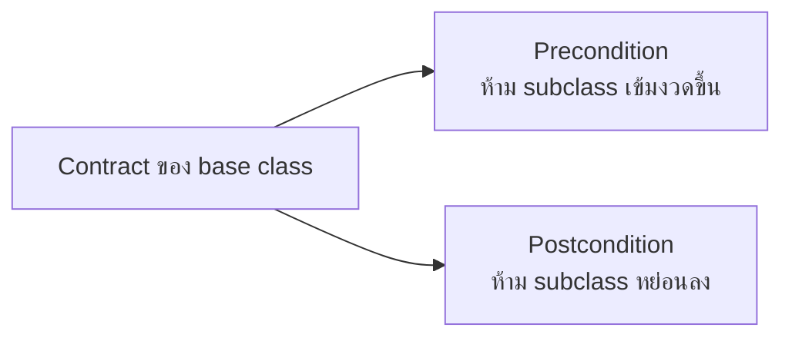

จากหัวข้อ Composition vs Inheritance — `Penguin extends Bird` ที่ต้อง override `fly()` ทิ้งเป็นปัญหาที่เรียกว่า Fragile Base Class Problem ไปแล้ว แต่จริงๆ มีชื่อเรียกที่แม่นยำกว่านั้น และมีหลักการที่อธิบายว่า**ทำไม**มันถึงผิด นั่นคือ **Liskov Substitution Principle (LSP)** ตัว "L" ใน SOLID

## นิยามที่มักเข้าใจผิด

<mark class="hl-term">**LSP**</mark> บอกว่า **subtype ต้องสามารถแทนที่ base type ได้ โดยไม่ทำให้ความถูกต้องของโปรแกรมเปลี่ยนไป** — ไม่ใช่แค่ "compile ผ่าน" หรือ "มี method ครบตาม type signature" แต่ต้อง**พฤติกรรม**ใช้แทนกันได้จริงด้วย โค้ดที่เขียนขึ้นมาทำงานกับ `Bird` ต้องทำงานถูกต้องเหมือนเดิมไม่ว่าจะส่ง `Sparrow` หรือ `Penguin` เข้าไปแทน

## ตัวอย่างคลาสสิก — Rectangle/Square

```typescript
class Rectangle {
  constructor(protected width: number, protected height: number) {}
  setWidth(w: number): void { this.width = w }
  setHeight(h: number): void { this.height = h }
  getArea(): number { return this.width * this.height }
}

class Square extends Rectangle {
  setWidth(w: number): void { this.width = w; this.height = w }  // ← ต้องบังคับให้เท่ากันเสมอ
  setHeight(h: number): void { this.width = h; this.height = h }
}

function test(rect: Rectangle) {
  rect.setWidth(5)
  rect.setHeight(4)
  console.assert(rect.getArea() === 20)  // ← พังถ้า rect เป็น Square! ได้ 16 แทน
}
```

<mark class="hl-warning">`Square` ดูเหมือน "เป็น" `Rectangle` ทางคณิตศาสตร์จริง (สี่เหลี่ยมจัตุรัสก็คือสี่เหลี่ยมผืนผ้าชนิดหนึ่ง) แต่พอ inherit มา `setWidth` ของ `Square` ต้อง**เปลี่ยนพฤติกรรม**ไปแอบบังคับ `height` ให้เท่ากันด้วย ทำให้โค้ดที่เขียนขึ้นมาโดยคาดหวังพฤติกรรมของ `Rectangle` (ตั้ง width กับ height แยกกันได้อิสระ) พังทันทีถ้าส่ง `Square` เข้าไปแทน — นี่คือการละเมิด LSP: compile ผ่าน type ตรง แต่พฤติกรรมไม่ compatible</mark>

## กฎที่แท้จริงเบื้องหลัง — Precondition และ Postcondition



<mark class="hl-insight">LSP มีรากฐานมาจากแนวคิด "design by contract" — subclass ห้าม**เข้มงวดกว่า** base class ในเงื่อนไขก่อนทำงาน (precondition) และห้าม**หย่อนกว่า** base class ในผลลัพธ์ที่รับประกัน (postcondition) `Square.setWidth` ละเมิดเพราะ postcondition ของ `Rectangle.setWidth` คือ "height ไม่เปลี่ยน" แต่ `Square.setWidth` ทำลาย postcondition นั้นไปเงียบๆ ผู้เรียกที่เชื่อ contract ของ `Rectangle` จะได้ผลลัพธ์ที่ผิดโดยไม่รู้ตัว</mark>

## ทางแก้ — อย่าบังคับความสัมพันธ์ Is-A ที่ไม่จริง

<mark class="hl-insight">ทางแก้ที่ถูกต้องไม่ใช่การ "patch" `Square` ให้พฤติกรรมตรงกับ `Rectangle` มากขึ้น แต่คือการยอมรับว่า**ความสัมพันธ์ is-a ทางคณิตศาสตร์ ไม่เท่ากับ is-a ทางพฤติกรรมของโค้ด** — ทางออกที่ตรงไปตรงมาคือไม่ให้ `Square` extends `Rectangle` เลย ทั้งสองควร implement interface `Shape` ร่วมกัน (มีแค่ `getArea()`) แทน ซึ่งเป็นแนวทางเดียวกับที่เรียนไปแล้วในหัวข้อ Composition vs Inheritance: ใช้ inheritance เฉพาะตอนที่ subclass ใช้พฤติกรรมของ parent ได้ครบจริงๆ โดยไม่ต้องเปลี่ยนความหมาย</mark>

> คำถามสัมภาษณ์: "โค้ด `Square extends Rectangle` compile ผ่านและมี method ครบตามที่ Rectangle มี ทำไมถึงยังถือว่าละเมิด LSP" — คำตอบที่ดีคือชี้ว่า LSP ไม่ได้วัดแค่ type signature ที่ compile ผ่าน แต่วัดที่**พฤติกรรม**ว่า subclass ใช้แทน base class ได้จริงในทุกจุดที่โค้ดคาดหวัง contract ของ base class ไว้หรือไม่ — `Square.setWidth` เปลี่ยนพฤติกรรมไปกระทบ `height` ด้วย ซึ่งขัดกับ postcondition เดิมของ `Rectangle.setWidth` ทำให้โค้ดที่เขียนมาทำงานกับ `Rectangle` ได้ผลลัพธ์ผิดพลาดทันทีที่ได้รับ `Square` มาแทน แม้ type จะตรงกันทุกประการก็ตาม
