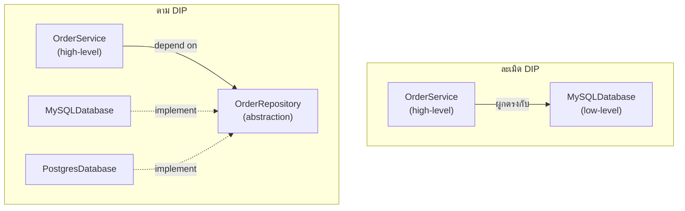

ลองนึกภาพเครื่องพิมพ์อเนกประสงค์ที่ทำได้ทั้งพิมพ์ สแกน แฟกซ์ — ถ้าต้อง implement interface `IMultiFunctionDevice` ที่มีครบทั้งสามความสามารถ แต่เครื่องพิมพ์ธรรมดาไม่มี hardware สแกนหรือแฟกซ์เลย จะเขียนโค้ดยังไง สองหลักการสุดท้ายใน SOLID ตอบคำถามเรื่อง**การออกแบบ interface**และ**ทิศทางของ dependency**

## ISP — อย่าบังคับให้ Implement สิ่งที่ไม่ได้ใช้

```typescript
// ละเมิด ISP — fat interface บังคับทุก class ต้อง implement ทุกอย่าง
interface MultiFunctionDevice {
  print(doc: Document): void
  scan(doc: Document): void
  fax(doc: Document): void
}

class BasicPrinter implements MultiFunctionDevice {
  print(doc: Document): void { /* ... */ }
  scan(doc: Document): void { throw new Error('เครื่องนี้สแกนไม่ได้') }  // ← ปัญหา
  fax(doc: Document): void { throw new Error('เครื่องนี้แฟกซ์ไม่ได้') }  // ← ปัญหา
}
```

<mark class="hl-term">**Interface Segregation Principle (ISP)**</mark> บอกว่า **client ไม่ควรถูกบังคับให้พึ่งพา method ที่ตัวเองไม่ได้ใช้** — `BasicPrinter` ต้อง implement `scan()` กับ `fax()` ทั้งที่ไม่มีความสามารถนั้นจริง ต้อง throw error ทิ้ง ซึ่งเป็นสัญญาณเดียวกับที่เรียนไปในหัวข้อ Liskov Substitution Principle ว่าถ้าโค้ดต้อง override แล้ว throw error แปลว่าความสัมพันธ์นั้นออกแบบผิดตั้งแต่แรก

```typescript
// ตาม ISP — แยก interface เล็กๆ ตามความสามารถจริง
interface Printable { print(doc: Document): void }
interface Scannable { scan(doc: Document): void }
interface Faxable { fax(doc: Document): void }

class BasicPrinter implements Printable {
  print(doc: Document): void { /* ... */ }
}
class OfficeAllInOne implements Printable, Scannable, Faxable {
  print(doc: Document): void { /* ... */ }
  scan(doc: Document): void { /* ... */ }
  fax(doc: Document): void { /* ... */ }
}
```

<mark class="hl-insight">แนวทางแก้คือแตก interface ใหญ่ให้เป็น interface เล็กๆ ตามความสามารถจริง แล้วให้แต่ละ class implement เฉพาะที่ตัวเองทำได้จริง — `BasicPrinter` implement แค่ `Printable` ไม่ต้องแตะ `scan`/`fax` เลย ส่วน `OfficeAllInOne` implement ครบทั้งสาม client ที่ต้องการแค่พิมพ์ก็ขอรับ dependency เป็น `Printable` อย่างเดียว ไม่ต้องรู้จัก `scan`/`fax` ที่ไม่เกี่ยวข้องกับตัวเองเลย</mark>

## DIP — พึ่งพา Abstraction ไม่ใช่ Concrete Implementation



<mark class="hl-term">**Dependency Inversion Principle (DIP)**</mark> บอกว่า **high-level module ไม่ควรพึ่งพา low-level module โดยตรง ทั้งคู่ควรพึ่งพา abstraction ร่วมกัน** — `OrderService` (business logic ระดับสูง) ที่ import `MySQLDatabase` (รายละเอียดการเก็บข้อมูลระดับล่าง) ตรงๆ ทำให้ business logic ผูกติดกับการตัดสินใจเรื่อง database ที่ควรเป็นรายละเอียดที่เปลี่ยนได้ ตาม DIP ทั้ง `OrderService` และ `MySQLDatabase` ควรพึ่งพา interface `OrderRepository` ร่วมกัน — สลับจาก MySQL เป็น Postgres ได้โดยไม่ต้องแตะ `OrderService` เลย

<mark class="hl-warning">DIP ไม่ได้แปลว่า "ทุก class ต้องมี interface" — การสร้าง interface ให้ทุก concrete class ทั้งที่ไม่เคยมีแผนจะสลับ implementation เลยคือ over-abstraction ที่เพิ่ม indirection โดยไม่ได้ประโยชน์จริง DIP ควรใช้ตรงจุดที่**ทิศทางการพึ่งพามีความหมายจริง** เช่น business logic ไม่ควรผูกกับรายละเอียด infrastructure (database, external API, file system) ที่มักเปลี่ยนบ่อยกว่า business rule</mark>

## ทำไม DIP เชื่อมกับ Clean Architecture ที่จะเรียนถัดไป

จากหลักการ DIP นี้เอง คือรากฐานของ Clean Architecture ที่จะเรียนในโมดูล Clean Architecture & Folder Structure — "Dependency Rule" ที่บอกว่า dependency ต้องชี้เข้าหา business logic เสมอ ไม่ใช่ชี้ออกไปหา framework หรือ database คือการนำ DIP มาประยุกต์ใช้ในระดับสถาปัตยกรรมทั้งระบบ ไม่ใช่แค่ระดับ class เดียว

## ตารางสรุป

| หลักการ | ปัญหาที่แก้ | กลไก |
|---|---|---|
| **ISP** | Interface ใหญ่บังคับ implement สิ่งที่ไม่ใช้ | แตก interface เป็นชิ้นเล็กตามความสามารถจริง |
| **DIP** | High-level logic ผูกติดกับ low-level detail | ทั้งคู่พึ่งพา abstraction ร่วมกัน ไม่ใช่พึ่งกันตรงๆ |

> คำถามสัมภาษณ์: "ทีมสร้าง interface ให้ทุก class ในระบบโดยอ้างว่าทำตาม Dependency Inversion Principle แต่ codebase ซับซ้อนขึ้นมากโดยไม่มีใครเคยสลับ implementation จริง ควรมองยังไง" — คำตอบที่ดีคือชี้ว่านี่คือการเข้าใจ DIP ผิด — DIP ไม่ได้บอกให้สร้าง interface ทุกจุด แต่บอกให้ high-level business logic ไม่ผูกติดกับ low-level implementation detail ที่มีแนวโน้มเปลี่ยนจริง การสร้าง interface ให้ทุก class โดยไม่มีเหตุผลคือ over-abstraction เพิ่ม indirection โดยไม่ได้ประโยชน์ ควรใช้ DIP เฉพาะจุดที่ทิศทางการพึ่งพามีความหมาย เช่น business logic กับ infrastructure detail ไม่ใช่ใช้พร่ำเพรื่อทุกที่
