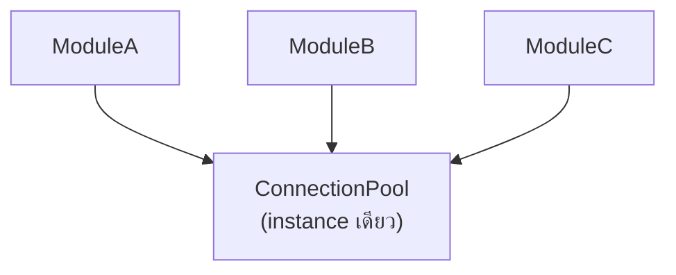

ออฟฟิศหนึ่งมีเครื่องปริ๊นเตอร์เครื่องเดียว ทุกแผนกต้องส่งงานมาที่เครื่องนี้เครื่องเดียวเท่านั้น ไม่มีทางสร้างเครื่องที่สองขึ้นมาแอบใช้ได้ — **Singleton Pattern** รับประกันสิ่งเดียวกันนี้ในโค้ด: class หนึ่งมี instance ได้แค่ตัวเดียวในทั้งระบบ แต่ pattern นี้เป็น pattern แรกที่ทุกคนเรียนและก็เป็น pattern แรกที่ถูกใช้ผิดบ่อยที่สุดเช่นกัน

## โครงสร้างพื้นฐาน

```typescript
class DatabaseConnection {
  private static instance: DatabaseConnection

  private constructor() { /* เชื่อมต่อ database */ }

  static getInstance(): DatabaseConnection {
    if (!DatabaseConnection.instance) {
      DatabaseConnection.instance = new DatabaseConnection()
    }
    return DatabaseConnection.instance
  }
}

const db1 = DatabaseConnection.getInstance()
const db2 = DatabaseConnection.getInstance()
console.log(db1 === db2)  // true — instance เดียวกันเป๊ะ
```

<mark class="hl-term">**Singleton**</mark> ทำสองอย่างพร้อมกัน: (1) ทำให้ constructor เป็น `private` ป้องกันไม่ให้ใครสร้าง instance ใหม่ตรงๆ ด้วย `new` และ (2) เก็บ instance เดียวไว้ใน static field แล้วให้ `getInstance()` เป็นจุดเข้าถึงเดียวที่คืนค่า instance เดิมเสมอ ไม่ว่าจะเรียกกี่ครั้งก็ได้ตัวเดียวกัน

## กรณีที่ Singleton สมเหตุสมผลจริง



<mark class="hl-insight">Singleton เหมาะกับทรัพยากรที่**การมีหลาย instance จะสร้างปัญหาจริง** — connection pool ที่ถ้ามีหลาย pool จะเปิด connection เกินขีดจำกัดของ database, หรือ logger ที่ต้องเขียนลง log file เดียวกันโดยไม่มี race condition ระหว่างหลาย instance แย่งกันเปิดไฟล์ กรณีเหล่านี้ "มี instance เดียว" คือ**ข้อกำหนดทางธุรกิจจริง** ไม่ใช่แค่ความสะดวกของผู้เขียนโค้ด</mark>

## ทำไม Singleton ถูกมองว่าเป็น Anti-Pattern บ่อยครั้ง

<mark class="hl-warning">ปัญหาใหญ่ของ Singleton ไม่ใช่ตัว pattern เอง แต่คือ**วิธีที่มันถูกใช้งานผิด** — `DatabaseConnection.getInstance()` ถูกเรียกจากทุกที่ในโค้ดโดยตรง ทำให้ class ที่ใช้มันมี**dependency ที่ซ่อนอยู่** ไม่ปรากฏใน constructor หรือ parameter เลย ขัดกับ Dependency Inversion Principle ที่เรียนไปแล้วในโมดูล SOLID Principles ที่บอกว่า high-level module ควรพึ่งพา abstraction ที่ inject เข้ามา ไม่ใช่เรียก concrete class ตรงๆ จากทุกที่ — ผลที่ตามมาคือ**เขียน unit test ยากมาก** เพราะ mock `DatabaseConnection` ไม่ได้ ทุก test ที่แตะ class ที่เรียก singleton จะพ่วง global state เดียวกันไปด้วย ทำให้ test แต่ละตัวไม่เป็นอิสระต่อกัน</mark>

## ทางเลือกที่ดีกว่าในระบบสมัยใหม่

| แนวทาง | ข้อดีเทียบกับ Singleton แบบเดิม |
|---|---|
| Dependency Injection (inject instance เดียวจาก container) | Test mock ได้ง่าย เพราะ dependency ปรากฏชัดใน constructor |
| Module-level instance (ในภาษาที่ module cache เอง เช่น ES Module) | ได้ "instance เดียว" โดยไม่ต้องเขียน pattern เอง ภาษาจัดการให้ |
| Scoped instance (เช่น instance เดียวต่อ request ไม่ใช่ต่อทั้งแอป) | ยืดหยุ่นกว่า ไม่ผูกเป็น global ตลอดอายุโปรแกรม |

<mark class="hl-insight">แนวทางที่นิยมในระบบสมัยใหม่คือยังคง "มี instance เดียว" ไว้ตามที่ธุรกิจต้องการจริง แต่**เปลี่ยนวิธีส่งต่อ instance นั้น**จากการเรียก static method ทั่วโค้ด มาเป็นการ inject ผ่าน constructor หรือ dependency injection container แทน — ได้ประโยชน์ของ "instance เดียว" ครบ โดยไม่เสีย testability และไม่ซ่อน dependency ไว้</mark>

> คำถามสัมภาษณ์: "ทำไม Singleton Pattern ถึงถูกมองว่าเป็น anti-pattern ในหลายบริบท ทั้งที่เป็นหนึ่งใน Gang of Four design pattern ดั้งเดิม" — คำตอบที่ดีคือชี้ว่าปัญหาไม่ได้อยู่ที่แนวคิด "มี instance เดียว" ซึ่งยังมีประโยชน์จริงในบางกรณี (connection pool, logger) แต่อยู่ที่**การเข้าถึงผ่าน global static method** ที่ทำให้ dependency ซ่อนอยู่ ไม่ปรากฏชัดใน API ของ class ที่ใช้มัน ขัดกับ Dependency Inversion Principle และทำให้ unit test ยากเพราะ mock ไม่ได้ ทางแก้ที่ดีกว่าคือยังคงรักษา instance เดียวไว้แต่ส่งผ่าน dependency injection แทนการเรียก static method ตรงๆ จากทุกจุดในโค้ด
