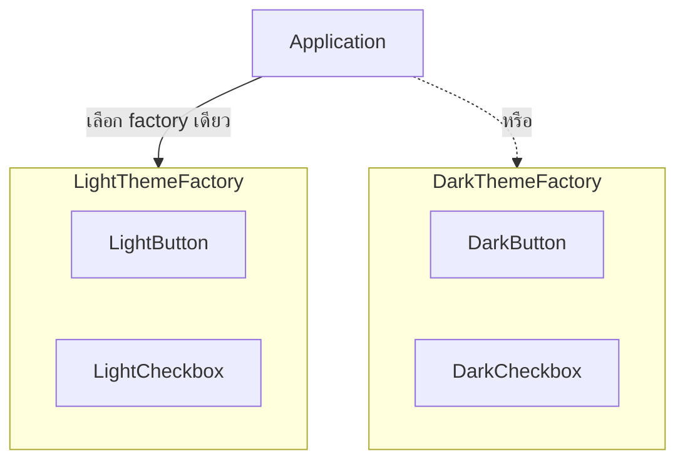

จากหัวข้อ SRP และ OCP — ตัวอย่าง `processPayment` ที่ใช้ `if-else` ไล่ตาม type แล้วถูก refactor เป็น `interface PaymentMethod` เพื่อไม่ต้องแก้โค้ดเดิมทุกครั้งที่เพิ่ม case ใหม่ นั่นแหละคือ**การใช้งาน Factory Method Pattern** ในทางปฏิบัติ เพียงแต่ตอนนั้นยังไม่ได้เรียกชื่อ pattern ตรงๆ

## Factory Method — ให้ Subclass ตัดสินใจว่าจะสร้าง Object ไหน

```typescript
interface PaymentMethod {
  process(amount: number): void
}
class CreditCardPayment implements PaymentMethod { process(amount: number) { /* ... */ } }
class CryptoPayment implements PaymentMethod { process(amount: number) { /* ... */ } }

// Factory Method — จุดเดียวที่รู้ว่าจะสร้าง concrete class ไหน
function createPaymentMethod(type: string): PaymentMethod {
  switch (type) {
    case 'credit_card': return new CreditCardPayment()
    case 'crypto': return new CryptoPayment()
    default: throw new Error(`ไม่รู้จัก payment type: ${type}`)
  }
}
```

<mark class="hl-term">**Factory Method**</mark> ย้าย logic การตัดสินใจว่าจะสร้าง concrete class ไหนมารวมไว้ที่**จุดเดียว** — โค้ดส่วนอื่นเรียก `createPaymentMethod('crypto')` โดยไม่ต้องรู้จัก `CryptoPayment` class ตรงๆ เลย เมื่อเพิ่ม payment type ใหม่ แก้แค่ใน factory function จุดเดียว โค้ดที่เรียกใช้ไม่ต้องแตะเลย — นี่คือการนำ OCP มาทำเป็นรูปธรรม: จุดที่ "ต้องแก้เมื่อมี case ใหม่" ถูกจำกัดไว้ให้แคบที่สุดเท่าที่จะทำได้

## Abstract Factory — สร้าง "ตระกูล" ของ Object ที่ต้องเข้ากันได้



```typescript
interface UIFactory {
  createButton(): Button
  createCheckbox(): Checkbox
}
class LightThemeFactory implements UIFactory {
  createButton(): Button { return new LightButton() }
  createCheckbox(): Checkbox { return new LightCheckbox() }
}
class DarkThemeFactory implements UIFactory {
  createButton(): Button { return new DarkButton() }
  createCheckbox(): Checkbox { return new DarkCheckbox() }
}
```

<mark class="hl-term">**Abstract Factory**</mark> คือ factory ที่ผลิต**object หลายชนิดที่ต้องเข้ากันได้เป็นชุดเดียว** — ถ้าเลือก `DarkThemeFactory` แล้ว `createButton()` ต้องได้ `DarkButton` เสมอ ไม่มีทางได้ `LightCheckbox` ปนมาโดยไม่ตั้งใจ เพราะทุก method ในตระกูลเดียวกันถูกผูกไว้ใน factory ตัวเดียว ต่างจาก Factory Method ที่สร้าง object ชนิดเดียว Abstract Factory สร้าง**ทั้งตระกูล**ของ object ที่ต้องสอดคล้องกัน

<mark class="hl-insight">ความแตกต่างสำคัญคือ Factory Method ตอบคำถาม "จะสร้าง object ชนิดไหน" ส่วน Abstract Factory ตอบคำถาม "จะสร้าง object หลายชนิดที่ต้องเข้ากันได้ยังไง" — ถ้าสลับ theme กลางทาง (ใช้ `LightButton` คู่กับ `DarkCheckbox`) UI จะดูไม่สอดคล้องกันทันที Abstract Factory ป้องกันปัญหานี้โดยการันตีว่าทุก object ที่สร้างจาก factory ตัวเดียวกันมาจากตระกูลเดียวกันเสมอ</mark>

## เมื่อไหร่ที่ Factory เป็นการเพิ่ม Complexity โดยไม่จำเป็น

<mark class="hl-warning">ถ้ามีแค่ concrete class เดียวที่ไม่มีแนวโน้มจะเพิ่มชนิดใหม่เลย การสร้าง factory function ห่อ `new ClassName()` ไว้คือการเพิ่ม indirection โดยไม่ได้ประโยชน์อะไร — Factory Method คุ้มค่าตอนที่**มีมากกว่าหนึ่งชนิดที่ต้องเลือกจริง**และมีแนวโน้มเพิ่มชนิดใหม่ในอนาคต ถ้าเขียน factory ให้ทุก class ตั้งแต่แรกทั้งที่ไม่เคยมี case ที่สอง คือ over-engineering เหมือนที่เรียนไปแล้วในหัวข้อ SRP และ OCP</mark>

## ตารางสรุป

| Pattern | สร้าง Object กี่ชนิด | ตัวอย่างการใช้ |
|---|---|---|
| **Factory Method** | ชนิดเดียวต่อการเรียก แต่เลือกได้หลาย concrete class | เลือก payment method, เลือก notification channel |
| **Abstract Factory** | หลายชนิดพร้อมกันเป็นตระกูลที่ต้องเข้ากันได้ | UI theme (button + checkbox ชุดเดียวกัน), database driver family |

> คำถามสัมภาษณ์: "Factory Method กับ Abstract Factory ต่างกันยังไง เมื่อไหร่ควรใช้แบบไหน" — คำตอบที่ดีคือชี้ว่า Factory Method เหมาะเมื่อต้องเลือกสร้าง object ชนิดเดียวจากหลายตัวเลือก (เช่น payment method) โดยย้าย logic การตัดสินใจไว้จุดเดียวตาม OCP ส่วน Abstract Factory เหมาะเมื่อต้องสร้าง object**หลายชนิดพร้อมกัน**ที่ต้องเข้ากันได้เป็นตระกูลเดียว เช่น UI component ของ theme เดียวกัน การเลือกใช้ผิดฝั่ง เช่น ใช้ Factory Method เดี่ยวๆ กับกรณีที่ต้องการความสอดคล้องกันของ object หลายชนิด จะเสี่ยงได้ component จากคนละ theme มาปนกันโดยไม่มีอะไรป้องกัน
