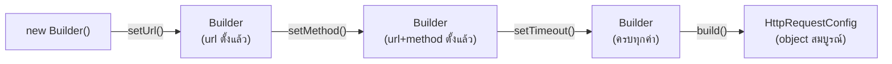

ลองสั่งแซนด์วิชแบบกำหนดเองที่ร้าน — เลือกขนมปัง เลือกเนื้อสัตว์ เลือกผัก เลือกซอส บางอย่างเลือกก็ได้ไม่เลือกก็ได้ ลองนึกภาพถ้าต้องเขียนเป็น constructor ที่รับทุก parameter พร้อมกันในลำดับที่ต้องจำให้แม่น — นั่นคือปัญหาที่ **Builder Pattern** ถูกออกแบบมาแก้โดยเฉพาะ

## ปัญหา — Telescoping Constructor

```typescript
// Telescoping constructor — parameter เยอะ จำลำดับไม่ได้ ส่วนไหน optional ก็ไม่ชัด
class HttpRequest {
  constructor(
    url: string,
    method: string,
    headers?: Record<string, string>,
    body?: string,
    timeout?: number,
    retries?: number,
    followRedirects?: boolean,
  ) { /* ... */ }
}

new HttpRequest('/api/users', 'POST', undefined, undefined, 5000, 3, true)
// ← undefined สองตัวคืออะไร ต้องนับตำแหน่งเอา อ่านไม่รู้เรื่องเลย
```

<mark class="hl-warning">**Telescoping Constructor**</mark> คืออาการที่ constructor รับ parameter จำนวนมาก บาง parameter เป็น optional ทำให้ตอนเรียกใช้ต้องใส่ `undefined` คั่นตำแหน่งที่ไม่ต้องการ อ่านโค้ดไม่ออกว่าค่าตำแหน่งไหนคืออะไร และเสี่ยงส่งผิดลำดับโดยไม่มี compiler เตือน (ถ้า type ตรงกันบังเอิญ เช่นสอง parameter เป็น `number` ทั้งคู่)

## Builder — สร้างทีละขั้น อ่านง่าย ปลอดภัยกว่า

```typescript
class HttpRequestBuilder {
  private request: Partial<HttpRequestConfig> = {}

  setUrl(url: string): this { this.request.url = url; return this }
  setMethod(method: string): this { this.request.method = method; return this }
  setHeader(key: string, value: string): this {
    this.request.headers = { ...this.request.headers, [key]: value }
    return this
  }
  setTimeout(ms: number): this { this.request.timeout = ms; return this }
  build(): HttpRequestConfig {
    if (!this.request.url) throw new Error('url จำเป็นต้องระบุ')
    return this.request as HttpRequestConfig
  }
}

const req = new HttpRequestBuilder()
  .setUrl('/api/users')
  .setMethod('POST')
  .setTimeout(5000)
  .build()
```

<mark class="hl-term">**Builder**</mark> แยกกระบวนการ**สร้าง**ทีละขั้น (`setUrl`, `setMethod`, ...) ออกจาก**ผลลัพธ์**สุดท้าย (`build()` ที่คืน object พร้อมใช้) — แต่ละ method ตั้งชื่อชัดเจนว่ากำลังกำหนดค่าอะไร ไม่ต้องนับตำแหน่ง parameter อีกต่อไป และ`build()`คือจุดเดียวที่ตรวจสอบว่า object ที่สร้างเสร็จแล้วถูกต้องครบถ้วนตาม invariant ก่อนส่งออกไปใช้งานจริง — เชื่อมกับหัวข้อ Encapsulation ที่เรียนไปแล้วว่าการ validate ควรอยู่ที่จุดเดียวที่ข้อมูลถูกสร้าง/แก้ไข

## Builder Chaining ทำงานยังไง



<mark class="hl-insight">การ return `this` ในทุก setter method (method chaining / fluent interface) ทำให้เรียกต่อกันเป็นประโยคอ่านง่ายได้ — แต่ประโยชน์ที่แท้จริงไม่ใช่แค่ syntax สวยงาม คือ**การเลื่อน validation ไปที่จุดเดียว** (`build()`) แทนที่จะ validate ทุกครั้งที่ตั้งค่าแต่ละ field ทำให้สร้าง object ที่ยังไม่สมบูรณ์ระหว่างทางได้อย่างอิสระ โดยรับประกันว่า object สุดท้ายที่ได้จาก `build()` ถูกต้องครบถ้วนเสมอ</mark>

## เมื่อไหร่ Builder คุ้มค่า เมื่อไหร่ไม่คุ้ม

<mark class="hl-warning">Builder เหมาะกับ object ที่มี field จำนวนมาก (มากกว่า 4-5 ตัว) โดยหลายตัวเป็น optional หรือมี validation ที่ซับซ้อนตอนสร้าง — ถ้า object มีแค่ 2-3 field ที่ required ทั้งหมด การสร้าง Builder class แยกต่างหากคือการเพิ่ม boilerplate โดยไม่ได้ประโยชน์ ใช้ constructor ธรรมดาหรือ object literal ตรงไปตรงมาย่อมดีกว่า — เหมือนหลักการ "shortest working diff" ที่ใช้ทั่วไปในการออกแบบ: ใช้ pattern ตอนที่ปัญหาที่มันแก้เกิดขึ้นจริงเท่านั้น</mark>

> คำถามสัมภาษณ์: "ทีมเขียน Builder Pattern ให้กับ object ที่มีแค่ 2 field ที่ required ทั้งคู่ ไม่มี optional เลย ควรมองยังไง" — คำตอบที่ดีคือชี้ว่า Builder Pattern แก้ปัญหา telescoping constructor ที่เกิดจาก parameter จำนวนมากและหลายตัวเป็น optional object ที่มีแค่ 2 field required ทั้งคู่ไม่มีปัญหานี้ตั้งแต่แรก constructor ธรรมดารับ 2 parameter ก็อ่านง่ายและปลอดภัยพอแล้ว การใช้ Builder ในกรณีนี้คือการเพิ่ม boilerplate (ต้องเขียน Builder class, setter method หลายตัว) โดยไม่ได้ประโยชน์ตอบแทน ควรใช้ pattern ที่ตรงกับขนาดของปัญหาจริง ไม่ใช่ใช้เพราะเป็น pattern ที่ "ดูเป็นมืออาชีพ"
