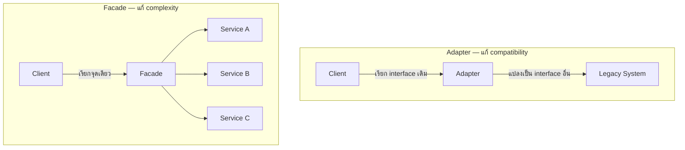

ปลั๊กไฟไทยเสียบเต้าเสียบยุโรปไม่ได้ตรงๆ ต้องมี adapter แปลงหัวปลั๊กมาคั่นกลาง — ขณะที่พนักงานต้อนรับโรงแรมเป็นจุดติดต่อจุดเดียวที่ประสานงานแทนคุณกับทุกแผนก (ทำความสะอาด รูมเซอร์วิส สปา) โดยไม่ต้องโทรหาแต่ละแผนกเอง **Adapter** กับ **Facade** ต่างก็ "ห่อ" อะไรบางอย่างไว้ แต่แก้ปัญหาคนละแบบ

## Adapter — แปลง Interface ที่เข้ากันไม่ได้ให้เข้ากันได้

```typescript
// Interface เก่าที่ client คาดหวัง
interface PaymentGateway {
  charge(amountInCents: number): void
}

// Library ภายนอกที่ interface ไม่ตรงกันเลย
class LegacyBillingSystem {
  processPaymentInDollars(dollars: number, cents: number): void { /* ... */ }
}

// Adapter — แปลง interface ให้ client ใช้ได้เหมือนเดิม
class LegacyBillingAdapter implements PaymentGateway {
  constructor(private legacy: LegacyBillingSystem) {}
  charge(amountInCents: number): void {
    const dollars = Math.floor(amountInCents / 100)
    const cents = amountInCents % 100
    this.legacy.processPaymentInDollars(dollars, cents)
  }
}
```

<mark class="hl-term">**Adapter**</mark> แก้ปัญหา**ความเข้ากันไม่ได้ของ interface** — `LegacyBillingSystem` มี method ที่รูปแบบไม่ตรงกับที่โค้ดส่วนที่เหลือคาดหวัง (`PaymentGateway.charge`) Adapter ทำหน้าที่แปลงการเรียกจาก interface หนึ่งไปยังอีก interface หนึ่งโดยไม่ต้องแก้โค้ดฝั่งไหนเลย ทั้ง `LegacyBillingSystem` เดิมและโค้ดที่เรียก `PaymentGateway` อยู่แล้ว — ใช้บ่อยตอนรวม library ภายนอกหรือระบบเก่าเข้ากับโค้ดใหม่ที่ออกแบบ interface ไว้ต่างกัน

## Facade — ให้ทางเข้าเดียวสู่ระบบที่ซับซ้อน

```typescript
// Subsystem ที่ซับซ้อน มีหลาย service ต้องประสานงานกัน
class InventoryService { reserve(sku: string): void { /* ... */ } }
class PaymentService { charge(amount: number): void { /* ... */ } }
class ShippingService { schedule(address: string): void { /* ... */ } }
class NotificationService { sendConfirmation(email: string): void { /* ... */ } }

// Facade — จุดเดียวที่ client ต้องคุยด้วย
class OrderFacade {
  constructor(
    private inventory: InventoryService,
    private payment: PaymentService,
    private shipping: ShippingService,
    private notification: NotificationService,
  ) {}

  placeOrder(sku: string, amount: number, address: string, email: string): void {
    this.inventory.reserve(sku)
    this.payment.charge(amount)
    this.shipping.schedule(address)
    this.notification.sendConfirmation(email)
  }
}
```

<mark class="hl-term">**Facade**</mark> แก้ปัญหา**ความซับซ้อนในการใช้งานระบบที่มีหลายส่วนประสานกัน** — client ที่ต้องการสั่งซื้อสินค้าไม่ต้องรู้จักหรือเรียก 4 service แยกกันเองตามลำดับที่ถูกต้อง แค่เรียก `orderFacade.placeOrder(...)` ครั้งเดียว `OrderFacade` เป็นคนจัดการลำดับการเรียกและ coordination ที่ซับซ้อนไว้ภายใน

## ความต่างที่แท้จริง



<mark class="hl-insight">Adapter มีอยู่เพราะ**interface สองฝั่งไม่ตรงกัน** (ปัญหาความเข้ากันได้) ส่วน Facade มีอยู่เพราะ**ระบบข้างหลังซับซ้อนเกินไปสำหรับ client ทั่วไป** (ปัญหาความง่ายในการใช้งาน) — Adapter มักคั่นระหว่าง 2 interface ที่มีอยู่แล้วโดยไม่ได้ลดจำนวน service ที่ต้องเรียก ส่วน Facade รวมหลาย service เข้าเป็นจุดเรียกเดียว ทั้งสอง pattern ไม่ได้เปลี่ยนพฤติกรรมของระบบข้างใน แค่เปลี่ยนวิธีที่ client มองเห็นและเข้าถึงมันเท่านั้น</mark>

## ข้อควรระวัง — Facade ไม่ใช่ทางแก้ปัญหาการออกแบบที่แย่

<mark class="hl-warning">Facade ที่ดีควรเป็น**ทางเลือกเสริม**ให้ client ที่ต้องการความง่าย ไม่ใช่**ข้อบังคับ**ที่ปิดกั้นไม่ให้เรียก service ย่อยตรงๆ เมื่อจำเป็น — ถ้าใช้ Facade เพื่อซ่อนว่าระบบข้างหลังมี coupling สูงเกินไประหว่าง service ต่างๆ โดยไม่แก้ที่ต้นตอ (จากหัวข้อ Coupling & Cohesion) ปัญหาที่แท้จริงยังอยู่เหมือนเดิม แค่มองไม่เห็นจากภายนอกเท่านั้น Facade ควรใช้ลด**ความยุ่งยากในการเรียกใช้** ไม่ใช่ปิดบัง**ความยุ่งเหยิงในการออกแบบ**</mark>

> คำถามสัมภาษณ์: "Adapter กับ Facade ทั้งคู่ห่อ object อื่นไว้และ expose interface ใหม่ให้ client เรียก ต่างกันยังไงจริงๆ" — คำตอบที่ดีคือชี้ว่า Adapter แก้ปัญหา**ความเข้ากันไม่ได้ของ interface** ระหว่าง 2 ระบบที่มีอยู่แล้ว (มักมี 1 ต่อ 1 กับสิ่งที่ wrap) ส่วน Facade แก้ปัญหา**ความซับซ้อนในการใช้งาน**ระบบที่มีหลายส่วนประสานกัน (มักรวมหลาย service เข้าเป็นจุดเดียว) Adapter ตอบคำถาม "ทำยังไงให้สองสิ่งที่ interface ไม่ตรงกันทำงานร่วมกันได้" ส่วน Facade ตอบคำถาม "ทำยังไงให้ client ใช้ระบบที่ซับซ้อนได้ง่ายขึ้น" เป็นปัญหาคนละมิติกันแม้จะมีรูปแบบการห่อ object คล้ายกัน
