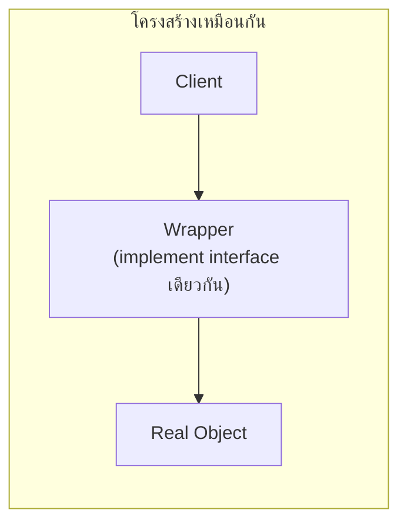

กาแฟดำแก้วเปล่าใส่นมเพิ่มได้ ใส่ไซรัปเพิ่มได้ ใส่วิปครีมเพิ่มได้ — แต่ละอย่างห่อทับกันเป็นชั้นๆ โดยไม่ต้องเปลี่ยนสูตรกาแฟดำเดิมเลย ขณะที่ยามหน้าประตูอาคารตรวจบัตรก่อนให้เข้า — ยามไม่ได้เปลี่ยนสิ่งที่อยู่ข้างในอาคาร แค่ควบคุมว่าใครเข้าได้บ้าง **Decorator** กับ **Proxy** ทั้งคู่ "ห่อ" object ที่มี interface เดียวกันไว้ แต่เจตนาต่างกันโดยสิ้นเชิง

## Decorator — เพิ่มพฤติกรรมทีละชั้นโดยไม่แก้ Class เดิม

```typescript
interface NotificationSender {
  send(message: string): void
}

class EmailSender implements NotificationSender {
  send(message: string): void { console.log(`ส่งอีเมล: ${message}`) }
}

// Decorator — implement interface เดียวกัน ห่อ object เดิม เพิ่มพฤติกรรม
class LoggingDecorator implements NotificationSender {
  constructor(private wrapped: NotificationSender) {}
  send(message: string): void {
    console.log(`[LOG] กำลังส่ง: ${message}`)
    this.wrapped.send(message)
    console.log(`[LOG] ส่งสำเร็จ`)
  }
}

class RetryDecorator implements NotificationSender {
  constructor(private wrapped: NotificationSender, private maxRetries: number) {}
  send(message: string): void {
    for (let i = 0; i < this.maxRetries; i++) {
      try { this.wrapped.send(message); return }
      catch (e) { if (i === this.maxRetries - 1) throw e }
    }
  }
}

const sender = new LoggingDecorator(new RetryDecorator(new EmailSender(), 3))
```

<mark class="hl-term">**Decorator**</mark> ห่อ object เดิมด้วย object ใหม่ที่ implement interface เดียวกัน แล้ว**เพิ่มพฤติกรรม**ก่อนหรือหลังเรียก method ของ object ที่ห่อไว้ — `LoggingDecorator` กับ `RetryDecorator` ซ้อนกันได้อย่างอิสระ ผสมกี่ชั้นก็ได้ตามต้องการ โดยไม่ต้องแก้ `EmailSender` เลยแม้แต่บรรทัดเดียว นี่คือรูปธรรมของหลักการ "favor composition over inheritance" ที่เรียนไปแล้วในโมดูล OOD Fundamentals: แทนที่จะสร้าง subclass `LoggingEmailSender`, `RetryEmailSender`, `LoggingRetryEmailSender` แยกกันเป็นสิบคลาส Decorator ให้ผสมพฤติกรรมที่ runtime ได้เลย

## Proxy — ควบคุมการเข้าถึง Object จริง โดยไม่เปลี่ยนพฤติกรรม

```typescript
interface ImageLoader {
  display(): void
}

class RealImage implements ImageLoader {
  constructor(private path: string) {
    this.loadFromDisk()  // โหลดไฟล์หนักตอนสร้างเลย
  }
  private loadFromDisk(): void { console.log(`โหลดไฟล์ ${this.path} จาก disk (ช้า)`) }
  display(): void { console.log(`แสดงรูป ${this.path}`) }
}

// Proxy — ยังไม่โหลดไฟล์จนกว่าจะเรียก display() จริง (lazy loading)
class ImageProxy implements ImageLoader {
  private realImage: RealImage | null = null
  constructor(private path: string) {}
  display(): void {
    if (!this.realImage) this.realImage = new RealImage(this.path)  // โหลดตอนใช้จริงเท่านั้น
    this.realImage.display()
  }
}
```

<mark class="hl-term">**Proxy**</mark> implement interface เดียวกับ object จริง (`RealImage`) แต่ไม่ได้เพิ่มพฤติกรรมใหม่ — แค่**ควบคุมว่าจะเข้าถึง object จริงเมื่อไหร่และยังไง** `ImageProxy` เลื่อนการโหลดไฟล์หนักออกไปจนกว่าจะเรียกใช้จริง (lazy loading) รูปแบบอื่นของ Proxy ยังใช้ทำ access control (เช็คสิทธิ์ก่อนอนุญาตเรียก), caching (คืนผลลัพธ์เก่าแทนเรียกซ้ำ), หรือ remote proxy (คุยกับ object ที่อยู่เครื่องอื่นราวกับเป็น local object)

## ทำไม Decorator กับ Proxy ดูเหมือนกันมากในโค้ด



<mark class="hl-insight">ในระดับโครงสร้างโค้ด Decorator กับ Proxy แทบเหมือนกันเป๊ะ — ทั้งคู่ implement interface เดียวกับ object ที่ห่อไว้ และ delegate การเรียกไปยัง object นั้น ความต่างอยู่ที่**เจตนา**ล้วนๆ: Decorator มีเจตนา**เพิ่มความสามารถ**ให้ object (object ทำงานได้มากขึ้นกว่าเดิม) ส่วน Proxy มีเจตนา**ควบคุมการเข้าถึง** object (object ทำงานเหมือนเดิมทุกอย่าง แค่มีเงื่อนไขว่าจะเข้าถึงเมื่อไหร่/ยังไง) เวลาอ่านโค้ดที่ wrap object ไว้ ให้ถามว่า "นี่เพิ่มความสามารถ หรือแค่คุมการเข้าถึง" เพื่อเข้าใจเจตนาที่แท้จริง</mark>

<mark class="hl-warning">ข้อควรระวังคือการซ้อน Decorator หลายชั้นเกินไป (5-6 ชั้นขึ้นไป) ทำให้ debug ยากมาก เพราะ error stack trace จะไล่ผ่านทุกชั้น decorator ก่อนถึง object จริง ควรซ้อนเท่าที่จำเป็นจริง และตั้งชื่อ decorator ให้สื่อความหมายชัดเจนว่าแต่ละชั้นเพิ่มอะไร</mark>

## ตารางสรุป

| Pattern | เจตนา | ผลลัพธ์ต่อ object |
|---|---|---|
| **Decorator** | เพิ่มความสามารถ | Object ทำงานได้มากขึ้นกว่าเดิม |
| **Proxy** | ควบคุมการเข้าถึง | Object ทำงานเหมือนเดิม แค่มีเงื่อนไขการเข้าถึง |

> คำถามสัมภาษณ์: "โค้ด class หนึ่ง implement interface เดียวกับ object ที่มันห่อไว้ แล้ว delegate เกือบทุก method ไปยัง object นั้น จะรู้ได้ยังไงว่าเป็น Decorator หรือ Proxy" — คำตอบที่ดีคือชี้ว่าโครงสร้างโค้ดของทั้งสอง pattern เหมือนกันมาก ต้องดูที่**เจตนา**แทน ถ้า class นั้นเพิ่มพฤติกรรมใหม่เข้าไป (logging, retry, validation เพิ่มเติม) ก่อนหรือหลังเรียก method เดิม นั่นคือ Decorator แต่ถ้า class นั้นแค่ควบคุมว่าจะเรียก object จริงเมื่อไหร่หรือยังไง (lazy loading, access control, caching) โดยพฤติกรรมสุดท้ายเหมือนเดิมทุกประการ นั่นคือ Proxy การแยกสองอย่างนี้ช่วยให้อ่านโค้ดคนอื่นและตัดสินใจออกแบบได้ตรงจุดขึ้น
