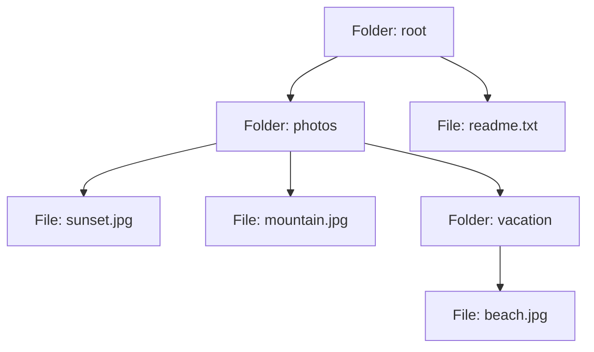

Folder ในเครื่องคอมพิวเตอร์มีทั้งไฟล์เดี่ยวๆ และ folder ย่อยที่ซ้อนกันได้ไม่จำกัดชั้น — เวลาถาม "ขนาดของ folder นี้เท่าไหร่" ต้องบวกขนาดไฟล์ทุกไฟล์ รวมถึงไฟล์ใน folder ย่อยที่ซ้อนอยู่ข้างในด้วย ระบบไฟล์ตอบคำถามนี้ได้อย่างสวยงามเพราะออกแบบมาให้**ไฟล์เดี่ยวและ folder ถูกถามคำถามเดียวกันได้เหมือนกัน** — นี่คือแก่นของ **Composite Pattern**

## โครงสร้าง Component ร่วมกัน

```typescript
interface FileSystemItem {
  getSize(): number
  getName(): string
}

// Leaf — ไม่มีลูก เป็นหน่วยที่เล็กที่สุด
class File implements FileSystemItem {
  constructor(private name: string, private size: number) {}
  getSize(): number { return this.size }
  getName(): string { return this.name }
}

// Composite — มีลูกได้ ซึ่งลูกเป็นได้ทั้ง File หรือ Folder อีกที
class Folder implements FileSystemItem {
  private children: FileSystemItem[] = []
  constructor(private name: string) {}
  add(item: FileSystemItem): void { this.children.push(item) }
  getSize(): number {
    return this.children.reduce((sum, child) => sum + child.getSize(), 0)  // ← เรียกซ้ำ recursive
  }
  getName(): string { return this.name }
}
```

```typescript
const photos = new Folder('photos')
photos.add(new File('sunset.jpg', 2_000_000))
photos.add(new File('mountain.jpg', 3_500_000))

const root = new Folder('root')
root.add(photos)
root.add(new File('readme.txt', 1_000))

console.log(root.getSize())  // บวกทุกไฟล์ทุกชั้นอัตโนมัติ ไม่ต้องเขียน loop แยก
```

<mark class="hl-term">**Composite**</mark> ให้ `File` (leaf — ไม่มีลูก) และ `Folder` (composite — มีลูกได้) implement interface เดียวกัน (`FileSystemItem`) — ผลลัพธ์คือ**client เรียก `getSize()` แบบเดียวกันได้ไม่ว่าจะเป็นไฟล์เดี่ยวหรือ folder ทั้งต้นไม้** ไม่ต้องเช็คว่า "นี่คือไฟล์หรือ folder" ก่อนแล้วค่อยเขียน logic ต่างกันสองแบบ

## Tree Structure ที่ซ้อนได้ไม่จำกัดชั้น



<mark class="hl-insight">ความสวยงามของ Composite คือ `Folder.getSize()` เรียก `child.getSize()` แบบ recursive โดยไม่สนใจว่า `child` แต่ละตัวเป็น `File` หรือ `Folder` ย่อยอีกที — ไม่ว่าต้นไม้จะลึกกี่ชั้น โค้ดเดิมทำงานถูกต้องเสมอ เพราะทุก node ไม่ว่าจะเป็น leaf หรือ composite ล้วนคุยผ่าน interface `FileSystemItem` เดียวกัน client (โค้ดที่เรียก `root.getSize()`) ไม่จำเป็นต้องรู้โครงสร้างต้นไม้ข้างในเลยแม้แต่น้อย</mark>

## ข้อถกเถียง — Leaf ควรมี method `add()` ไหม

```typescript
// แนวทางที่ 1: Transparent — File ก็มี add() แต่ throw error
class File implements FileSystemItem {
  add(item: FileSystemItem): void { throw new Error('File เพิ่มลูกไม่ได้') }  // ← มี method ที่ไม่ทำอะไรจริง
}

// แนวทางที่ 2: Safe — แยก interface composite ต่างหาก ไม่บังคับ leaf ต้องมี add()
interface FileSystemItem { getSize(): number }
interface Container extends FileSystemItem { add(item: FileSystemItem): void }
```

<mark class="hl-warning">นี่คือจุดที่ Composite ปะทะกับ Interface Segregation Principle ที่เรียนไปแล้วในโมดูล SOLID Principles โดยตรง — ถ้าให้ `FileSystemItem` มี `add()` ด้วย (แนวทาง "transparent") `File` ต้อง implement `add()` ที่ throw error ทิ้ง เหมือนปัญหา `Penguin.fly()` ที่เจอมาแล้ว แต่ถ้าแยก interface `Container` ออกมาต่างหาก (แนวทาง "safe") client ต้องเช็ค type ก่อนเรียก `add()` เสียความสวยงามของการปฏิบัติแบบเดียวกันไป — ไม่มีทางเลือกไหนถูกเสมอ ต้องชั่งน้ำหนักระหว่างความสะดวกของ client (transparent) กับความปลอดภัยของ type (safe) ตามบริบทจริงของระบบ</mark>

> คำถามสัมภาษณ์: "ทำไม Composite Pattern มักถูกยกมาเป็นตัวอย่างที่ปะทะกับ Interface Segregation Principle" — คำตอบที่ดีคือชี้ว่า Composite ต้องการให้ leaf (เช่น File) และ composite (เช่น Folder) ใช้ interface เดียวกันเพื่อให้ client ปฏิบัติต่อทั้งสองแบบเดียวกันได้ (uniformity) แต่ method บางตัวอย่าง `add()`/`remove()` มีความหมายแค่กับ composite เท่านั้น ถ้าใส่ไว้ใน interface ร่วม leaf ต้อง implement แล้ว throw error ทิ้ง ขัดกับ ISP ที่บอกว่า client ไม่ควรถูกบังคับพึ่งพา method ที่ตัวเองไม่ได้ใช้ ทางแก้คือเลือกแยก interface สำหรับ container ต่างหาก (safe) โดยยอมเสียความสะดวกในการเรียกแบบเดียวกันทุกจุดไปบ้าง เพื่อแลกกับ type safety ที่ถูกต้องกว่า
