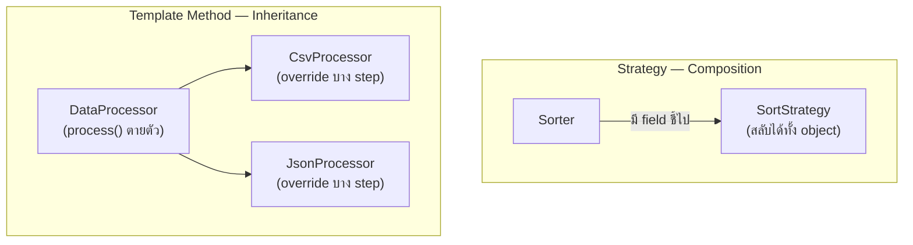

จากหัวข้อ Composition vs Inheritance — ตัวอย่าง `Bird` ที่มี `FlyBehavior` เป็น field แทนที่จะ inherit พฤติกรรมการบินมา ถูกทิ้งท้ายไว้ว่า "นี่คือรากฐานของ Strategy Pattern" ถึงเวลาแล้วที่จะเรียนแบบเต็มรูปแบบ พร้อมกับ pattern พี่น้องที่แก้ปัญหาคล้ายกันแต่ใช้กลไกตรงข้ามกันเป๊ะ: **Template Method**

## Strategy — สลับอัลกอริทึมทั้งชุดด้วย Composition

```typescript
interface SortStrategy {
  sort(data: number[]): number[]
}
class QuickSort implements SortStrategy {
  sort(data: number[]): number[] { /* quicksort logic */ return data }
}
class BubbleSort implements SortStrategy {
  sort(data: number[]): number[] { /* bubble sort logic */ return data }
}

class Sorter {
  constructor(private strategy: SortStrategy) {}
  setStrategy(strategy: SortStrategy): void { this.strategy = strategy }  // สลับได้ที่ runtime
  execute(data: number[]): number[] { return this.strategy.sort(data) }
}

const sorter = new Sorter(new QuickSort())
sorter.execute([5, 2, 8, 1])
sorter.setStrategy(new BubbleSort())  // เปลี่ยนอัลกอริทึมทั้งชุดโดยไม่แก้ Sorter เลย
```

<mark class="hl-term">**Strategy**</mark> encapsulate อัลกอริทึม**ทั้งชุด**ไว้เป็น object แยก แล้วให้ `Sorter` ถือ reference ไปยัง strategy นั้นผ่าน composition — สลับ `QuickSort` เป็น `BubbleSort` ได้ที่ runtime โดยไม่ต้องแก้ `Sorter` แม้แต่บรรทัดเดียว ตรงกับหลักการ OCP ที่เรียนไปแล้ว: เพิ่มอัลกอริทึมใหม่แค่เพิ่ม class ใหม่ implement `SortStrategy`

## Template Method — กำหนดโครงตายตัว ให้ Override แค่บางขั้นตอน

```typescript
abstract class DataProcessor {
  // Template method — ควบคุมลำดับขั้นตอนตายตัว ห้าม override
  process(): void {
    const raw = this.extract()
    const transformed = this.transform(raw)
    this.load(transformed)
  }
  protected abstract extract(): string
  protected abstract transform(raw: string): object
  protected load(data: object): void { console.log('บันทึกลง database', data) }  // มี default ให้ override ได้
}

class CsvProcessor extends DataProcessor {
  protected extract(): string { return 'อ่านไฟล์ CSV' }
  protected transform(raw: string): object { return { type: 'csv', raw } }
}
class JsonProcessor extends DataProcessor {
  protected extract(): string { return 'อ่านไฟล์ JSON' }
  protected transform(raw: string): object { return { type: 'json', raw } }
}
```

<mark class="hl-term">**Template Method**</mark> กำหนด**ลำดับขั้นตอน**ของอัลกอริทึมไว้ตายตัวใน method เดียว (`process()`) แล้วให้ subclass override เฉพาะบางขั้นตอนย่อย (`extract`, `transform`) ผ่าน inheritance — `CsvProcessor` กับ `JsonProcessor` ใช้ลำดับ extract → transform → load เหมือนกันเป๊ะ ต่างกันแค่รายละเอียดการ extract/transform เท่านั้น

## ความต่างที่กลไกคนละขั้ว



<mark class="hl-insight">ทั้งสอง pattern แก้ปัญหาเดียวกันคือ "ทำยังไงให้ส่วนหนึ่งของอัลกอริทึมเปลี่ยนได้ ส่วนที่เหลือคงเดิม" แต่ใช้กลไกตรงข้ามกัน — Strategy ใช้**composition**เปลี่ยน**อัลกอริทึมทั้งชุด**ได้ที่ runtime (ยืดหยุ่นกว่า) ส่วน Template Method ใช้**inheritance**เปลี่ยนแค่**บางขั้นตอนย่อย**โดยลำดับหลักตายตัวตั้งแต่ compile time (เข้าใจง่ายกว่าเพราะลำดับ fix ไว้ให้แล้ว) เลือกใช้ตัวไหนขึ้นอยู่กับว่าต้องการความยืดหยุ่นระดับ "ทั้งอัลกอริทึม" หรือแค่ "บางขั้นตอน"</mark>

<mark class="hl-warning">เพราะ Template Method พึ่งพา inheritance จึงมีความเสี่ยงแบบเดียวกับที่เรียนไปแล้วในหัวข้อ Liskov Substitution Principle — ถ้า subclass override ขั้นตอนใดขั้นตอนหนึ่งแล้วทำลาย invariant ที่ template method คาดหวังไว้ (เช่น `load()` ที่ override แล้วไม่บันทึกอะไรเลยทั้งที่ `process()` คาดหวังว่าข้อมูลจะถูกบันทึกเสมอ) จะเกิดปัญหาแบบเดียวกับ Fragile Base Class Problem ควรพิจารณา Strategy แทนถ้าต้องการความยืดหยุ่นสูงและกังวลเรื่องนี้</mark>

## ตารางสรุป

| Pattern | กลไก | เปลี่ยนอะไรได้ |
|---|---|---|
| **Strategy** | Composition | อัลกอริทึมทั้งชุด สลับได้ที่ runtime |
| **Template Method** | Inheritance | บางขั้นตอนย่อย ลำดับหลักตายตัวตั้งแต่ compile time |

> คำถามสัมภาษณ์: "Strategy กับ Template Method ต่างกันยังไง เมื่อไหร่ควรเลือกใช้แบบไหน" — คำตอบที่ดีคือชี้ว่าทั้งสองแก้ปัญหา "ทำให้บางส่วนของอัลกอริทึมเปลี่ยนแปลงได้" เหมือนกัน แต่ Strategy ใช้ composition สลับอัลกอริทึมทั้งชุดได้ที่ runtime เหมาะกับกรณีที่ต้องการความยืดหยุ่นสูงหรือมีแนวโน้มเพิ่มอัลกอริทึมใหม่บ่อย ส่วน Template Method ใช้ inheritance override แค่บางขั้นตอนย่อยโดยลำดับหลักตายตัว เหมาะกับกรณีที่ลำดับขั้นตอนควรเหมือนกันเสมอในทุก subclass ต่างกันแค่รายละเอียดบางจุด การเลือกผิดจะทำให้เสียความยืดหยุ่นที่ต้องการ (เลือก Template Method ทั้งที่ต้องการเปลี่ยนอัลกอริทึมทั้งชุด) หรือซับซ้อนเกินจำเป็น (เลือก Strategy ทั้งที่แค่ต้องการเปลี่ยนขั้นตอนเดียว)
