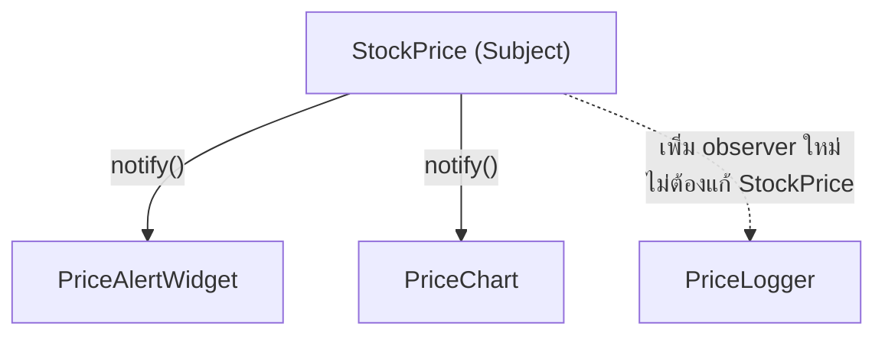

สมัครรับจดหมายข่าวไว้ครั้งเดียว จากนั้นทุกครั้งที่มีบทความใหม่ อีเมลก็โผล่มาในกล่องจดหมายเองโดยไม่ต้องเข้าเว็บไปเช็คทุกวัน — สำนักพิมพ์ไม่จำเป็นต้องรู้จักผู้อ่านแต่ละคนเป็นการส่วนตัว รู้แค่ว่า "มีคนสมัครรับข่าวอยู่" นี่คือแก่นของ **Observer Pattern** ที่เป็นรากฐานของระบบ event-driven ทุกชนิด

## โครงสร้าง Subject และ Observer

```typescript
interface Observer {
  update(price: number): void
}
interface Subject {
  subscribe(observer: Observer): void
  unsubscribe(observer: Observer): void
  notify(): void
}

class StockPrice implements Subject {
  private observers: Observer[] = []
  private price: number = 0

  subscribe(observer: Observer): void { this.observers.push(observer) }
  unsubscribe(observer: Observer): void {
    this.observers = this.observers.filter((o) => o !== observer)
  }
  notify(): void { this.observers.forEach((o) => o.update(this.price)) }

  setPrice(price: number): void {
    this.price = price
    this.notify()  // ราคาเปลี่ยน แจ้งทุก observer อัตโนมัติ
  }
}

class PriceAlertWidget implements Observer {
  update(price: number): void { console.log(`แจ้งเตือน: ราคาหุ้นเปลี่ยนเป็น ${price}`) }
}
class PriceChart implements Observer {
  update(price: number): void { console.log(`อัปเดตกราฟด้วยราคา ${price}`) }
}
```

<mark class="hl-term">**Observer**</mark> ให้ `Subject` (เช่น `StockPrice`) เก็บรายชื่อ `Observer` ที่สนใจการเปลี่ยนแปลงของมันไว้ แล้วเมื่อ state เปลี่ยน (`setPrice`) เรียก `notify()` วนแจ้งทุก observer ให้ทำงานของตัวเอง — `PriceAlertWidget` กับ `PriceChart` ทำงานต่างกันเวลาได้รับแจ้ง แต่ `StockPrice` ไม่จำเป็นต้องรู้เลยว่ามี widget แบบไหนบ้างที่ subscribe อยู่ รู้แค่ว่าทุกตัวมี `update()` ตาม interface `Observer`

## ทำไม Decoupling นี้สำคัญมาก



<mark class="hl-insight">Observer แก้ปัญหาเดียวกับที่เรียนไปแล้วในหัวข้อ Coupling & Cohesion — ถ้า `StockPrice` ต้องเรียก `priceAlertWidget.update()` และ `priceChart.update()` ตรงๆ ทีละตัว ทุกครั้งที่เพิ่ม observer ใหม่ (เช่น `PriceLogger`) ต้องกลับมาแก้ `StockPrice` เพิ่มบรรทัดเรียกใหม่ ขัดกับ OCP ที่เรียนไปแล้วเช่นกัน Observer ทำให้เพิ่ม observer ใหม่ได้แค่ `subscribe()` โดยไม่ต้องแตะ `StockPrice` เลย — นี่คือรากฐานระดับ OOD ของสิ่งที่ระบบ event-driven ขนาดใหญ่ (message queue, pub-sub, event bus) ทำในระดับสถาปัตยกรรมทั้งระบบ</mark>

## ข้อควรระวังในทางปฏิบัติ

<mark class="hl-warning">ปัญหาที่พบบ่อยที่สุดของ Observer คือ**memory leak จากการลืม unsubscribe** — ถ้า observer ถูกทำลายไปแล้ว (เช่น component ปิดหน้าจอไป) แต่ยังอยู่ใน list ของ `Subject` โดยไม่ถูก `unsubscribe()` ออก `Subject` จะยังถือ reference ค้างไว้ ป้องกัน garbage collector เก็บ observer นั้นไปได้ ทำให้หน่วยความจำรั่วไหลเรื่อยๆ ทุกครั้งที่สร้าง observer ใหม่แล้วลืม cleanup — ปัญหาที่สองคือ**ลำดับการแจ้งเตือนที่ไม่แน่นอน** ถ้า observer หลายตัว mutate state ร่วมกันระหว่างถูก notify อาจเกิดผลลัพธ์ที่ขึ้นกับลำดับ subscribe ซึ่งคาดเดายาก</mark>

> คำถามสัมภาษณ์: "ระบบ frontend ใช้ Observer Pattern เยอะมาก (component subscribe กับ store) แล้วเริ่มมีปัญหาหน่วยความจำค่อยๆ โตขึ้นเรื่อยๆ เมื่อผู้ใช้เปิดปิดหน้าจอไปมา สาเหตุที่เป็นไปได้มากที่สุดคืออะไร" — คำตอบที่ดีคือชี้ว่าสาเหตุที่พบบ่อยที่สุดคือ component ที่ subscribe กับ store แล้วไม่ได้ unsubscribe ตอนถูก unmount หรือทำลายไป ทำให้ store (Subject) ยังถือ reference ไปยัง component นั้นอยู่ garbage collector จึงเก็บ component นั้นไปไม่ได้แม้จะไม่ได้แสดงผลบนหน้าจอแล้ว ทางแก้คือให้ทุก component ที่ subscribe ต้อง unsubscribe เสมอในจังหวะที่ถูกทำลาย ซึ่งเป็นเหตุผลที่ framework สมัยใหม่ส่วนใหญ่ผูก cleanup logic นี้ไว้กับ lifecycle hook โดยอัตโนมัติ
