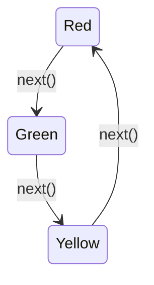

บริกรในร้านอาหารไม่ได้ตะโกนบอกครัวตรงๆ ว่า "ทำผัดไทยให้โต๊ะ 5" แต่เขียนใบสั่งอาหารเป็นตั๋ว — ตั๋วนั้นเข้าคิวได้ ยกเลิกได้ ตรวจสอบย้อนหลังได้ ส่วนไฟจราจรไม่มีทาง "ข้าม" จากไฟแดงไปไฟเขียวได้ตรงๆ ต้องผ่านไฟเหลืองก่อนเสมอ พฤติกรรมของมันเปลี่ยนไปตาม state ปัจจุบัน สอง pattern สุดท้ายในโมดูลนี้ล้วนแก้ปัญหา**เอา if-else/switch ก้อนใหญ่ออกไปเป็น object**

## Command — ห่อคำสั่งเป็น Object

```typescript
interface Command {
  execute(): void
  undo(): void
}

class LightOnCommand implements Command {
  constructor(private light: Light) {}
  execute(): void { this.light.turnOn() }
  undo(): void { this.light.turnOff() }
}

class RemoteControl {
  private history: Command[] = []
  press(command: Command): void {
    command.execute()
    this.history.push(command)
  }
  pressUndo(): void {
    const last = this.history.pop()
    last?.undo()
  }
}
```

<mark class="hl-term">**Command**</mark> encapsulate "การเรียก method หนึ่งครั้ง" ให้กลายเป็น object ที่มี `execute()` — แทนที่ `RemoteControl` จะเรียก `light.turnOn()` ตรงๆ มันเก็บ `Command` object ไว้แทน ทำให้**เข้าคิวคำสั่งได้** (ทำทีหลัง), **log คำสั่งไว้ได้** (audit trail), และ**undo ได้**เพราะ `Command` เก็บทั้งวิธีทำและวิธีย้อนกลับไว้คู่กัน

## State — ให้ Object เปลี่ยนพฤติกรรมตาม State ปัจจุบัน

```typescript
interface TrafficLightState {
  next(light: TrafficLight): void
  getColor(): string
}
class RedState implements TrafficLightState {
  next(light: TrafficLight): void { light.setState(new GreenState()) }
  getColor(): string { return 'แดง' }
}
class GreenState implements TrafficLightState {
  next(light: TrafficLight): void { light.setState(new YellowState()) }
  getColor(): string { return 'เขียว' }
}
class YellowState implements TrafficLightState {
  next(light: TrafficLight): void { light.setState(new RedState()) }
  getColor(): string { return 'เหลือง' }
}

class TrafficLight {
  private state: TrafficLightState = new RedState()
  setState(state: TrafficLightState): void { this.state = state }
  change(): void { this.state.next(this) }  // ← ไม่มี if-else เช็ค state เลย
  getColor(): string { return this.state.getColor() }
}
```

<mark class="hl-term">**State**</mark> ย้าย logic "ทำอะไรต่อในแต่ละ state" ออกจาก `TrafficLight` ไปเป็น class แยกต่อ state หนึ่ง — ถ้าเขียนแบบเดิมด้วย `if-else` จะต้องมี `if (state === 'red') ... else if (state === 'green') ...` กระจายอยู่ทุกที่ที่เช็ค state แต่ State Pattern รวม logic การเปลี่ยนสถานะไว้ที่ state object เอง `RedState.next()` รู้เองว่าต้องไปเป็น `GreenState` โดย `TrafficLight` ไม่ต้องรู้ลำดับการเปลี่ยนสถานะเลย

## Diagram การเปลี่ยนสถานะ



<mark class="hl-insight">State Pattern คือ Strategy Pattern ที่เรียนไปแล้ว บวกกับความสามารถพิเศษอย่างหนึ่ง: **state object รู้ว่าตัวเองควรเปลี่ยนไปเป็น state ไหนต่อ** — Strategy ธรรมดาไม่สนใจว่าหลังเรียกเสร็จควรสลับเป็น strategy อื่นไหม แต่ `RedState.next()` ตัดสินใจเองเลยว่าต่อไปต้องเป็น `GreenState` ทำให้ logic การเปลี่ยนสถานะทั้งระบบกระจายอยู่ในแต่ละ state object แทนที่จะรวมกระจุกอยู่ที่ `TrafficLight` เป็นก้อนใหญ่ก้อนเดียว</mark>

## ข้อควรระวังของ Command

<mark class="hl-warning">การ implement `undo()` ให้ถูกต้องซับซ้อนกว่าที่คิด — ต้องเก็บ**state ก่อนหน้า**ไว้ให้พอสำหรับย้อนกลับ ไม่ใช่แค่เรียก method ตรงข้ามเฉยๆ เช่น command ที่ลบข้อมูลออกจาก array ต้องเก็บทั้งค่าที่ลบไปและตำแหน่งเดิมไว้ ไม่งั้น undo แล้วข้อมูลจะกลับมาผิดตำแหน่งหรือหายไปเลย ยิ่ง command ซับซ้อนขึ้น (เช่นกระทบหลาย object พร้อมกัน) การออกแบบ `undo()` ให้ถูกต้อง 100% ยิ่งต้องคิดละเอียดมากขึ้นตามไปด้วย</mark>

## ตารางสรุป

| Pattern | เก็บอะไรเป็น Object | แก้ปัญหาอะไร |
|---|---|---|
| **Command** | คำสั่งหนึ่งครั้ง (execute + undo) | เข้าคิว, log, undo/redo คำสั่งที่เคยเป็นแค่ method call ตรงๆ |
| **State** | สถานะปัจจุบันพร้อม logic การเปลี่ยนสถานะ | เอา if-else เช็ค state ก้อนใหญ่ออกจาก context class |

> คำถามสัมภาษณ์: "ทำไม State Pattern ถึงมักถูกอธิบายว่าเป็น Strategy Pattern แบบพิเศษ" — คำตอบที่ดีคือชี้ว่าทั้งสองใช้กลไกเดียวกันคือ context class ถือ reference ไปยัง object ที่ implement interface ร่วม แล้วมอบหมายพฤติกรรมให้ object นั้นทำแทน แต่ State เพิ่มความสามารถพิเศษคือ state object แต่ละตัวรู้เองว่าควรเปลี่ยนไปเป็น state ไหนต่อ (ผ่าน method อย่าง `next()`) ทำให้ logic การเปลี่ยนสถานะทั้งหมดกระจายอยู่ในแต่ละ state object แทนที่จะรวมอยู่ที่ context class เป็นก้อนใหญ่ ขณะที่ Strategy ทั่วไปไม่มีความรับผิดชอบเรื่องการสลับตัวเองไปเป็นอย่างอื่น ต้องให้โค้ดภายนอกเป็นคนสั่งเปลี่ยนแทน
