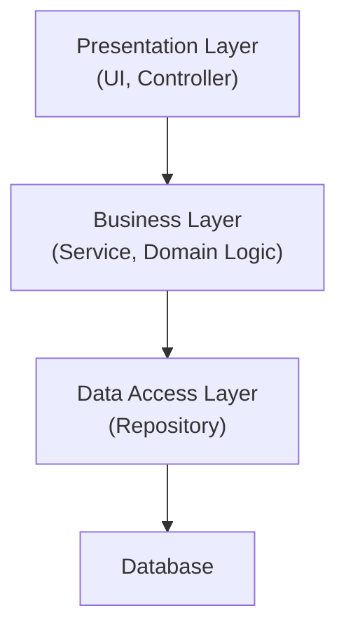

ตึกสูงมีชั้นวางเรียงกัน แต่ละชั้นวางอยู่บนชั้นล่างกว่า — สถาปัตยกรรมซอฟต์แวร์แบบดั้งเดิมที่สุดก็คิดแบบเดียวกัน: **Layered Architecture** แบ่งโค้ดเป็นชั้นๆ ตามหน้าที่ ดูเผินๆ เหมือนจะจัดระเบียบดีแล้ว แต่ปัญหาที่ซ่อนอยู่คือ**ทิศทางของ dependency ระหว่างชั้น**ต่างหาก ไม่ใช่แค่การแบ่งชั้น

## โครงสร้าง Layered Architecture แบบดั้งเดิม



<mark class="hl-term">**Layered Architecture**</mark> แบ่งโค้ดเป็นชั้นตามหน้าที่ — Presentation จัดการ UI/API, Business จัดการ business logic, Data Access จัดการการอ่านเขียนข้อมูล แต่ละชั้นเรียกชั้นที่อยู่ล่างกว่าได้ ห้ามเรียกชั้นบนกว่า ดูเป็นระเบียบดี แต่ปัญหาอยู่ที่รายละเอียดของการ implement

## ปัญหาที่ซ่อนอยู่ — Business Layer ผูกติดกับ Data Access Layer โดยตรง

```typescript
// Business Layer — import concrete class จาก Data Access Layer ตรงๆ
import { MySQLUserRepository } from '../data-access/MySQLUserRepository'

class UserService {
  private repository = new MySQLUserRepository()  // ← ผูกติดกับ MySQL ตรงๆ

  getUser(id: string) {
    return this.repository.findById(id)
  }
}
```

<mark class="hl-warning">แม้จะแบ่งเป็นชั้นสวยงามแล้ว แต่ `UserService` (Business Layer) ยัง import `MySQLUserRepository` (Data Access Layer) มาใช้ตรงๆ อยู่ดี — นี่คือปัญหาเดียวกับที่เรียนไปแล้วในหัวข้อ Dependency Inversion Principle: high-level module (business logic) ผูกติดกับ low-level module (การเก็บข้อมูลจริง) โดยตรง ทั้งที่ "การแบ่งเป็นชั้น" ดูเหมือนจะแยกความรับผิดชอบไว้ดีแล้ว แต่ทิศทางของ dependency (ใคร import ใคร) ยังคงผิดอยู่เหมือนเดิม</mark>

## ผลที่ตามมาเมื่อ Dependency ชี้ผิดทิศ

<mark class="hl-insight">ถ้าต้องการเปลี่ยนจาก MySQL เป็น PostgreSQL, หรือเขียน unit test ให้ `UserService` โดยไม่ต้องต่อ database จริง จะทำไม่ได้เลยถ้าไม่แก้ `UserService` เอง เพราะ business logic ผูกติดกับรายละเอียด infrastructure ที่ควรเป็นแค่ "รายละเอียดที่เปลี่ยนได้" ไม่ใช่สิ่งที่ business logic ต้องรู้จักโดยตรง — ปัญหานี้ไม่ได้เกิดจากการแบ่งชั้นผิด แต่เกิดจากไม่ได้บังคับทิศทาง dependency ให้ถูกต้องระหว่างชั้น</mark>

## คำถามที่ Layered Architecture ทิ้งไว้ให้ตอบ

| คำถาม | Layered Architecture แบบดั้งเดิมตอบได้ไหม |
|---|---|
| แบ่งโค้ดตามหน้าที่ได้ชัดเจนไหม | ✅ ได้ มีชั้นแยกชัดเจน |
| Business logic ทดสอบได้โดยไม่ต้องต่อ database จริงไหม | ❌ ไม่ได้ เพราะผูกกับ concrete repository ตรงๆ |
| สลับ implementation ของ Data Access ได้โดยไม่แก้ Business Layer ไหม | ❌ ไม่ได้ เพราะ import concrete class ตรงๆ |

<mark class="hl-insight">คำถามสองข้อสุดท้ายในตารางคือสิ่งที่ **The Dependency Rule** ของ Clean Architecture ถูกออกแบบมาตอบโดยเฉพาะ — ในหัวข้อถัดไปจะเห็นว่าการแก้ปัญหานี้ไม่ใช่การแบ่งชั้นใหม่ทั้งหมด แต่คือการบังคับทิศทางของ dependency ระหว่างชั้นให้ถูกต้อง โดยใช้ interface มาคั่นระหว่าง business logic กับ infrastructure ตามหลัก DIP ที่เรียนไปแล้ว</mark>

> คำถามสัมภาษณ์: "ระบบหนึ่งแบ่ง Layered Architecture ไว้ชัดเจน (Presentation, Business, Data Access) แต่ทีมยังบ่นว่าเขียน unit test สำหรับ business logic ไม่ได้เลยถ้าไม่ต่อ database จริง ปัญหาอยู่ตรงไหน" — คำตอบที่ดีคือชี้ว่าการแบ่งเป็นชั้นไม่ได้รับประกันว่า dependency จะชี้ถูกทิศทาง ปัญหาที่แท้จริงคือ Business Layer likely import concrete implementation ของ Data Access Layer ตรงๆ (เช่น `MySQLUserRepository`) แทนที่จะพึ่งพา abstraction (interface) ทำให้ business logic ผูกติดกับรายละเอียด infrastructure ที่ควรสลับหรือ mock ได้อย่างอิสระ ทางแก้คือใช้หลัก Dependency Inversion Principle ให้ทั้งสองชั้นพึ่งพา interface ร่วมกันแทน
