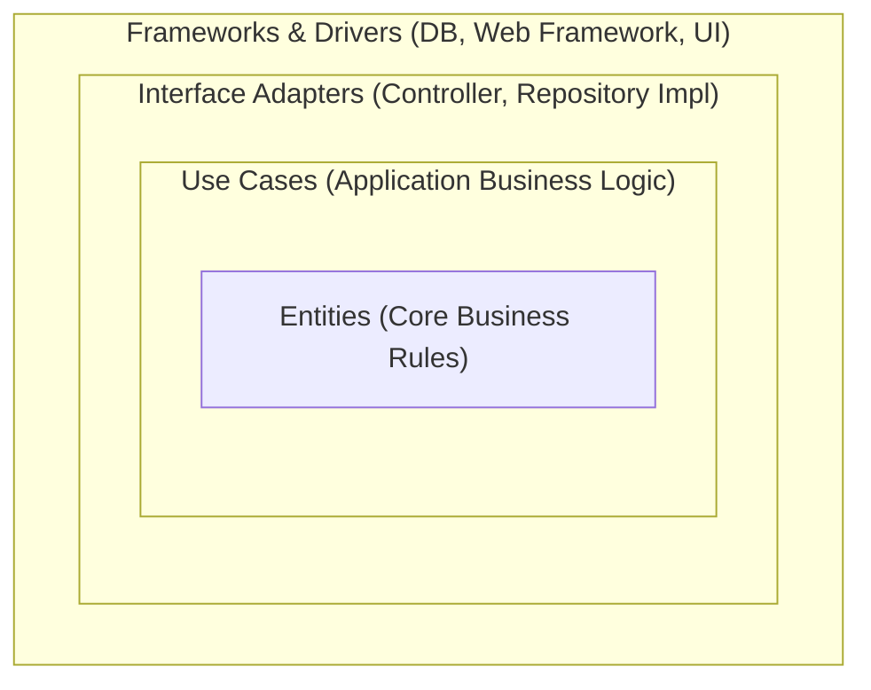

จากหัวข้อ Layered Architecture — ปัญหาที่ทิ้งไว้คือ business logic ผูกติดกับรายละเอียด infrastructure โดยตรง ทั้งที่แบ่งเป็นชั้นแล้ว **Clean Architecture** แก้ปัญหานี้ด้วยกฎเดียวที่ชัดเจนมาก: **The Dependency Rule** — วาดวงกลมซ้อนกันแทนชั้นเรียงตรง แล้วบังคับว่า dependency ชี้เข้าหาศูนย์กลางได้ทางเดียวเท่านั้น

## วงกลมซ้อนกันแทนชั้นเรียงตรง



<mark class="hl-term">**The Dependency Rule**</mark> บอกว่า **source code dependency ต้องชี้เข้าหาศูนย์กลางเท่านั้น ห้ามชี้ออก** — `Entities` (business rule หลัก) ไม่รู้จักอะไรเลยนอกวงตัวเอง `Use Cases` รู้จักแค่ `Entities` ไม่รู้จัก `Interface Adapters` หรือ `Frameworks` เลย ยิ่งเข้าใกล้ศูนย์กลางเท่าไหร่ ยิ่งเป็น business logic ล้วนๆ ที่ไม่ผูกกับ framework, database, หรือ UI ใดๆ ทั้งสิ้น

## แปลง The Dependency Rule เป็นโค้ดจริง

```typescript
// Use Case layer — พึ่งพา interface (port) เท่านั้น ไม่รู้จัก database จริง
interface UserRepository {
  findById(id: string): User | null
}
class GetUserUseCase {
  constructor(private repository: UserRepository) {}  // ← รับ abstraction ผ่าน constructor
  execute(id: string): User | null {
    return this.repository.findById(id)
  }
}

// Interface Adapters layer — implement interface ที่ use case ต้องการ
class MySQLUserRepository implements UserRepository {
  findById(id: string): User | null { /* เชื่อมต่อ MySQL จริง */ return null }
}

// ประกอบร่างที่จุดเริ่มต้นโปรแกรม (composition root)
const useCase = new GetUserUseCase(new MySQLUserRepository())
```

<mark class="hl-insight">นี่คือ Dependency Inversion Principle ที่เรียนไปแล้วในโมดูล SOLID Principles แต่นำมาใช้**ทั้งสถาปัตยกรรม**แทนที่จะใช้แค่ระดับ class เดียว — `GetUserUseCase` พึ่งพา interface `UserRepository` (port) ไม่รู้จัก `MySQLUserRepository` (adapter) เลยแม้แต่น้อย การประกอบร่างว่าจะใช้ adapter ไหนเกิดขึ้นที่จุดเริ่มต้นโปรแกรมเท่านั้น (composition root) — แนวคิดนี้มีอีกชื่อที่ใช้แทนกันได้คือ **Ports & Adapters (Hexagonal Architecture)**: `UserRepository` คือ port, `MySQLUserRepository` คือ adapter ที่เสียบเข้ามาจากภายนอก</mark>

## ทำไมสิ่งนี้แก้ปัญหา Testability ได้จริง

```typescript
// Test — สลับ adapter เป็น fake ที่ไม่ต้องต่อ database จริงเลย
class FakeUserRepository implements UserRepository {
  findById(id: string): User | null { return { id, name: 'Test User' } }
}
const useCase = new GetUserUseCase(new FakeUserRepository())
// ทดสอบ business logic ล้วนๆ โดยไม่มี network call, ไม่มี database จริง
```

<mark class="hl-insight">เพราะ `GetUserUseCase` ไม่รู้จัก `MySQLUserRepository` เลย การเขียน test จึงสลับเป็น `FakeUserRepository` ได้ทันทีโดยไม่ต้องแก้ use case แม้แต่บรรทัดเดียว — นี่คือคำตอบของคำถามที่ Layered Architecture แบบดั้งเดิมตอบไม่ได้ในหัวข้อก่อนหน้า ธุรกิจ logic ทดสอบได้อย่างอิสระจากรายละเอียด infrastructure โดยสมบูรณ์</mark>

## ข้อควรระวัง — อย่าให้ Framework รั่วเข้าไปในวงใน

<mark class="hl-warning">การละเมิด Dependency Rule ที่พบบ่อยที่สุดคือการ import type หรือ class ของ framework เข้าไปใน `Entities`/`Use Cases` โดยไม่รู้ตัว เช่น `GetUserUseCase` ที่รับ parameter เป็น `Express.Request` ตรงๆ แทนที่จะรับ parameter แบบ plain object — ทำให้ business logic ผูกติดกับ Express ทั้งที่ไม่ควรรู้จักเลยว่าเบื้องหลังใช้ web framework ไหน ถ้าจะเปลี่ยนจาก Express เป็น Fastify ในอนาคต จะต้องไปแก้ use case ด้วย ทั้งที่ business logic ไม่ได้เปลี่ยนอะไรเลย</mark>

> คำถามสัมภาษณ์: "The Dependency Rule ของ Clean Architecture ต่างจาก Dependency Inversion Principle ยังไง หรือเป็นเรื่องเดียวกัน" — คำตอบที่ดีคือชี้ว่าเป็นแนวคิดเดียวกันแต่คนละระดับ — DIP เป็นหลักการระดับ class เดียวว่า high-level module ควรพึ่งพา abstraction ไม่ใช่ concrete implementation ส่วน The Dependency Rule คือการนำ DIP ไปใช้อย่างเป็นระบบทั่วทั้งสถาปัตยกรรม โดยจัดกลุ่มโค้ดเป็นวงกลมซ้อนกันตามระดับความเป็น business logic (วงในสุด) ไปจนถึงรายละเอียด infrastructure (วงนอกสุด) แล้วบังคับว่า source code dependency ต้องชี้เข้าหาศูนย์กลางเท่านั้น พูดง่ายๆ คือ The Dependency Rule คือ DIP ที่ถูกขยายให้ครอบคลุมทั้งระบบ ไม่ใช่แค่คู่ class เดียว
