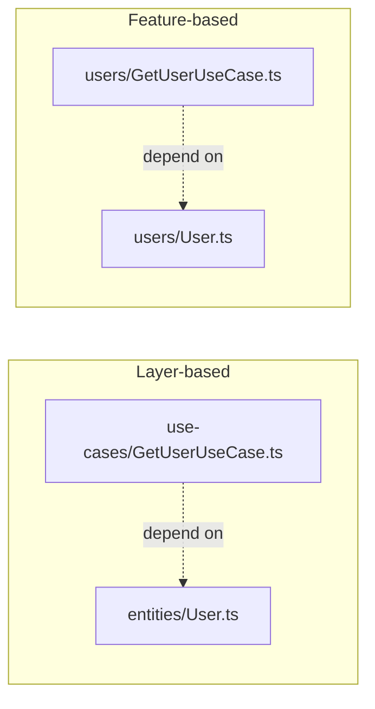

The Dependency Rule เป็นทฤษฎีที่สวยงามบนกระดาษ — แต่พอเปิด editor ขึ้นมาจริงๆ จะสร้างโฟลเดอร์ยังไง วาง `GetUserUseCase` ไว้ตรงไหน `MySQLUserRepository` ไว้ตรงไหน คำถามเหล่านี้ไม่มีคำตอบตายตัวหนึ่งเดียว มีสองแนวทางหลักที่ใช้กันจริงในอุตสาหกรรม

## Layer-Based Folder Structure — จัดตามหน้าที่ทางเทคนิค

```
src/
  entities/
    User.ts
  use-cases/
    GetUserUseCase.ts
    CreateUserUseCase.ts
  adapters/
    MySQLUserRepository.ts
    UserController.ts
  frameworks/
    express-server.ts
```

<mark class="hl-insight">**Layer-based** จัดโฟลเดอร์ตามชั้นของ Clean Architecture โดยตรง — เปิดโฟลเดอร์ `use-cases/` แล้วเห็น business logic ทั้งหมดของระบบรวมกันอยู่ ข้อดีคือมองเห็นภาพรวมของ "อะไรทำอะไรได้บ้าง" ง่าย แต่ข้อเสียคือถ้าจะแก้ feature เดียว (เช่น User) ต้องกระโดดไปมาระหว่างหลายโฟลเดอร์ (`entities/User.ts`, `use-cases/GetUserUseCase.ts`, `adapters/UserController.ts`) ซึ่งเป็นอาการคล้าย Shotgun Surgery ที่เรียนไปแล้วในโมดูล OOD Fundamentals แม้ในกรณีนี้จะเป็นผลจากการจัดโฟลเดอร์ ไม่ใช่ coupling ที่แท้จริงก็ตาม</mark>

## Feature-Based Folder Structure — จัดตาม Domain

```
src/
  users/
    User.ts                    (entity)
    GetUserUseCase.ts          (use case)
    UserRepository.ts          (port — interface)
    MySQLUserRepository.ts     (adapter)
    UserController.ts          (adapter)
  orders/
    Order.ts
    CreateOrderUseCase.ts
    OrderRepository.ts
    MySQLOrderRepository.ts
    OrderController.ts
```

<mark class="hl-insight">**Feature-based** จัดโฟลเดอร์ตาม domain/feature โดยรวมทุกชั้นของ feature เดียวกันไว้ในที่เดียว — แก้ feature `users` ทั้งหมดอยู่ในโฟลเดอร์ `users/` เดียว ไม่ต้องกระโดดข้ามโฟลเดอร์ ตรงกับหลัก high cohesion ที่เรียนไปแล้วในโมดูล OOD Fundamentals: สิ่งที่เปลี่ยนด้วยเหตุผลเดียวกัน (feature เดียวกัน) ควรอยู่ใกล้กัน ข้อเสียคือมองภาพรวมของ "use case ทั้งหมดในระบบ" ยากกว่า เพราะกระจายอยู่คนละโฟลเดอร์ตาม feature</mark>

## ทั้งสองแนวทางยังคงรักษา The Dependency Rule เหมือนกัน



<mark class="hl-insight">ไม่ว่าจะเลือกจัดโฟลเดอร์แบบไหน **The Dependency Rule ยังต้องถูกรักษาเหมือนเดิม** — `GetUserUseCase.ts` ต้องไม่ import อะไรจาก `MySQLUserRepository.ts` ตรงๆ ไม่ว่าไฟล์ทั้งสองจะอยู่คนละโฟลเดอร์ (layer-based) หรือโฟลเดอร์เดียวกัน (feature-based) ก็ตาม — folder structure เป็นแค่**การจัดระเบียบการมองเห็นไฟล์** ไม่ใช่ตัวบังคับทิศทาง dependency จริง ทิศทาง dependency ต้องถูกบังคับด้วยวินัยในการเขียน import statement (และเสริมด้วย lint rule อัตโนมัติได้ เช่น ESLint boundaries plugin ที่ error ทันทีถ้า use case import จาก adapter โดยตรง)</mark>

## เมื่อไหร่ Clean Architecture คือการทำเกินความจำเป็น

<mark class="hl-warning">Clean Architecture แบบเต็มรูปแบบ (แยก entities/use-cases/adapters/frameworks ชัดเจน) มีต้นทุนสูง — ต้องเขียน interface, ทำ dependency injection, ประกอบร่างที่ composition root สำหรับ CRUD app เล็กๆ ที่มี business logic น้อยมาก (แทบจะแค่ read/write database ตรงๆ) ต้นทุนนี้อาจไม่คุ้มค่ากับประโยชน์ที่ได้ เหมือนหลักการ YAGNI ที่เรียนไปแล้วในโมดูล SOLID Principles ตอนพูดถึง OCP — Clean Architecture คุ้มค่าที่สุดเมื่อระบบมี**business logic ที่ซับซ้อนจริง**และมีแนวโน้มต้อง**สลับ infrastructure บ่อย** (เช่น ต้อง support หลาย database, ต้องเขียน test จำนวนมากสำหรับ business rule ที่ซับซ้อน) ไม่ใช่ default ที่ต้องใช้ทุกโปรเจกต์</mark>

> คำถามสัมภาษณ์: "ทีมเถียงกันว่าควรจัดโฟลเดอร์แบบ layer-based หรือ feature-based สำหรับโปรเจกต์ที่กำลังจะโตขึ้นเรื่อยๆ ควรแนะนำยังไง" — คำตอบที่ดีคือชี้ว่าทั้งสองแนวทางรักษา The Dependency Rule ได้เหมือนกัน ความต่างอยู่ที่ ergonomics ไม่ใช่ความถูกต้องทางสถาปัตยกรรม — feature-based มักเหมาะกับระบบที่โตขึ้นเรื่อยๆ และมีหลายทีมทำงานคนละ feature เพราะรวม cohesion ของแต่ละ feature ไว้ด้วยกัน แก้ feature เดียวไม่ต้องกระโดดข้ามหลายโฟลเดอร์ ตรงกับที่เรียนไปแล้วเรื่อง Coupling & Cohesion ส่วน layer-based เหมาะกับทีมเล็กที่อยากเห็นภาพรวมของทุก use case ในที่เดียว ไม่มีคำตอบที่ถูกเสมอ ขึ้นอยู่กับขนาดทีมและรูปแบบการทำงานจริง
