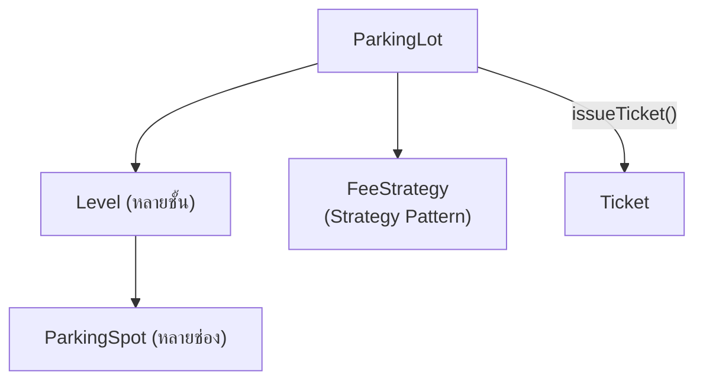

"ออกแบบระบบลานจอดรถ" เป็นโจทย์ LLD ที่ถูกถามในสัมภาษณ์บ่อยที่สุดข้อหนึ่ง เพราะมันบังคับให้ใช้เกือบทุกหลักการที่เรียนมาทั้ง track พร้อมกัน — ตั้งแต่การแบ่ง responsibility ไปจนถึงการเลือก pattern ที่เหมาะกับแต่ละส่วน

## เริ่มจาก Requirement ที่ชัดเจน

- ลานจอดรถมีหลายชั้น (`Level`) แต่ละชั้นมีช่องจอด (`ParkingSpot`) หลายประเภท: มอเตอร์ไซค์, รถเก๋ง, รถบรรทุก
- รถแต่ละคันจอดได้แค่ช่องที่ขนาดพอดีหรือใหญ่กว่า (มอเตอร์ไซค์จอดช่องรถเก๋งได้ แต่รถบรรทุกจอดช่องมอเตอร์ไซค์ไม่ได้)
- เข้า-ออกต้องออกตั๋ว (`Ticket`) คำนวณค่าจอดตามเวลา และอาจมีอัตราต่างกันตามประเภทรถ

## แบ่ง Responsibility ตาม SRP

```typescript
class ParkingSpot {
  constructor(
    public readonly id: string,
    public readonly type: SpotType,
    private occupied: boolean = false,
  ) {}
  isAvailable(): boolean { return !this.occupied }
  occupy(): void { this.occupied = true }
  vacate(): void { this.occupied = false }
}

class Ticket {
  constructor(
    public readonly id: string,
    public readonly spot: ParkingSpot,
    public readonly entryTime: Date,
  ) {}
}

// แยกออกมาต่างหาก ไม่ยัดรวมกับ ParkingSpot หรือ Ticket
class ParkingLot {
  private levels: Level[] = []
  findAvailableSpot(vehicleType: VehicleType): ParkingSpot | null { /* ... */ return null }
  issueTicket(spot: ParkingSpot): Ticket { /* ... */ return new Ticket('', spot, new Date()) }
}
```

<mark class="hl-insight">ตาม Single Responsibility Principle ที่เรียนไปแล้วในโมดูล SOLID Principles — `ParkingSpot` รู้แค่สถานะของตัวเอง (`occupied` หรือไม่), `Ticket` รู้แค่ข้อมูลการจอด, `ParkingLot` รับผิดชอบเรื่องหาช่องว่างและออกตั๋ว แต่ละ class มีเหตุผลให้เปลี่ยนแปลงแค่เหตุผลเดียว ถ้ายัดทุกอย่างไว้ใน `ParkingLot` class เดียว (หาช่องว่าง + ออกตั๋ว + คิดค่าจอด + รับเงิน) จะกลายเป็น God Class ที่เรียนไปแล้วในโมดูล OOD Fundamentals ทันที</mark>

## Strategy Pattern สำหรับคำนวณค่าจอด

```typescript
interface FeeStrategy {
  calculate(entryTime: Date, exitTime: Date): number
}
class HourlyFeeStrategy implements FeeStrategy {
  calculate(entryTime: Date, exitTime: Date): number {
    const hours = (exitTime.getTime() - entryTime.getTime()) / 3_600_000
    return Math.ceil(hours) * 40
  }
}
class FlatRateFeeStrategy implements FeeStrategy {
  calculate(): number { return 100 }
}
```

<mark class="hl-insight">การคำนวณค่าจอดมีแนวโน้มเปลี่ยนบ่อยที่สุดในระบบนี้ (โปรโมชั่น, อัตรารายชั่วโมงเทียบกับเหมาจ่าย, ส่วนลดสมาชิก) — ใช้ **Strategy Pattern** จากโมดูล Behavioral Design Patterns encapsulate การคำนวณแต่ละแบบไว้เป็น object แยก `ParkingLot` ถือ `FeeStrategy` ไว้และเปลี่ยนได้ที่ runtime โดยไม่ต้องแก้โค้ดเดิม ตรงตาม OCP ที่เรียนไปแล้ว: เพิ่มอัตราค่าจอดแบบใหม่แค่เพิ่ม class ใหม่</mark>

## Class Diagram ภาพรวม



<mark class="hl-warning">ข้อผิดพลาดที่พบบ่อยในคำตอบสัมภาษณ์คือการใช้ `if-else`/`switch` เช็ค `VehicleType` กระจายอยู่หลายจุด (ตอนหาช่องว่าง, ตอนคำนวณค่าจอด, ตอนตรวจสอบว่าจอดได้ไหม) — ควรรวม logic การเทียบขนาดรถกับขนาดช่องไว้ที่จุดเดียว (เช่น method `canFit(vehicle)` ใน `ParkingSpot`) แทนที่จะกระจาย `if (vehicleType === 'motorcycle')` ไว้หลายที่ ซึ่งเป็นสัญญาณ Shotgun Surgery ที่เรียนไปแล้วในโมดูล OOD Fundamentals</mark>

> คำถามสัมภาษณ์: "ถ้าลานจอดรถมีหลายทางเข้าพร้อมกัน แล้วสองคันเข้ามาพร้อมกันเป๊ะและต้องการช่องเดียวกัน จะออกแบบยังไงไม่ให้เกิด race condition" — คำตอบที่ดีคือชี้ว่า `findAvailableSpot()` และ `occupy()` ต้องเป็น atomic operation เดียวกัน (เช่น lock ที่ระดับ spot หรือใช้ database transaction ถ้าเก็บสถานะใน database) ไม่ใช่แยกเป็นสองขั้นตอน (หาช่องว่าง แล้วค่อย occupy) เพราะระหว่างสองขั้นตอนนี้อาจมีคำขอที่สองมาแทรกได้ การออกแบบ interface ให้ `findAndOccupySpot()` เป็น method เดียวที่ atomic ป้องกันปัญหานี้ได้ตรงจุดกว่าการแยกสองขั้นตอน
