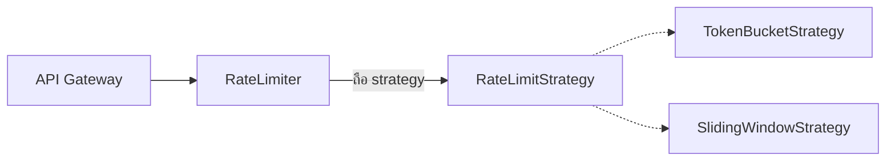

"ออกแบบ Rate Limiter" เป็นโจทย์ที่ข้ามเส้นระหว่าง System Design กับ LLD พอดี — ฝั่ง System Design สนใจว่าจะ scale rate limiter ข้ามหลายเครื่อง server ยังไง (ต้องใช้ Redis กลาง เป็นต้น) แต่ฝั่ง LLD สนใจคำถามที่แคบกว่า: **จะออกแบบ class ให้สลับอัลกอริทึมได้ และเพิ่มอัลกอริทึมใหม่ได้โดยไม่แก้โค้ดเดิม**

## Interface กลางที่ทุกอัลกอริทึมต้องตรงกัน

```typescript
interface RateLimitStrategy {
  allowRequest(clientId: string): boolean
}
```

<mark class="hl-insight">ก่อนเขียนอัลกอริทึมไหนเลย ขั้นแรกที่สำคัญที่สุดคือกำหนด interface กลางที่ทุกอัลกอริทึม rate limiting ต้อง implement ให้ตรงกัน — นี่คือการประยุกต์ Strategy Pattern จากโมดูล Behavioral Design Patterns โดยตรง เพราะ requirement ของ rate limiter มักเปลี่ยนบ่อย (เปลี่ยนจาก fixed window เป็น sliding window ตอน traffic เยอะขึ้น) การออกแบบให้สลับอัลกอริทึมได้ตั้งแต่แรกจึงคุ้มค่ากว่าปกติ ต่างจากตัวอย่างใน Factory Method ที่เรียนไปแล้วว่าไม่ควรเผื่อขยายถ้าไม่มีสัญญาณจริง — ในเคสนี้มีสัญญาณจริงชัดเจนว่าอัลกอริทึมจะเปลี่ยนบ่อย</mark>

## Token Bucket — อัลกอริทึมที่นิยมที่สุด

```typescript
class TokenBucketStrategy implements RateLimitStrategy {
  private buckets = new Map<string, { tokens: number; lastRefill: number }>()
  constructor(private capacity: number, private refillPerSecond: number) {}

  allowRequest(clientId: string): boolean {
    const now = Date.now()
    const bucket = this.buckets.get(clientId) ?? { tokens: this.capacity, lastRefill: now }

    const elapsed = (now - bucket.lastRefill) / 1000
    bucket.tokens = Math.min(this.capacity, bucket.tokens + elapsed * this.refillPerSecond)
    bucket.lastRefill = now

    if (bucket.tokens < 1) { this.buckets.set(clientId, bucket); return false }
    bucket.tokens -= 1
    this.buckets.set(clientId, bucket)
    return true
  }
}
```

<mark class="hl-term">**Token Bucket**</mark> ให้แต่ละ client มี "ถัง" เก็บ token จำนวนหนึ่ง ทุก request เบิก token ไป 1 หน่วย ถ้าไม่มี token เหลือ request ถูกปฏิเสธ ถังเติม token กลับเข้ามาเรื่อยๆ ตามอัตราที่กำหนด — ข้อดีคือรองรับ burst traffic ได้ในระดับหนึ่ง (ถ้าถังเต็มพอดี ยิง request รัวๆ ได้ชั่วขณะ) ต่างจาก Fixed Window ที่นับ request เป็นช่วงเวลาตายตัวและมีปัญหา burst ที่ขอบหน้าต่างเวลา

## Sliding Window — อัลกอริทึมทางเลือก

```typescript
class SlidingWindowStrategy implements RateLimitStrategy {
  private requestLog = new Map<string, number[]>()
  constructor(private maxRequests: number, private windowMs: number) {}

  allowRequest(clientId: string): boolean {
    const now = Date.now()
    const timestamps = (this.requestLog.get(clientId) ?? [])
      .filter((t) => now - t < this.windowMs)

    if (timestamps.length >= this.maxRequests) { this.requestLog.set(clientId, timestamps); return false }
    timestamps.push(now)
    this.requestLog.set(clientId, timestamps)
    return true
  }
}
```

## สลับอัลกอริทึมได้โดยไม่แตะโค้ดที่เรียกใช้



```typescript
class RateLimiter {
  constructor(private strategy: RateLimitStrategy) {}
  isAllowed(clientId: string): boolean { return this.strategy.allowRequest(clientId) }
}

const limiter = new RateLimiter(new TokenBucketStrategy(10, 2))
// เปลี่ยนอัลกอริทึมทั้งชุดโดยไม่แตะ RateLimiter หรือโค้ดที่เรียกใช้เลย
```

<mark class="hl-warning">ข้อผิดพลาดที่พบบ่อยในคำตอบสัมภาษณ์คือลืมพูดถึง**thread safety** — โค้ดตัวอย่างข้างบนใช้ `Map` ธรรมดาซึ่งไม่ปลอดภัยถ้ามีหลาย request เข้ามาพร้อมกันในระบบที่รันแบบ concurrent จริง (multi-thread หรือหลาย process) การอ่าน-แก้ไข `bucket.tokens` ต้องเป็น atomic operation ไม่งั้นสอง request ที่มาพร้อมกันอาจอ่านค่า token ก่อนอีกฝ่ายจะเขียนค่าใหม่ ทำให้ปล่อยผ่าน request มากกว่าที่ควรจะเป็น (race condition) ในระบบจริงมักใช้ atomic counter หรือ distributed lock (เช่น Redis `INCR` ที่เป็น atomic โดยธรรมชาติ) แทน in-memory `Map`</mark>

> คำถามสัมภาษณ์: "ทำไมการออกแบบ RateLimiter ให้พึ่งพา interface RateLimitStrategy ตั้งแต่แรก แทนที่จะเขียน Token Bucket ตรงๆ ไปเลย ไม่ขัดกับหลักการ YAGNI ที่บอกว่าอย่าเผื่อขยายไว้ล่วงหน้า" — คำตอบที่ดีคือชี้ว่า YAGNI ใช้ได้เมื่อไม่มีสัญญาณว่าจะต้องขยายจริง แต่ rate limiting เป็นโดเมนที่รู้ล่วงหน้าอยู่แล้วว่ามีอัลกอริทึมหลายแบบที่ใช้กันจริงในอุตสาหกรรม (fixed window, sliding window, token bucket, leaky bucket) แต่ละแบบมี trade-off ต่างกันเรื่อง burst handling และความแม่นยำ การออกแบบให้สลับได้ตั้งแต่แรกจึงไม่ใช่การเผื่อขยายแบบเดา แต่เป็นการตอบสนองต่อสัญญาณจริงที่ domain นี้มีให้เห็นชัดเจนอยู่แล้ว
