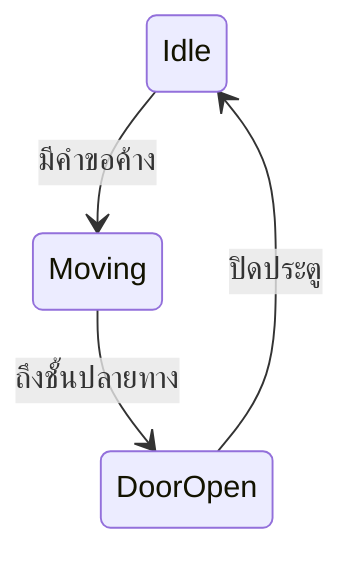
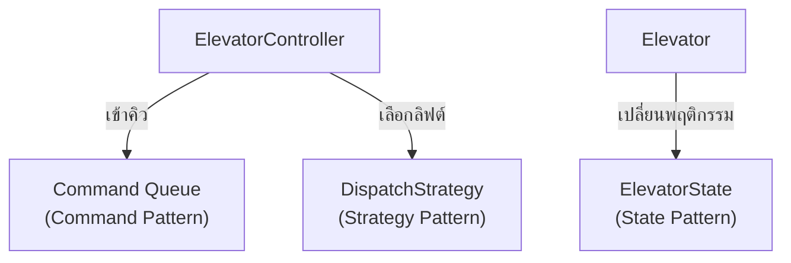

"ออกแบบระบบลิฟต์" คือโจทย์ LLD ที่รวมเอา pattern เกือบทุกตัวที่เรียนมาทั้ง track เข้าด้วยกันในปัญหาเดียว — ลิฟต์มี state ชัดเจน (กำลังขึ้น, กำลังลง, เปิดประตู), มีคำสั่งที่ต้องเข้าคิว (คนกดปุ่มจากหลายชั้นพร้อมกัน), และมีอัลกอริทึมการจัดสรรที่สลับได้

## State Pattern สำหรับสถานะของลิฟต์

```typescript
interface ElevatorState {
  handle(elevator: Elevator): void
}
class IdleState implements ElevatorState {
  handle(elevator: Elevator): void {
    if (elevator.hasPendingRequests()) elevator.setState(new MovingState())
  }
}
class MovingState implements ElevatorState {
  handle(elevator: Elevator): void {
    if (elevator.hasArrivedAtDestination()) elevator.setState(new DoorOpenState())
  }
}
class DoorOpenState implements ElevatorState {
  handle(elevator: Elevator): void {
    elevator.setState(new IdleState())  // ปิดประตูแล้วกลับไป idle
  }
}
```

<mark class="hl-insight">จากโมดูล Behavioral Design Patterns — ลิฟต์คือตัวอย่างคลาสสิกของ **State Pattern** เพราะพฤติกรรมของมันเปลี่ยนไปตามสถานะปัจจุบันชัดเจนมาก: ลิฟต์ที่กำลังเปิดประตูอยู่ ไม่ควรตอบสนองต่อคำสั่ง "เคลื่อนที่" เลย ทั้งที่ลิฟต์ที่ idle ตอบสนองได้ปกติ ถ้าเขียนด้วย `if-else` เช็ค state ทุกจุดจะยุ่งเหยิงเร็วมาก State Pattern ย้าย logic นี้ไปไว้ที่ state object แต่ละตัวแทน</mark>

## Diagram การเปลี่ยนสถานะของลิฟต์



## Command Pattern สำหรับคำสั่งกดปุ่ม

```typescript
interface ElevatorCommand {
  execute(): void
}
class FloorRequestCommand implements ElevatorCommand {
  constructor(private elevator: Elevator, private floor: number) {}
  execute(): void { this.elevator.addDestination(this.floor) }
}

class ElevatorController {
  private commandQueue: ElevatorCommand[] = []
  submitRequest(command: ElevatorCommand): void { this.commandQueue.push(command) }
  processNext(): void { this.commandQueue.shift()?.execute() }
}
```

<mark class="hl-insight">คนกดปุ่มเรียกลิฟต์จากหลายชั้นพร้อมกันได้ตลอดเวลา ไม่ว่าลิฟต์จะกำลังทำอะไรอยู่ก็ตาม — จากโมดูล Behavioral Design Patterns เช่นกัน **Command Pattern** encapsulate การกดปุ่มแต่ละครั้งให้เป็น object ที่เข้าคิวได้ (`commandQueue`) แทนที่จะประมวลผลทันทีที่กด ทำให้ระบบรับคำสั่งได้ต่อเนื่องแม้ลิฟต์จะไม่ว่าง และเปิดโอกาสให้ log คำสั่งไว้ตรวจสอบย้อนหลังได้ด้วย</mark>

## Strategy Pattern สำหรับอัลกอริทึมจัดสรรลิฟต์

```typescript
interface DispatchStrategy {
  selectElevator(elevators: Elevator[], requestedFloor: number): Elevator
}
class NearestElevatorStrategy implements DispatchStrategy {
  selectElevator(elevators: Elevator[], requestedFloor: number): Elevator {
    return elevators.reduce((closest, e) =>
      Math.abs(e.currentFloor - requestedFloor) < Math.abs(closest.currentFloor - requestedFloor) ? e : closest,
    )
  }
}
```

<mark class="hl-insight">ถ้าอาคารมีลิฟต์หลายตัว ระบบต้องตัดสินใจว่าจะส่งลิฟต์ตัวไหนไปรับ — algorithm การจัดสรรนี้มีหลายแบบในโลกจริง (เลือกตัวที่ใกล้ที่สุด, เลือกตัวที่ทิศทางตรงกับคำขอ, เลือกตัวที่คิวสั้นที่สุด) จึงเหมาะกับ **Strategy Pattern** เช่นเดียวกับที่ใช้ในเคส Rate Limiter ก่อนหน้า — สลับอัลกอริทึมจัดสรรได้โดยไม่ต้องแก้ `ElevatorController` เลย</mark>

## ภาพรวมที่ผสาน Pattern เข้าด้วยกัน



<mark class="hl-warning">ข้อผิดพลาดที่พบบ่อยในคำตอบสัมภาษณ์คือพยายามยัด logic ทั้งหมด (state, การจัดคิว, การเลือกลิฟต์) ไว้ใน `Elevator` class เดียว ทำให้กลายเป็น God Class ที่เรียนไปแล้วในโมดูล OOD Fundamentals — การแยกแต่ละความรับผิดชอบออกเป็น pattern คนละตัว (State สำหรับสถานะ, Command สำหรับคิวคำสั่ง, Strategy สำหรับอัลกอริทึมจัดสรร) ทำให้แต่ละส่วนทดสอบและแก้ไขแยกจากกันได้ ตรงตาม SRP ที่เรียนไปแล้วเช่นกัน</mark>

> คำถามสัมภาษณ์: "ทำไมโจทย์ Elevator System ถึงมักถูกใช้เป็นตัวอย่างสรุป design pattern หลายตัวพร้อมกัน ทั้งที่แต่ละ pattern ก็มีตัวอย่างเดี่ยวๆ ของตัวเองอยู่แล้ว" — คำตอบที่ดีคือชี้ว่าระบบจริงไม่ได้ใช้แค่ pattern เดียวแก้ปัญหาทั้งหมด — ปัญหาลิฟต์มีมิติที่ต่างกันชัดเจนสามมิติพร้อมกัน: พฤติกรรมที่เปลี่ยนตามสถานะ (เหมาะกับ State), คำขอที่ต้องเข้าคิวและประมวลผลทีหลัง (เหมาะกับ Command), และอัลกอริทึมที่ต้องสลับได้ (เหมาะกับ Strategy) การเลือก pattern ที่เหมาะกับแต่ละมิติของปัญหาแยกกัน แล้วให้แต่ละส่วนทำงานร่วมกันผ่าน interface ที่ชัดเจน คือทักษะที่แท้จริงของ LLD ไม่ใช่การท่องจำว่า pattern ไหนแก้ปัญหาอะไร แต่คือการแตกปัญหาใหญ่ให้เห็นมิติย่อยที่แต่ละ pattern ตอบได้ตรงจุด
