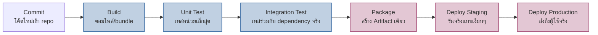
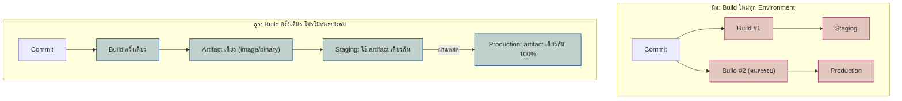

ลองนึกภาพสายการผลิตในโรงงานประกอบรถ — ก่อนที่รถคันหนึ่งจะออกจากโรงงานได้ ต้องผ่าน**ป้อมตรวจ (checkpoint)** หลายจุด: ประกอบเครื่องยนต์เสร็จ ตรวจว่าเครื่องยนต์ทำงานไหม, พ่นสีเสร็จ ตรวจว่าสีเรียบไหม, ประกอบครบทั้งคัน ตรวจขับทดสอบ (test drive) ก่อนส่งออกโชว์รูม — ถ้าจุดไหนตรวจไม่ผ่าน รถคันนั้น**หยุดอยู่ที่จุดนั้นทันที** ไม่ถูกส่งต่อไปจุดถัดไป

**CI/CD Pipeline** ทำงานแบบเดียวกัน — โค้ดที่ commit เข้ามาต้องผ่านป้อมตรวจหลายจุด (build, test, package) ก่อนจะถูกส่งไปถึงมือผู้ใช้จริงบน production ถ้าจุดไหนพัง โค้ดจะ**หยุดอยู่จุดนั้น** ไม่มีทางไหลต่อไปทำร้าย production ได้

## Pipeline คืออะไร: สายพานที่มี Gate ตรวจคุณภาพทุกจุด



<mark class="hl-term">**CI (Continuous Integration)**</mark> คือช่วง Build → Test — โค้ดของทุกคนถูกรวม (integrate) และตรวจสอบอัตโนมัติทุกครั้งที่ push ไม่ต้องรอรวมโค้ดทีเดียวตอนจบ sprint แบบสมัยก่อน <mark class="hl-term">**CD (Continuous Delivery/Deployment)**</mark> คือช่วง Package → Deploy — พา artifact ที่ผ่านการตรวจแล้วไปถึงมือผู้ใช้แบบอัตโนมัติ (หรือกดปุ่มเดียว)

<mark class="hl-insight">แต่ละ Gate ในสายพานนี้คือ "จุดตัดสินใจ" ว่าโค้ดนี้ไปต่อได้ไหม — Unit Test ล้มเหลว = หยุดที่ Build ไม่มีทาง Package ต่อได้ นี่คือกลไกที่ทำให้ bug ร้ายแรงถูกจับตั้งแต่ต้นสายพาน ก่อนจะไหลไปถึงจุดที่แก้ยากและแพงกว่ามาก (production)</mark>

## CI vs Continuous Delivery vs Continuous Deployment ต่างกันยังไง

คนมักพูดคำว่า "CI/CD" รวมๆ แต่จริงๆ มี 3 ระดับที่ต่างกันตรง "ขั้นสุดท้ายใครเป็นคนกดปล่อย":

| ระดับ | ทำอะไรอัตโนมัติ | ใครกด Deploy ขึ้น Production |
|---|---|---|
| Continuous Integration | Build + Test อัตโนมัติทุก commit | ไม่เกี่ยวกับ deploy เลย แค่รู้ว่าโค้ดพังไหม |
| Continuous Delivery | Build + Test + Package จนพร้อม deploy ได้ทุกเมื่อ | คน — กดปุ่ม "Deploy" เอง |
| Continuous Deployment | ทุกอย่างอัตโนมัติจน production | ไม่มีคนกด — ผ่าน gate ครบ = ขึ้นเองทันที |

<mark class="hl-warning">Continuous Deployment (อัตโนมัติเต็มสาย ไม่มีคนกด) ไม่ใช่เป้าหมายที่ทุกทีมต้องไปให้ถึง — ทีมที่ระบบ test coverage ยังไม่แน่นพอ ควรอยู่แค่ระดับ Continuous Delivery (คนกดปุ่มเอง) ไปก่อน จนกว่าจะมั่นใจว่า gate อัตโนมัติจับ bug ได้จริงเกือบทั้งหมด</mark>

## Build Once, Deploy Many: อย่า Build ใหม่ทุก Environment

ข้อผิดพลาดที่พบบ่อยของทีมที่เริ่มทำ pipeline คือ build โค้ดใหม่ทุกครั้งที่ deploy แต่ละ environment (build แยกให้ staging, build แยกให้ prod) — ปัญหาคือ build แต่ละครั้งอาจได้ dependency เวอร์ชันไม่ตรงกันเป๊ะ (แม้ lock file เดียวกัน ก็มีโอกาสเจอ environment ของเครื่อง build ต่างกัน) ทำให้เกิดเคสคลาสสิก **"มันรันได้บนเครื่องผม"** ข้ามไปพังบน prod



<mark class="hl-insight">หลักการคือ **Build Once, Deploy Many** — compile/bundle แค่ครั้งเดียวได้ artifact ก้อนเดียว (container image, jar, binary) แล้วโปรโมท (promote) artifact ก้อนนั้นไล่ไปทุก environment โดยไม่แตะกระบวนการ build อีก สิ่งที่ต่างกันระหว่าง environment ควรเป็นแค่ **config/env variable** ที่ฉีดเข้าไปตอนรัน ไม่ใช่ตัวโค้ดที่ต่างกัน</mark> วิธีนี้การันตีว่าสิ่งที่ทดสอบผ่านบน staging คือไบต์เดียวกันเป๊ะกับที่ขึ้น production จริง

ตัวอย่าง pipeline แบบย่อ (สไตล์ GitHub Actions) ที่ยึดหลัก build-once:

```yaml
jobs:
  build:
    steps:
      - run: docker build -t app:$GIT_SHA .   # build ครั้งเดียว, tag ด้วย commit sha
      - run: docker push registry/app:$GIT_SHA

  deploy-staging:
    needs: build
    steps:
      - run: kubectl set image deploy/app app=registry/app:$GIT_SHA -n staging

  deploy-prod:
    needs: deploy-staging   # โปรโมท image ก้อนเดียวกัน ไม่ build ใหม่
    steps:
      - run: kubectl set image deploy/app app=registry/app:$GIT_SHA -n prod
```

เคยเรียนเรื่อง Deployment Strategies (blue-green, canary) ไปแล้วในโมดูล Reliability — บทนั้นตอบคำถาม "สลับเวอร์ชันยังไงให้ user ไม่รู้สึก" ส่วนบทนี้ตอบคำถามที่มาก่อนหน้านั้น: "artifact ที่จะสลับ ถูกสร้างและพาไปถึงจุดที่พร้อม deploy ได้ยังไง" — สองเรื่องนี้เป็นคนละขั้นของ pipeline เดียวกัน (บทถัดไปในโมดูลนี้ "Progressive Delivery" จะเชื่อมสองเรื่องนี้เข้าด้วยกัน)

> คำถามสัมภาษณ์: "ทีมนี้ deploy วันละหลายครั้ง แต่ทีมนั้น deploy เดือนละครั้ง อะไรทำให้ต่างกันขนาดนี้" — คำตอบที่ดีคือไม่ใช่แค่ "มี CI/CD" หรือไม่ แต่คือ**ความยาว feedback loop ของ pipeline** — ทีมที่ deploy บ่อยมักมี automated test ที่ครอบคลุมพอจนกล้าไว้ใจ gate อัตโนมัติ (ไม่ต้องรอคน manual test นานๆ) และยึด build-once-deploy-many จนมั่นใจว่า artifact ที่ผ่าน staging คือตัวเดียวกับที่จะขึ้น prod ไม่มีความเสี่ยงแอบแฝงจากการ build ใหม่
