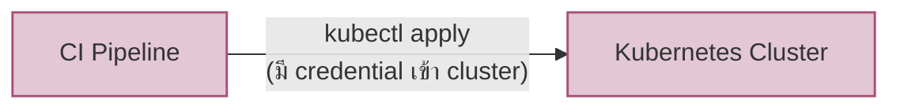
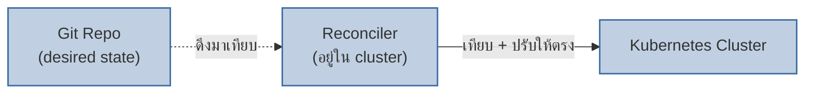
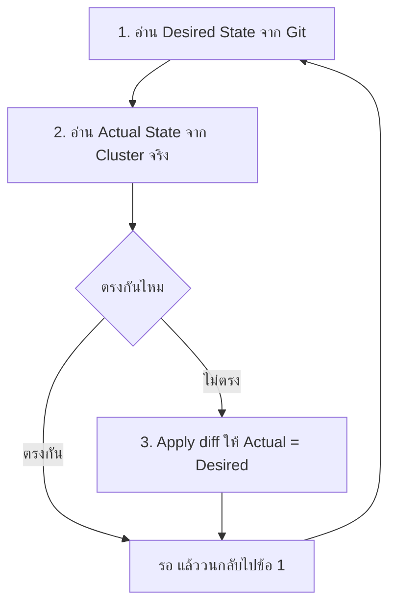
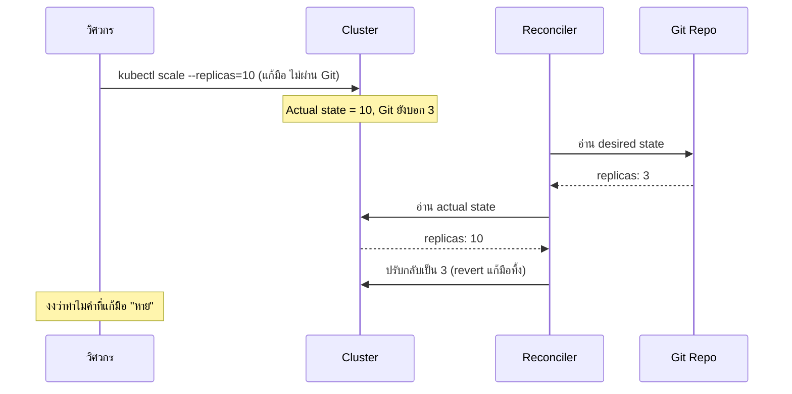

เครื่องปรับอากาศแบบตั้ง thermostat ทำงานยังไง — คุณไม่ได้บอกแอร์ว่า "เปิดคอมเพรสเซอร์ 3 นาที แล้วปิด แล้วเปิดพัดลมแรง 2" คุณแค่ตั้งว่า **"อยากได้ 25 องศา"** (desired state) แล้วเครื่องจะคอยวัดอุณหภูมิจริงในห้อง เทียบกับ 25 องศาที่ตั้งไว้ ถ้าห้องร้อนกว่าก็เปิดคอมเพรสเซอร์เอง ถ้าเย็นพอแล้วก็หยุดเอง — คุณไม่ต้องสั่งทีละคำสั่ง เครื่องแค่**คอยเทียบสภาพจริงกับสภาพที่ต้องการ แล้วปรับเข้าหากันเรื่อยๆ**

**GitOps** ใช้หลักการเดียวกันกับการ deploy ระบบ

## Push-based Deploy vs Pull-based GitOps





<mark class="hl-term">**GitOps**</mark> คือแนวคิดที่ให้ **Git repo เป็น "single source of truth" ของสภาพที่ระบบควรจะเป็น** (desired state) แทนที่จะให้ CI pipeline วิ่งเข้าไป `kubectl apply` ตรงๆ (push-based) จะมี agent ตัวหนึ่งที่อยู่ **ภายใน cluster เอง** (เช่น ArgoCD, Flux) คอยดึง (pull) desired state จาก Git มาเทียบกับสภาพจริงในคลัสเตอร์ ถ้าไม่ตรงกันก็ปรับให้ตรง — วนแบบนี้ตลอดเวลา เรียกว่า <mark class="hl-term">**Reconcile Loop**</mark>

<mark class="hl-insight">ข้อดีด้านความปลอดภัยที่มักถูกมองข้าม: แบบ push-based ต้องให้ CI pipeline (ระบบภายนอก cluster) ถือ credential ที่เข้าคลัสเตอร์ได้ — ถ้า pipeline ถูกแฮ็ก เท่ากับคนร้ายมีทางเข้า cluster ทันที ส่วนแบบ pull-based ไม่มีระบบภายนอกไหนต้องถือ credential เข้า cluster เลย เพราะ agent ที่ดึงข้อมูลอยู่**ข้างในคลัสเตอร์เอง** ผิวการโจมตี (attack surface) เลยเล็กกว่ามาก</mark>

## Reconcile Loop: วงจรที่ไม่มีวันหยุด



Reconciler ไม่ใช่สคริปต์ที่รันครั้งเดียวจบ — มันวน loop นี้ตลอดเวลา (ทุกไม่กี่วินาทีถึงไม่กี่นาที) นั่นแปลว่าถ้ามีใครไปแก้ cluster ตรงๆ โดยไม่ผ่าน Git (เช่น `kubectl edit` แก้ replica count มือ) รอบถัดไปของ reconcile loop จะเห็นว่า actual state ไม่ตรงกับ Git แล้ว**ปรับกลับให้ตรงกับ Git เหมือนเดิมอัตโนมัติ**



<mark class="hl-warning">นี่คือกับดักที่วิศวกรใหม่มักเจอ: แก้ค่าตรง cluster แบบ manual แล้วงงว่าทำไม "หาย" ไปเอง — คำตอบคือ GitOps ไม่ได้เสีย มันทำงานตามที่ออกแบบไว้เป๊ะ (self-healing กลับไปที่ desired state ใน Git) วิธีแก้ที่ถูกคือแก้ที่ Git แล้วให้ reconciler pull ไปเอง ไม่ใช่แก้ตรง cluster</mark>

```demo
component: GitOpsReconcileDemo
caption: ลองกดจำลอง drift ดู แล้วดู Reconciler ปรับกลับอัตโนมัติในรอบถัดไป
```

## เทียบสองแบบให้ชัด

| มิติ | Push-based (CI apply ตรง) | Pull-based (GitOps) |
|---|---|---|
| ใครเริ่ม deploy | CI pipeline วิ่งเข้าไป apply | agent ในคลัสเตอร์ดึงมาเอง |
| Credential เข้า cluster | ต้องอยู่ที่ CI (ระบบภายนอก) | อยู่แค่ในคลัสเตอร์ ไม่ต้องแจก credential ออกไป |
| มีคนแก้มือ (drift) | ไม่มีกลไกจับ ค่าที่แก้มือคงอยู่จนกว่า deploy รอบหน้า | reconcile loop จับและ revert ให้ตรง Git อัตโนมัติ |
| Rollback | ต้อง deploy เวอร์ชันก่อนหน้าใหม่ | `git revert` เฉยๆ reconciler จัดการที่เหลือ |
| ประวัติการเปลี่ยนแปลง | กระจายอยู่ใน deploy log ของแต่ละครั้ง | อยู่ใน git log ที่เดียว ตรวจสอบย้อนหลังง่าย |

ต่อจากบทก่อน (CI/CD Pipeline Anatomy) — หลังจาก pipeline build+test+package ได้ artifact แล้ว สิ่งที่ pipeline ทำต่อในโลก GitOps ไม่ใช่ "วิ่งเข้าไป deploy เอง" แต่คือ**แก้ manifest ใน Git ให้ชี้ไปที่ artifact เวอร์ชันใหม่** แล้วปล่อยให้ reconciler ที่อยู่ในคลัสเตอร์เป็นคนดึงไป apply เอง — CI ไม่แตะ cluster โดยตรงอีกต่อไป

> คำถามสัมภาษณ์: "ทีมนึงใช้ GitOps แต่ยังอยากแก้ config ฉุกเฉินเร็วๆตอนเกิด incident กลางดึก จะทำยังไงให้ไม่ผิดหลักการ" — คำตอบที่ดีคือย้ำว่า**ทางที่ถูกต้องคือแก้ที่ Git เสมอ แม้ตอนฉุกเฉิน** (commit ตรงเข้า branch ที่ reconciler เฝ้าอยู่ ได้ทันทีเหมือนกัน ไม่ช้ากว่าแก้มือ) เพราะแก้มือเข้า cluster ตรงๆ จะถูก reconciler revert ทิ้งในรอบถัดไปโดยไม่ตั้งใจ ซ้ำยังทำให้ Git ไม่ตรงกับสภาพจริง เสียจุดแข็งเรื่อง "ประวัติอยู่ที่เดียว" ไปด้วย
