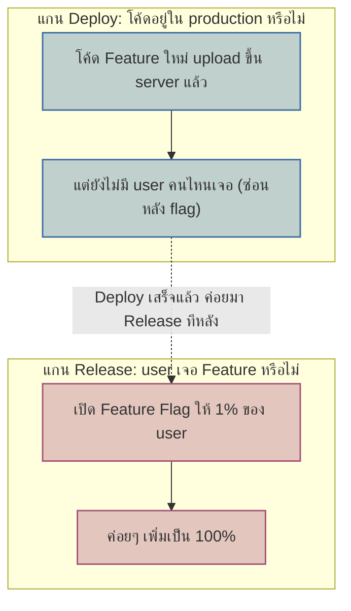
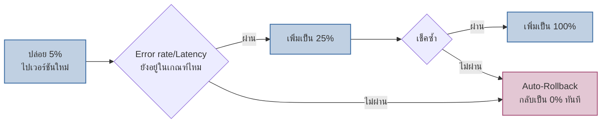

เคยเรียน Deployment Strategies (blue-green, canary) ไปแล้วในโมดูล Reliability — บทนั้นตอบคำถาม "จะสลับเวอร์ชันยังไงให้ downtime เป็นศูนย์" ส่วนบทนี้ไปไกลกว่านั้นอีกขั้น: **จะรู้ได้ยังไงว่าเวอร์ชันใหม่ "ดีจริง" ก่อนปล่อยให้ user ทุกคนเจอ** — และแยกให้เห็นว่า "โค้ดขึ้น production" กับ "user เห็น feature" ไม่ใช่เรื่องเดียวกันเสมอไป

## Deploy ≠ Release: สองแกนที่แยกกันได้

<mark class="hl-term">**Feature Flag**</mark> คือสวิตช์ในโค้ดที่คุมว่า user คนไหนเห็น feature ไหน — ทำให้แยก **Deploy** (เอาโค้ดขึ้น production) ออกจาก **Release** (เปิดให้ user เห็น) ได้เด็ดขาด <mark class="hl-insight">ประโยชน์คือ deploy ได้บ่อยแบบเงียบๆ ทุกวันโดยไม่ต้องกลัว user เจอของที่ยังไม่พร้อม เพราะโค้ดอยู่ใน production จริงแล้ว แต่สวิตช์ยังปิดอยู่ — พอพร้อมค่อยเปิด flag ทีละนิดโดยไม่ต้อง deploy ใหม่เลย</mark>

## Progressive Delivery: Canary ที่มีสมองคอยเช็คให้

Canary release แบบพื้นฐาน (จากโมดูล Reliability) คือส่ง traffic ไปเวอร์ชันใหม่ทีละน้อยแล้ว**คนคอยเฝ้าดู** dashboard เอง — Progressive Delivery ยกระดับขึ้นไปอีกขั้น: ให้ระบบ**เฝ้าดูและตัดสินใจเอง** โดยอิงจาก metric จริง (เชื่อมกับที่เรียนไปในโมดูล Alerting & SLO)

<mark class="hl-warning">จุดสำคัญคือ metric ที่ใช้ตัดสิน "ผ่านไหม" ต้องเป็น metric แบบเดียวกับที่ตั้ง SLO ไว้ (error rate, p99 latency จาก RED method) ไม่ใช่แค่ "deploy สำเร็จไม่มี error ตอน apply" — ต่อให้ deploy สำเร็จเนียนๆ แต่ error rate ของ user จริงพุ่งขึ้นหลัง traffic เริ่มไหลเข้า ระบบต้อง auto-rollback ได้โดยไม่ต้องรอคนมาเห็น dashboard ก่อน</mark>

## เทียบ 3 วิธีปล่อย Feature

| วิธี | คุมที่ระดับ | Rollback เร็วแค่ไหน | ใช้ตอนไหน |
|---|---|---|---|
| Blue-Green | Infrastructure (สลับ environment ทั้งชุด) | เร็วมาก (สลับ router กลับ) | ต้องการ all-or-nothing ชัดเจน ไม่มีสองเวอร์ชันรันพร้อมกันนาน |
| Canary / Progressive Delivery | Traffic percentage | เร็ว (ปรับ % หรือ auto-rollback) | อยากเห็นผลกระทบจริงกับ user กลุ่มเล็กก่อน ค่อยขยาย |
| Feature Flag | Business logic ในโค้ด (per-user/segment) | เร็วที่สุด (toggle switch เดียว ไม่ต้อง deploy ใหม่) | อยากคุมว่า "ใคร" เห็น ไม่ใช่แค่ "กี่ %" (เช่น เปิดให้ beta tester ก่อน) |

ทั้งสามวิธีนี้**ใช้ร่วมกันได้ ไม่ใช่เลือกอย่างเดียว** — ทีมจริงมักวาง pipeline (บทที่ 1) → build artifact เดียว → deploy ด้วย canary (บทนี้) → ควบคุมการมองเห็นของ user ระดับ business logic ด้วย feature flag อีกชั้น เป็น defense-in-depth ของการปล่อย feature

> คำถามสัมภาษณ์: "Canary บอกว่า metric ปกติดีทุกอย่าง แต่พอปล่อย 100% แล้ว user บ่นเยอะ เกิดจากอะไรได้บ้าง" — คำตอบที่ดีคือชี้ปัญหาคลาสสิกของ canary: **กลุ่ม user ที่ได้ traffic 5% แรกอาจไม่ representative** ของ user ทั้งหมด (เช่น สุ่มได้ user ที่ใช้ browser รุ่นใหม่ทั้งหมด แต่ปัญหาจริงอยู่ที่ browser รุ่นเก่าซึ่งไม่ได้อยู่ในกลุ่มทดสอบ) วิธีป้องกันคือทำให้การสุ่มกลุ่ม canary กระจายตัวแทน user จริง (เช่น สุ่มข้าม region/device type) ไม่ใช่สุ่มแบบง่ายๆตาม request ที่มาถึงก่อน
