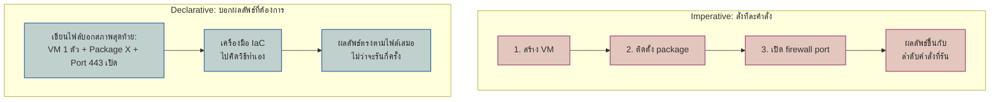
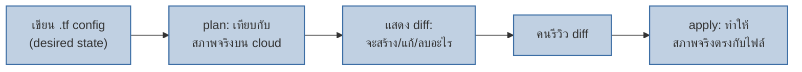
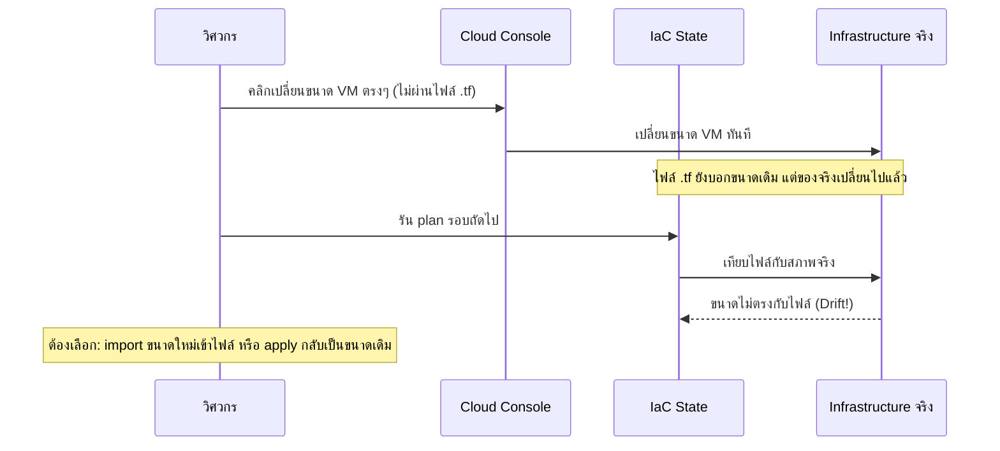

สั่งสร้างบ้านมีสองแบบ — แบบแรก: บอกช่างทีละคำสั่ง "ตั้งเสาต้นนี้ก่อน แล้วเทปูนพื้น แล้วก่อผนัง แล้วมุงหลังคา" ถ้าสั่งผิดลำดับหรือลืมขั้นตอนไหน บ้านออกมาผิดทันที — แบบที่สอง: ส่ง**พิมพ์เขียว**ให้ผู้รับเหมาไปเดียว บอกแค่ว่า **"อยากได้บ้าน 2 ชั้น 3 ห้องนอน หน้าตาแบบนี้"** ส่วนจะก่อสร้างลำดับไหน ผู้รับเหมาไปคิดเอง คุณสนใจแค่ผลลัพธ์สุดท้ายตรงพิมพ์เขียวหรือไม่

**Infrastructure as Code (IaC)** คือการเขียนพิมพ์เขียวของ infrastructure (server, network, database) เป็นไฟล์โค้ด แทนการเข้าไปคลิกสร้างเองทีละอันบน cloud console

## Imperative vs Declarative

<mark class="hl-term">**Declarative**</mark> คือสไตล์ IaC ที่ครองตลาดปัจจุบัน (Terraform, CloudFormation, Pulumi) — คุณเขียนแค่ **"สภาพสุดท้ายที่ต้องการ"** ไม่ใช่ขั้นตอนการไปให้ถึง เครื่องมือจะเทียบไฟล์กับสภาพจริงของ infrastructure ตอนนี้ แล้วคิดเองว่าต้องสร้าง/แก้/ลบอะไรถึงจะตรงกับที่เขียนไว้

<mark class="hl-insight">คุณสมบัติสำคัญที่ตามมาคือ <mark class="hl-term">**Idempotency**</mark> — รันไฟล์ config ซ้ำกี่ครั้งก็ได้ผลลัพธ์เดิมเสมอ ไม่สร้างของซ้ำ ต่างจาก imperative script ที่ถ้ารัน "สร้าง VM" ซ้ำสองครั้งอาจได้ VM สองตัวโดยไม่ตั้งใจ เพราะสคริปต์แค่ทำตามคำสั่งตรงๆไม่เคยเช็คว่ามีอยู่แล้วหรือยัง</mark>

## Plan → Apply: วงจรที่คล้าย Reconcile Loop

เคยเรียน Reconcile Loop ของ GitOps ไปแล้วในโมดูลนี้เอง (บทแรก) — IaC tool ทำงานคล้ายกันมาก แต่เทียบกับ**ทรัพยากร infrastructure** (VM, network, database) แทนที่จะเป็น container/app config

<mark class="hl-warning">ต่างจาก GitOps reconcile loop ที่วนอัตโนมัติตลอดเวลาโดยไม่มีคนเข้ามาเกี่ยวข้อง IaC แบบดั้งเดิม (Terraform) มักมี**ขั้นตอน "review diff ก่อน apply"** เป็นด่านสำคัญ — เพราะการเปลี่ยนแปลง infrastructure บางอย่าง (เช่น ลบ database) ทำผิดแล้วกู้คืนไม่ได้ ต่างจากการ deploy app เวอร์ชันใหม่ที่ rollback ได้ง่ายกว่ามาก จึงยังต้องมีคนตรวจ diff ก่อนกดยืนยันเสมอ</mark>

## Drift: เมื่อมีคนคลิกแก้ตรง Cloud Console

<mark class="hl-warning">การคลิกแก้ตรง cloud console แบบนี้เรียกว่า <mark class="hl-term">**ClickOps**</mark> — เป็นสาเหตุอันดับหนึ่งของ **drift** (สภาพจริงไม่ตรงกับไฟล์ IaC) ต่างจาก GitOps ที่ reconciler จะ revert ค่าที่แก้มือกลับอัตโนมัติ, IaC ทั่วไปจะแค่**แจ้งเตือนว่าไม่ตรง** ให้คนตัดสินใจเองว่าจะรับค่าใหม่เข้าไฟล์ (import) หรือจะบังคับกลับไปค่าเดิมในไฟล์ (apply) — ไม่มีฝั่งไหน "ถูกอัตโนมัติ" เพราะบางทีค่าที่แก้มือฉุกเฉินอาจเป็นค่าที่ควรเก็บไว้จริงๆ</mark>

## เทียบ Imperative vs Declarative

| มิติ | Imperative (script) | Declarative (IaC) |
|---|---|---|
| ต้องรู้ลำดับขั้นตอนไหม | ต้องรู้ ต้องเรียงคำสั่งให้ถูก | ไม่ต้อง บอกแค่ผลลัพธ์ |
| รันซ้ำได้ปลอดภัยไหม (Idempotent) | ไม่แน่นอน อาจสร้างซ้ำ | ได้เสมอ ผลลัพธ์เดิมทุกครั้ง |
| ตรวจ Drift ได้ไหม | ไม่มีกลไก ต้องเช็คเอง | มี (`plan` เทียบให้อัตโนมัติ) |
| ตัวอย่างเครื่องมือ | Bash script, AWS CLI ต่อคำสั่ง | Terraform, CloudFormation, Pulumi |

> คำถามสัมภาษณ์: "ทำไมทีมที่ใช้ Terraform ยังต้องมีขั้นตอน `plan` ให้คนอ่านก่อน ทั้งที่มันคือ declarative ที่ควรเชื่อถือได้อยู่แล้ว" — คำตอบที่ดีคือชี้ว่า declarative แก้ปัญหาแค่ "ต้องรู้ลำดับขั้นตอนไหม" กับ "รันซ้ำปลอดภัยไหม" แต่ไม่ได้แปลว่าการเปลี่ยนแปลงที่คำนวณได้จะปลอดภัยเสมอ (เช่น diff อาจบอกว่าจะ "ทำลายแล้วสร้าง database ใหม่" ซึ่งเสียข้อมูลถ้าไม่รู้ตัว) การอ่าน `plan` ก่อนคือด่านสุดท้ายที่จับความเปลี่ยนแปลงที่ไม่ได้ตั้งใจก่อนมันเกิดจริงบน production
