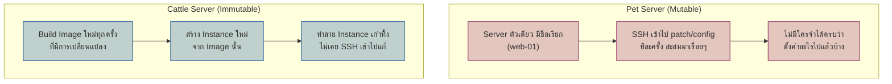
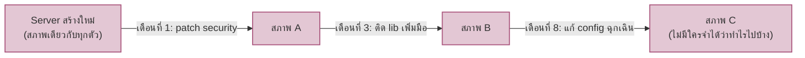

มือถือสมัยนี้เจอปัญหาก็ "รีเซ็ตเครื่อง" หรือ "ล้างเครื่องใหม่" แทนการเปิดฝาหลังไปงมหาชิ้นส่วนที่เสีย — ต่างจากรถเก่าที่เจ้าของ**ค่อยๆซ่อม ค่อยๆเปลี่ยนอะไหล่ทีละชิ้น**มาหลายปีจนไม่มีใครจำได้ว่าชิ้นไหนเดิม ชิ้นไหนเปลี่ยนไปแล้วกี่รอบ

Server ก็มีสองสายพันธุ์นี้เหมือนกัน — วงการเรียกมันว่า <mark class="hl-term">**Pets vs Cattle**</mark>

## Pets vs Cattle

<mark class="hl-insight">**Pet** คือ server ที่ถูกดูแลเป็นรายตัว มีชื่อ มีสถานะเฉพาะตัว ถ้าตายไปกู้คืนยาก (ไม่รู้ว่าต้อง config อะไรกลับบ้างครบไหม) **Cattle** คือ server ที่ไม่แคร์ตัวไหนตายไปตัวหนึ่ง เพราะทุกตัวเกิดจาก image เดียวกัน ตายแล้วสร้างตัวใหม่แทนได้ทันทีโดยไม่เสียอะไร — เชื่อมกับที่เรียนไปแล้วเรื่อง Build Once, Deploy Many: container image คือตัวอย่าง immutable infrastructure ที่ชัดที่สุด สร้าง image ครั้งเดียว รันได้ทุกที่ ไม่เคยแก้ไขตัวที่รันอยู่</mark>

## Config Drift ของ Pet Server

<mark class="hl-warning">นี่คือปัญหาที่เรียกว่า <mark class="hl-term">**Snowflake Server**</mark> — server ที่มีสภาพเฉพาะตัวจนไม่มีใครสร้างซ้ำได้เหมือนเดิม 100% ถ้าเครื่องนี้พังจริง กู้คืนต้องมานั่งไล่จำว่า patch/config อะไรไปแล้วบ้าง ซึ่งมักจำไม่ได้ครบ — Config Management (Ansible, Chef, Puppet) ช่วยลดปัญหานี้ได้บ้างด้วยการเขียน script ตั้งค่าไว้เป็นระบบ แต่ก็ยังเป็น**การแก้ในเครื่องเดิมซ้ำๆ** อยู่ดี ไม่ได้ตัดปัญหา drift ทิ้งไปทั้งหมดเหมือน immutable infra</mark>

## เทียบ Mutable (Config Management) vs Immutable (Image-based)

| มิติ | Mutable + Config Management | Immutable Infrastructure |
|---|---|---|
| วิธีอัปเดต | SSH เข้าเครื่องเดิม รัน script ตั้งค่าใหม่ | Build image ใหม่ → สร้าง instance ใหม่ → ทำลายตัวเก่า |
| Rollback | ยาก ต้องรัน script ย้อนกลับ (มักไม่มี) | ง่ายมาก สลับกลับไปใช้ image เวอร์ชันก่อนหน้า |
| Consistency ระหว่าง environment | เสี่ยง drift ถ้า script รันไม่ครบ/ไม่เหมือนกัน | การันตี เพราะทุก environment ใช้ image ก้อนเดียวกัน |
| ตัวอย่างเครื่องมือ | Ansible, Chef, Puppet | Docker, Packer, AMI/VM Image |
| เหมาะกับ | ระบบที่ยังต้องจัดการ VM ระยะยาว ปรับทีละนิด | ระบบที่ deploy บ่อย ต้องการ reproducibility สูง |

<mark class="hl-insight">สองแนวทางนี้ใช้ร่วมกันได้ — เช่น ใช้ Config Management "ตอน build image" (สร้าง image สะอาดครั้งเดียวด้วย Ansible/Packer) แล้วหลังจากนั้น**ไม่แก้ไข instance ที่รันอยู่อีก** เปลี่ยนเป็นสร้าง image ใหม่+swap instance ทุกครั้งที่มีการเปลี่ยนแปลง — ได้ทั้งความสะดวกของ config management ตอนสร้าง และความชัวร์ของ immutable ตอนใช้งานจริง</mark>

> คำถามสัมภาษณ์: "ทีมนี้บอกว่าใช้ Ansible อยู่แล้ว จำเป็นต้องเปลี่ยนไป immutable infra ไหม" — คำตอบที่ดีคือชี้ว่าคำถามสำคัญกว่าคือ **"Ansible ถูกรันกับ server ตัวเดิมซ้ำๆ (mutable) หรือรันตอน build image ใหม่ทุกครั้ง (immutable)"** — เครื่องมือเดียวกันใช้ได้ทั้งสองสไตล์ ปัญหา snowflake server ไม่ได้อยู่ที่เครื่องมือ แต่อยู่ที่ว่า**เคยแก้ instance ที่รันอยู่จริงโดยไม่ build ใหม่หรือเปล่า**
