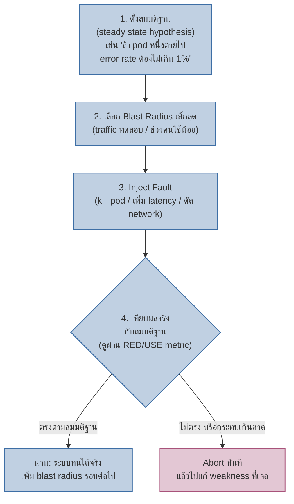
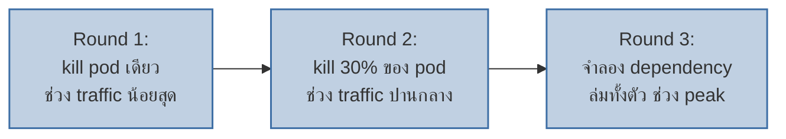

ทำไมสายการบินต้องซ้อมแผนฉุกเฉิน (fire drill) ทั้งที่ไม่มีไฟไหม้จริง ทำไมโรงไฟฟ้าต้องจำลองสถานการณ์ไฟดับก่อนมันดับจริง — เพราะอยากรู้ว่าคนและระบบจะรับมือได้จริงไหม **ก่อน**เกิดเหตุจริง ไม่ใช่รอให้เกิดแล้วมาทดสอบตอนนั้นซึ่งอาจสายเกินไป

**Chaos Engineering** เอาหลักการเดียวกันมาใช้กับระบบ production — ทดลอง "พังบางส่วน" ตั้งใจ ในสภาพแวดล้อมที่ควบคุมได้ เพื่อดูว่า mechanism ที่ออกแบบไว้ (Circuit Breaker, Retry, Failover ที่เรียนไปแล้วในโมดูล Reliability) ทำงานจริงหรือแค่ในทฤษฎี

## ไม่ใช่ "ทำลายเล่นๆ" แต่คือการทดลองแบบมีสมมติฐาน



<mark class="hl-term">**Steady State Hypothesis**</mark> คือหัวใจของ chaos engineering — ก่อนทดลองต้องนิยามก่อนว่า "ระบบปกติ" หน้าตาเป็นยังไง (วัดด้วย metric จาก RED/USE Method ที่เรียนไปแล้ว) แล้วตั้งสมมติฐานว่า**ถึงมี fault เกิดขึ้น ค่า metric นี้ก็ควรยังอยู่ในเกณฑ์เดิม** — ถ้าทดลองแล้วหลุดเกณฑ์ แปลว่าเจอจุดอ่อนจริงที่ต้องแก้

<mark class="hl-warning">คำว่า "Chaos" ทำให้คนเข้าใจผิดว่าคือการสุ่มทำลายแบบไม่มีแผน — ตรงข้ามเลย มันคือการทดลองแบบวิทยาศาสตร์ที่**ควบคุมตัวแปรอย่างเข้มงวด** เริ่มจาก blast radius (พื้นที่ผลกระทบ) เล็กที่สุดเสมอ และต้องมี **kill switch** พร้อมหยุดทดลองทันทีถ้ากระทบ user จริงเกินคาด ไม่ทำ chaos experiment ยิงตรงเข้า 100% production traffic โดยไม่มีทางหยุดฉุกเฉิน</mark>

## ประเภท Fault ที่นิยม Inject

| ประเภท Fault | ทดสอบอะไร | เชื่อมกับ mechanism ที่เรียนไปแล้ว |
|---|---|---|
| Instance/Pod Termination | ระบบมี redundancy จริงไหม | Failover & Redundancy |
| Network Latency Injection | Timeout/Retry ตั้งไว้เหมาะสมไหม | Retry & Backoff |
| Dependency Failure (mock API ล่ม) | Circuit Breaker ตัดจริงไหม ไม่รอค้าง | Circuit Breaker |
| Resource Exhaustion (CPU/Memory เต็ม) | Rate Limiting/Autoscale ทำงานไหม | Rate Limiting |
| Network Partition | ระบบยัง serve ได้บางส่วนไหม หรือพังทั้งระบบ | CAP Theorem, Consistency Models |

## ตัวอย่างการไล่ขยาย Blast Radius



<mark class="hl-insight">หลักการคือ**ไล่ขยาย blast radius ทีละขั้นเมื่อรอบก่อนหน้าผ่าน** ไม่กระโดดไปทดสอบสถานการณ์รุนแรงสุดตั้งแต่รอบแรก — แต่ละรอบที่ผ่านคือหลักฐานว่าเพิ่มความมั่นใจได้อีกระดับ ถ้ารอบไหนหลุดเกณฑ์ หยุดตรงนั้นแล้วไปแก้จุดอ่อนก่อนค่อยทดลองรอบเดิมซ้ำ ไม่ขยับต่อ</mark>

```demo
component: ChaosBlastRadiusDemo
caption: ลองกด Run Round ไล่ขยาย blast radius ดูว่ารอบไหนหลุดเกณฑ์
```

> คำถามสัมภาษณ์: "ทีมทำ chaos experiment ฆ่า pod แบบสุ่มทุกวันศุกร์บ่ายมา 6 เดือน ผลลัพธ์คือไม่มีอะไรเกิดขึ้นเลยทุกครั้ง ควรมองเรื่องนี้ยังไง" — คำตอบที่ดีคือไม่ควรรีบพอใจว่า "ระบบทนทานแล้ว หยุดทดลองได้" เพราะอาจหมายถึงระบบทนทานจริง **หรือ** อาจหมายถึง fault type/blast radius ที่เลือกไม่ท้าทายพอ (เช่น pod สำรองเผื่อไว้เยอะเกินจนไม่รู้สึกอะไรเลย) แนวทางที่ถูกคือค่อยๆขยับความรุนแรงของ experiment ขึ้นเรื่อยๆ (เพิ่ม blast radius, ลองผสม fault หลายชนิดพร้อมกัน) จนกว่าจะเจอจุดที่ระบบเริ่มมีปัญหาจริง นั่นคือขอบเขตความทนทานที่แท้จริงของระบบ ไม่ใช่แค่ "ยังไม่เจอปัญหาเพราะทดลองเบาไป"
