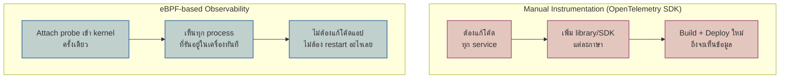

นักสืบสืบคดีมีสองวิธี — วิธีแรก: เดินไปสัมภาษณ์พยานทีละคน ขอให้แต่ละคน**เล่าเรื่องที่เห็น**ให้ฟัง (ต้องขอความร่วมมือ พยานบางคนอาจเล่าไม่ครบ/ลืมเล่า) — วิธีที่สอง: ดึงภาพจาก**กล้องวงจรปิดที่ติดอยู่แล้วทั่วตึก** เห็นทุกอย่างที่เกิดขึ้นจริงโดยไม่ต้องขอใคร ไม่ต้องพึ่งว่าพยานจะเล่าครบไหม

<mark class="hl-term">**OpenTelemetry**</mark> ที่เรียนไปแล้ว (โมดูล Distributed Tracing) คือวิธีแรก — ต้องเพิ่ม SDK เข้าโค้ดแต่ละ service ให้มัน "เล่า" (emit span/metric) ออกมาเอง ส่วน <mark class="hl-term">**eBPF**</mark> คือกล้องวงจรปิด — มันเห็นทุก process ในเครื่องได้โดยไม่ต้องแก้โค้ดแอปสักบรรทัด

## eBPF คืออะไร

**eBPF (extended Berkeley Packet Filter)** คือโปรแกรมเล็กๆที่รันอยู่**ใน Linux kernel** แบบปลอดภัย (sandboxed, ตรวจสอบก่อนรันว่าไม่ทำให้ kernel crash หรือวนลูปไม่จบ) โปรแกรมนี้ hook เข้าไปที่จุดต่างๆของ kernel ได้ — ทุก syscall, ทุก network packet, ทุกครั้งที่ function ในเคอร์เนลถูกเรียก — แล้วดึงข้อมูลออกมาได้โดยที่ **application ข้างบนไม่รู้ตัวเลยว่ากำลังถูกสังเกตอยู่**

<mark class="hl-insight">ข้อดีที่ชัดที่สุดคือ**ครอบคลุม legacy service ที่แก้โค้ดไม่ได้แล้ว** — service เก่าที่เขียนด้วยภาษาที่ไม่มีคนดูแล ไม่มี OpenTelemetry SDK รองรับ หรือทีมไม่กล้าแก้เพราะเสี่ยง eBPF ยังมองเห็นได้ปกติ เพราะมันดูที่ระดับ kernel ไม่สนใจว่าแอปข้างบนเขียนด้วยภาษาอะไร</mark>

## Trade-off: เห็นกว้าง แต่ไม่เห็นลึกถึง Business Logic

<mark class="hl-warning">eBPF ไม่ใช่ตัวมาแทน manual instrumentation ทั้งหมด — มันเห็นแค่ระดับ **network/syscall** (เช่น "process A เปิด connection ไปที่ IP นี้ ใช้เวลาเท่านี้") แต่ไม่รู้ **business context** อย่าง "request นี้เป็นของ user คนไหน กำลังทำ checkout อยู่หรือเปล่า" — context แบบนั้นต้องมาจาก span attribute ที่โค้ดเขียนเองผ่าน OpenTelemetry เท่านั้น eBPF กับ manual instrumentation จึงเป็นของที่**ใช้เสริมกัน ไม่ใช่เลือกอย่างเดียว**</mark>

## เทียบสองวิธี

| มิติ | Manual Instrumentation (OTel SDK) | eBPF |
|---|---|---|
| ต้องแก้โค้ดแอปไหม | ต้อง เพิ่ม SDK ทุก service | ไม่ต้อง ทำงานที่ kernel ระดับเดียว |
| เห็น Business Context ไหม (user, order id) | เห็น ถ้าเขียน custom span attribute ไว้ | ไม่เห็น รู้แค่ระดับ network/syscall |
| รองรับ Legacy Service ที่แก้โค้ดไม่ได้ | ไม่ได้ ต้องแก้โค้ดก่อนถึงจะมีข้อมูล | ได้ทันที ไม่ต้องแตะโค้ดเดิม |
| Overhead ต่อ Application | ต่ำ-กลาง ขึ้นกับจำนวน span ที่สร้าง | ต่ำมาก เพราะรันแยกที่ kernel ไม่ผ่าน application code path |
| ตัวอย่างเครื่องมือ | OpenTelemetry SDK | Cilium, Pixie, Parca (ใช้ eBPF เป็นฐาน) |

> คำถามสัมภาษณ์: "ทีมมี legacy service ที่ไม่มีใครกล้าแก้โค้ดมา 5 ปีแล้ว อยากได้ observability เพิ่มโดยไม่แตะโค้ดเลย จะทำยังไง" — คำตอบที่ดีคือชี้ไปที่ eBPF-based tool (เช่น Cilium Hubble, Pixie) ที่ attach เข้า kernel ของเครื่องที่ service นั้นรันอยู่ ได้ข้อมูล network-level (latency, error, throughput ระหว่าง service) โดยไม่ต้อง deploy อะไรใหม่เข้าไปในโค้ด แต่ต้องบอกด้วยว่าจะไม่เห็น business-level detail เท่า manual instrumentation ถ้าต้องการ context ระดับนั้นจริงๆ ยังต้องวางแผนแก้โค้ดเพิ่ม span attribute อยู่ดี
