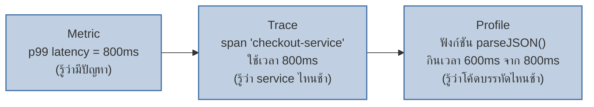
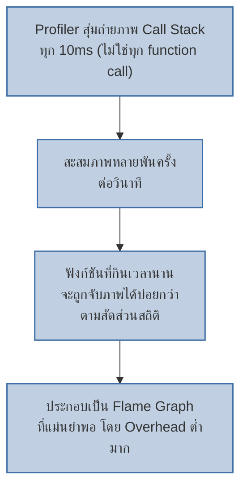

หมอวัดชีพจรบอกได้แค่ว่า **"เต้นเร็วผิดปกติ"** แต่ไม่บอกว่าอวัยวะไหนทำงานหนักจนหัวใจต้องเต้นเร็วตาม — ถ้าอยากรู้ต้องทำ MRI สแกนดูเนื้อเยื่อจริงว่าตรงไหนทำงานหนักผิดปกติ

**Metric** (p99 latency สูง) ก็เหมือนชีพจร — บอกว่า "มีปัญหา" แต่ไม่บอกว่า**บรรทัดโค้ดไหน**ที่กินเวลาจริง ส่วน **Profiling** คือ MRI ของโค้ด

## จาก Metric → Trace → Profile: ความละเอียดที่เพิ่มขึ้นทีละขั้น

<mark class="hl-insight">เคยเรียน Four Golden Signals กับ Distributed Tracing ไปแล้ว — สามชั้นนี้ทำงานร่วมกันเป็นลำดับการสืบสวนที่ลึกขึ้นทีละขั้น: **Metric บอกว่ามีปัญหาไหม, Trace บอกว่า service ไหนช้า, Profile บอกว่าฟังก์ชันไหนในโค้ดที่กินเวลาจริง** — ถ้าหยุดแค่ metric+trace มักได้คำตอบแค่ "service A ช้า" แต่ไม่รู้ว่าจะไปแก้โค้ดจุดไหน</mark>

## Flame Graph: อ่านยังไง

Flame Graph คือวิธี visualize call stack ให้เห็นว่าฟังก์ชันไหนกินเวลามากที่สุด — **แกนนอน = สัดส่วนเวลาที่ใช้ (กว้าง = ใช้เวลานาน)**, **แกนตั้ง = ความลึกของการเรียกฟังก์ชัน (function A เรียก B เรียก C ซ้อนกันลงมา)**

| ระดับ Call Stack | ฟังก์ชัน | สัดส่วนเวลา (Self Time) |
|---|---|---|
| 1 (บนสุด) | `handleCheckoutRequest()` | 100% (ครอบทั้งหมด) |
| 2 | `validateOrder()` | 15% |
| 2 | `parseJSON()` | 75% |
| 3 | `JSON.parse() (built-in)` | 70% ของเวลาทั้งหมด (ตัวการหลัก) |
| 2 | `sendResponse()` | 10% |

<mark class="hl-warning">จากตารางนี้ ถ้าดูแค่ metric จะเห็นแค่ "checkout ช้า" แต่ flame graph ชี้ตรงไปที่ `parseJSON()` ที่กิน 75% ของเวลาทั้งหมด — เป็นจุดที่ควรไปแก้ก่อน ไม่ใช่ไปแก้ `validateOrder()` ที่กินแค่ 15% ทั้งที่หน้าตาโค้ดอาจดู "ซับซ้อนกว่า" จนคนเข้าใจผิดว่าเป็นตัวการ</mark>

## Continuous Profiling: รันตลอดเวลาบน Production ได้ยังไงโดยไม่กิน CPU เพิ่ม

Profiler แบบดั้งเดิมอ่าน call stack ได้ละเอียดมาก แต่ overhead สูงเกินกว่าจะรันตลอดเวลาบน production ได้ — **Continuous Profiling** แก้ปัญหานี้ด้วยการ**สุ่มอ่าน (sampling)** call stack เป็นระยะ (เช่น ทุก 10ms) แทนการติดตามทุก function call แบบละเอียด 100%

<mark class="hl-term">**Sampling Profiler**</mark> ยอม**แลกความละเอียด 100% เพื่อ overhead ที่ต่ำจนรันบน production ได้ตลอด 24/7** — ฟังก์ชันที่กินเวลาจริงมีโอกาสถูก "จับภาพได้" ระหว่างการสุ่มบ่อยกว่าฟังก์ชันที่เร็ว ทำให้ผลลัพธ์ทางสถิติแม่นยำพอใช้งานจริงได้ แม้จะไม่ได้ติดตามทุก function call เป๊ะ 100% เหมือน profiler แบบเดิม

## เทียบ Traditional Profiling vs Continuous Profiling

| มิติ | Traditional Profiling | Continuous Profiling |
|---|---|---|
| รันตอนไหน | Dev/debug ครั้งเดียว ตอนสงสัยปัญหา | ตลอดเวลา บน production 24/7 |
| Overhead | สูง (ติดตามทุก call) ไม่เหมาะกับ prod | ต่ำมาก (sampling based) |
| ย้อนดูอดีตได้ไหม | ไม่ได้ ต้องรันใหม่ตอนเกิดปัญหา | ได้ มี flame graph เก็บไว้เทียบย้อนหลัง |
| เหมาะกับ | Debug ปัญหาที่ reproduce ได้ในเครื่อง dev | หา regression ที่เกิดขึ้นเฉพาะบน production เท่านั้น |

> คำถามสัมภาษณ์: "Metric บอกว่า p99 latency ของ service สูงขึ้นตั้งแต่ deploy เวอร์ชันล่าสุด แต่ trace บอกแค่ว่า service นี้ช้าลงโดยรวม จะหาสาเหตุระดับโค้ดได้ยังไงโดยไม่ต้องแก้โค้ดเพิ่ม log" — คำตอบที่ดีคือชี้ไปที่ Continuous Profiling: เปิด flame graph ของช่วงเวลาก่อนกับหลัง deploy มาเทียบกัน ถ้าเห็นฟังก์ชันใหม่ที่ไม่เคยกินเวลามากในเวอร์ชันก่อน แต่กินเวลาเยอะขึ้นในเวอร์ชันใหม่ นั่นคือจุดที่ regression เกิดขึ้นจริง โดยไม่ต้อง deploy โค้ดเพิ่ม log ใหม่แล้วรอ reproduce ปัญหาซ้ำเลย
