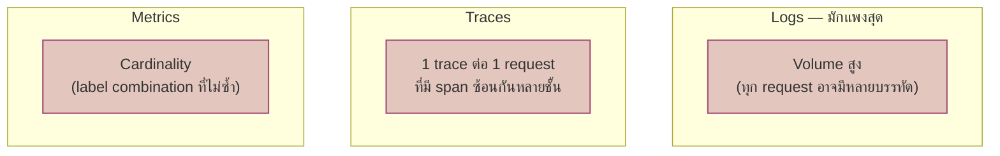
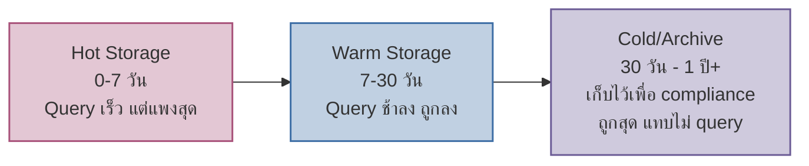

บ้านที่เปิดไฟทุกห้องทิ้งไว้ทั้งวันทั้งคืน ไม่ว่าจะมีคนอยู่ในห้องนั้นหรือไม่ — บิลค่าไฟพุ่งจนวันหนึ่งอาจแพงกว่าค่าเช่าบ้านเองซะอีก ระบบ observability ที่เก็บ log/metric/trace **ทุกอย่าง ทุกจุด แบบไม่คิด** ก็เจอปัญหาเดียวกัน — มีเคสจริงหลายองค์กรที่บิล observability tool แพงกว่าบิล infrastructure ที่มันเฝ้าดูอยู่เสียอีก

เคยเรียนเรื่อง Cardinality Explosion (โมดูล Metrics & Prometheus) และ Log Sampling (โมดูล Centralized Logging) มาแล้ว — สองบทนั้นมองทีละสัญญาณ บทนี้มองภาพรวม**ทั้ง 3 สัญญาณพร้อมกัน**ในมุมต้นทุน

## อะไรทำให้แต่ละสัญญาณแพง

<mark class="hl-insight">**Logs มักเป็นสัญญาณที่แพงที่สุด** เพราะ volume ต่อ request สูงกว่า metric/trace มาก (metric คือตัวเลขสรุป, trace คือ span ไม่กี่สิบต่อ request แต่ log อาจมีหลายสิบบรรทัดต่อ request ถ้า verbosity สูง) การคุมต้นทุนจึงมักเริ่มจากฝั่ง log ก่อนเป็นอันดับแรก</mark>

## กลยุทธ์ลดต้นทุนต่อสัญญาณ

| สัญญาณ | ตัวขับต้นทุน | กลยุทธ์ลดต้นทุน | ความเสี่ยงถ้าลดเกินไป |
|---|---|---|---|
| Metrics | Cardinality (label ที่ไม่ซ้ำเยอะ) | จำกัด label ที่ high-cardinality, aggregate ก่อนเก็บ | เห็น pattern เฉพาะกลุ่มไม่ได้ (unknown-unknowns หาไม่เจอ) |
| Logs | Volume ต่อ request, verbosity | Sample ตาม level, structured logging, dedupe | log สำคัญตอน incident หายไปพอดี |
| Traces | 1 trace ต่อ request | Sampling (เก็บบางเปอร์เซ็นต์ หรือเก็บเฉพาะ error/ช้าผิดปกติ) | trace ของ incident หายากที่สุดอาจไม่ถูกเก็บไว้เลย |

<mark class="hl-warning">คอลัมน์ "ความเสี่ยง" คือจุดที่ต้องระวังที่สุด — การลด cost ด้วยการ sample/drop ข้อมูลแบบหว่านเดียวกันทุกจุด เสี่ยงตัดข้อมูลที่จำเป็นสำหรับสืบสวน unknown-unknowns ออกไปด้วย (ย้อนกลับไปที่หัวข้อเปิดของ track นี้เรื่อง Monitoring vs Observability) — ยิ่ง sample หนักเท่าไหร่ ยิ่งเหลือข้อมูลดิบให้ query แบบ ad-hoc ตอนเกิดเหตุจริงน้อยลงเท่านั้น</mark>

## Tiered Retention: ไม่ใช่ทุกข้อมูลต้อง Query เร็วตลอดไป

<mark class="hl-term">**Tiered Retention**</mark> ใช้หลักการที่ว่า**ข้อมูลใหม่ถูก query บ่อยกว่าข้อมูลเก่ามาก** — incident ส่วนใหญ่ถูกสืบสวนภายในไม่กี่วันแรก ข้อมูลที่เก่าเกิน 1 เดือนมักถูก query น้อยลงเรื่อยๆ จึงย้ายไปเก็บใน storage ที่ query ช้าแต่ถูกกว่ามาก (เช่น object storage เย็น) แทนที่จะเก็บทุกอย่างไว้ใน storage แพงสุดตลอดไป

## ตัวอย่างการแก้แบบ "Smart" ไม่ใช่แบบ "หว่าน"

การ sample แบบ uniform (เช่น "เก็บ log แค่ 1% ของทุก request") มีปัญหา: ถ้า incident เกิดกับ request แค่ 0.1% ของทั้งหมด โอกาสที่ log ของ incident นั้นจะอยู่ใน 1% ที่เก็บไว้ต่ำมาก — วิธีที่ถูกกว่าคือ**sample แบบมีเงื่อนไข**:

- Log ระดับ ERROR/WARN → **เก็บ 100% เสมอ ไม่ sample**
- Log ระดับ INFO/DEBUG (volume สูง ไม่ critical) → sample ตามสัดส่วนที่ตั้งไว้
- Trace → ใช้ tail-based sampling (ตัดสินใจเก็บ "หลัง" เห็นผลลัพธ์ทั้ง trace แล้ว) เก็บเฉพาะ trace ที่ error หรือ latency สูงผิดปกติเสมอ ไม่สุ่มทิ้งเคสสำคัญ

> คำถามสัมภาษณ์: "ทีมลด cost logging ด้วยการตั้ง sample 1% แบบเดียวกันทุก log level แล้วมาเจอว่า incident ที่เกิดแค่ 0.1% ของ request ไม่มี log เก็บไว้เลยตอนสืบสวน ควรแก้ยังไง" — คำตอบที่ดีคือชี้ว่าปัญหาคือ sample แบบ uniform ไม่แยกความสำคัญของข้อมูล วิธีแก้คือเก็บ log ระดับ error/warning ไว้ 100% เสมอ (ไม่ sample เลย) แล้ว sample เฉพาะ log ระดับ info/debug ที่ volume สูงแต่ไม่ critical ต่อการสืบสวน incident — คุม cost ได้โดยไม่เสียข้อมูลที่จำเป็นตอนเกิดเหตุจริง
